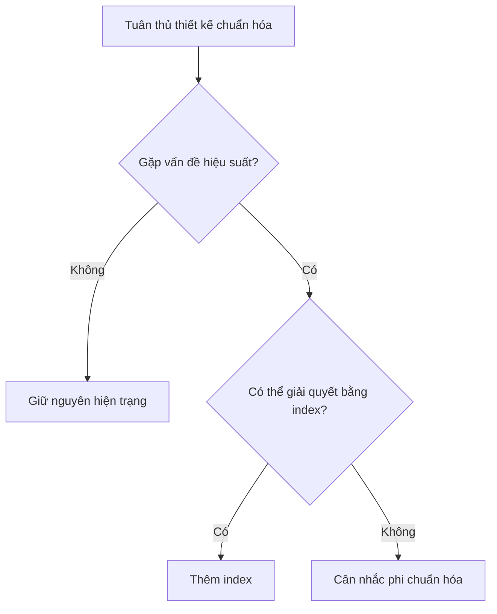

# 4.1.4 Quy tắc có thể bị phá vỡ không — Phi chuẩn hóa: Cân nhắc đánh đổi để tối ưu hiệu suất

### Một câu giải thích

Phi chuẩn hóa là "cố ý vi phạm" để đạt hiệu suất — đánh đổi dư thừa dữ liệu để lấy tốc độ truy vấn.

### Khi nào cần phi chuẩn hóa?



**Điều kiện kích hoạt phi chuẩn hóa**:

1. Truy vấn JOIN nhiều bảng thường xuyên ảnh hưởng nghiêm trọng đến hiệu suất
2. Một số dữ liệu tổng hợp cần tính toán thời gian thực, chi phí quá cao
3. Kịch bản đọc nhiều ghi ít, có thể hy sinh hiệu suất ghi để đổi lấy tốc độ đọc

### Các chiến lược phi chuẩn hóa phổ biến

#### Chiến lược một: Lưu trữ dư thừa

**Kịch bản**: Danh sách bài viết cần hiển thị tên tác giả, mỗi lần JOIN bảng User đều tốn chi phí cao.

**Thiết kế chuẩn hóa**:

```prisma
model Post {
  id       String @id
  title    String
  authorId String
  author   User   @relation(fields: [authorId], references: [id])
}
```

**Thiết kế phi chuẩn hóa**:

```prisma
model Post {
  id         String @id
  title      String
  authorId   String
  authorName String  // Lưu trữ dư thừa tên tác giả
  author     User    @relation(fields: [authorId], references: [id])
}
```

**Chi phí**: Khi người dùng đổi tên, cần đồng bộ cập nhật tất cả bài viết liên quan.

#### Chiến lược hai: Tính toán trước tổng hợp

**Kịch bản**: Hiển thị số lượng bình luận, lượt thích của bài viết.

**Cách làm chuẩn hóa**: Mỗi lần truy vấn đều COUNT

```typescript
const post = await prisma.post.findUnique({
  where: { id },
  include: {
    _count: {
      select: { comments: true, likes: true }
    }
  }
})
```

**Cách làm phi chuẩn hóa**: Lưu trữ bộ đếm

```prisma
model Post {
  id           String @id
  title        String
  commentCount Int    @default(0)  // Đếm dư thừa
  likeCount    Int    @default(0)  // Đếm dư thừa
}
```

**Cách bảo trì**: Cập nhật bộ đếm khi bình luận/thích

```typescript
await prisma.$transaction([
  prisma.comment.create({ data: { postId, content } }),
  prisma.post.update({
    where: { id: postId },
    data: { commentCount: { increment: 1 } }
  })
])
```

#### Chiến lược ba: Materialized view / Bảng cache

**Kịch bản**: Truy vấn báo cáo thống kê phức tạp.

**Cách làm**: Định kỳ tạo bảng dữ liệu tổng hợp

```prisma
// Bảng tổng hợp doanh số hàng ngày
model DailySalesSummary {
  id        String   @id @default(cuid())
  date      DateTime @unique
  totalSales Decimal
  orderCount Int
  createdAt DateTime @default(now())
}
```

**Chiến lược cập nhật**:
- Tác vụ định kỳ tạo mỗi ngày lúc nửa đêm
- Hoặc cập nhật thời gian thực (qua trigger hoặc tầng ứng dụng)

### Chi phí của phi chuẩn hóa

| Nhận được | Phải trả |
|------|------|
| Tốc độ đọc nhanh | Ghi cần bảo trì nhiều nơi |
| Giảm JOIN | Dữ liệu có thể không nhất quán |
| Truy vấn đơn giản | Tăng không gian lưu trữ |

### Phương pháp duy trì tính nhất quán dữ liệu

**Phương pháp một: Đảm bảo bằng transaction**

```typescript
await prisma.$transaction(async (tx) => {
  // Cập nhật dữ liệu chính
  await tx.user.update({
    where: { id: userId },
    data: { name: newName }
  })
  // Đồng bộ cập nhật dữ liệu dư thừa
  await tx.post.updateMany({
    where: { authorId: userId },
    data: { authorName: newName }
  })
})
```

**Phương pháp hai: Tính nhất quán cuối cùng**

Đối với dữ liệu không quan trọng, có thể chấp nhận không nhất quán tạm thời:

```typescript
// Cập nhật dữ liệu dư thừa bất đồng bộ
await queue.add('syncAuthorName', { userId, newName })
```

**Phương pháp ba: Database trigger**

Đồng bộ tự động ở tầng cơ sở dữ liệu (không khuyến nghị, sẽ tăng độ phức tạp).

### Danh sách kiểm tra quyết định

Trước khi quyết định phi chuẩn hóa, hỏi bản thân:

- [ ] **Thực sự có vấn đề hiệu suất không**? Có dữ liệu giám sát thực tế hỗ trợ không?
- [ ] **Đã thử các giải pháp khác chưa**? Index, cache, tối ưu truy vấn?
- [ ] **Có thể chấp nhận rủi ro dữ liệu không nhất quán không**?
- [ ] **Có khả năng bảo trì logic đồng bộ dữ liệu không**?
- [ ] **Sau khi dữ liệu tăng trưởng trong tương lai vẫn áp dụng được không**?

### Đề xuất thực hành trong Vibe Coding

1. **Giai đoạn đầu không phi chuẩn hóa**: Thiết kế theo chuẩn hóa trước, giữ đơn giản
2. **Dùng giám sát để hướng dẫn tối ưu**: Có dữ liệu hỗ trợ rồi mới ra quyết định
3. **Để AI giúp bạn đánh giá**:
   ```
   Bảng Post của tôi có 1000 truy vấn mỗi giây, mỗi lần đều cần JOIN bảng User để lấy tên tác giả.
   Bạn nghĩ tôi nên lưu trữ dư thừa authorName không? Có rủi ro gì?
   ```

### Tóm tắt phần này

- Phi chuẩn hóa là sự đánh đổi cho hiệu suất
- Các chiến lược phổ biến: lưu trữ dư thừa, tính toán trước tổng hợp, materialized view
- Chi phí là cần bảo trì tính nhất quán dữ liệu
- Tuân thủ chuẩn hóa trước, gặp vấn đề hiệu suất thực sự rồi mới phi chuẩn hóa
