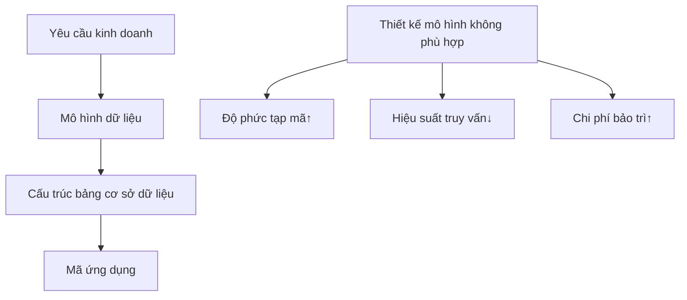
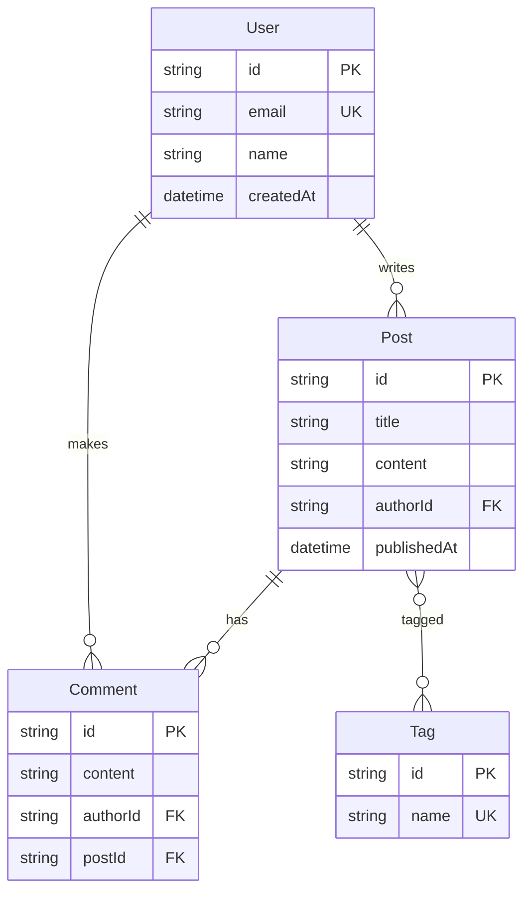

# 4.1 Làm rõ quan hệ dữ liệu trước tiên — Mô hình hóa dữ liệu và Sơ đồ ER: Thực thể/Quan hệ/Ràng buộc; Hướng đến thay đổi và phát triển

### Tái cấu trúc nhận thức

Mô hình hóa dữ liệu không phải là "vẽ bảng", mà là **mô tả thế giới kinh doanh bằng cách có cấu trúc**. Một mô hình dữ liệu tốt có thể khiến logic kinh doanh phức tạp trở nên rõ ràng và có thể kiểm soát.

### Tại sao mô hình hóa dữ liệu lại quan trọng?



Mô hình dữ liệu là **lớp dịch trung gian** từ yêu cầu kinh doanh đến triển khai mã:

- **Thiết kế tốt**: Code gọn gàng, truy vấn hiệu quả, dễ mở rộng
- **Thiết kế kém**: Vá khắp nơi, truy vấn chậm, sửa một chỗ ảnh hưởng toàn bộ

### Các khái niệm cốt lõi trong phần này

| Khái niệm | Giải thích | Ví dụ |
|------|------|------|
| **Thực thể** | Đối tượng cốt lõi trong kinh doanh | Người dùng, Bài viết, Đơn hàng |
| **Thuộc tính** | Đặc điểm của thực thể | Tên người dùng, Email, Thời gian tạo |
| **Quan hệ** | Liên kết giữa các thực thể | Người dùng "sở hữu" nhiều bài viết |
| **Ràng buộc** | Quy tắc giới hạn dữ liệu | Email phải duy nhất |

### Điều hướng chương con

| Chương | Chủ đề | Mục tiêu học tập |
|------|------|----------|
| 4.1.1 | Xác định thực thể | Trích xuất đối tượng cốt lõi từ kinh doanh |
| 4.1.2 | Thiết kế quan hệ | Một-một/Một-nhiều/Nhiều-nhiều |
| 4.1.3 | Lý thuyết chuẩn hóa | Cấu trúc dữ liệu được chuẩn hóa |
| 4.1.4 | Phi chuẩn hóa | Thỏa hiệp hợp lý cho hiệu suất |

### Ví dụ Sơ đồ ER

Lấy hệ thống blog làm ví dụ:



### Hướng dẫn cộng tác với AI

**Ý định cốt lõi**: Nói cho AI biết bạn muốn thiết kế mô hình dữ liệu cho nghiệp vụ gì.

**Công thức định nghĩa yêu cầu**:
```
Tôi cần thiết kế mô hình dữ liệu cho [kịch bản kinh doanh].
Các thực thể chính bao gồm: [danh sách thực thể]
Quy trình kinh doanh cốt lõi là: [mô tả quy trình]
Hãy giúp tôi thiết kế Sơ đồ ER và Prisma Schema.
```

**Thuật ngữ quan trọng**: `thực thể`, `thuộc tính`, `quan hệ`, `khóa chính`, `khóa ngoại`, `một-nhiều`, `nhiều-nhiều`

### Bước tiếp theo

Học cách xác định thực thể từ yêu cầu kinh doanh → 4.1.1 Xác định thực thể
