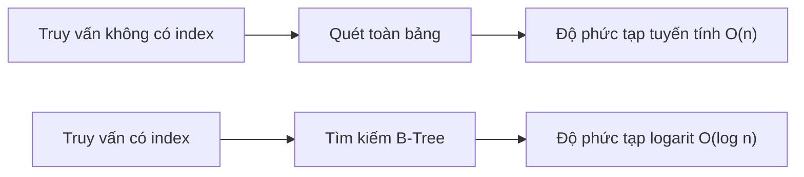

# 4.2.2 Tại sao truy vấn lại nhanh thế — Nguyên lý Index: Index B-Tree và tối ưu truy vấn

### Một câu giải thích

Index giống như mục lục của sách — không có nó bạn chỉ có thể lật từng trang để tìm, có nó bạn có thể nhảy thẳng đến vị trí mục tiêu.

### Bản chất của Index



| Lượng dữ liệu | Quét toàn bảng | Truy vấn Index |
|--------|----------|----------|
| 1,000 | 1,000 lần | 10 lần |
| 100,000 | 100,000 lần | 17 lần |
| 10,000,000 | 10,000,000 lần | 24 lần |

### Nguyên lý hoạt động của Index B-Tree

B-Tree (Balanced Tree - Cây cân bằng) là cấu trúc index phổ biến nhất trong cơ sở dữ liệu:

```
              [50]
             /    \
        [25,35]    [75,85]
        / | \       / | \
    [10] [30] [40] [60] [80] [90]
```

- Mỗi node chứa nhiều giá trị khóa
- Dữ liệu được sắp xếp theo thứ tự
- Bắt đầu từ node gốc, mỗi lần loại bỏ một nửa dữ liệu

### Tạo Index trong Prisma

**Index trường đơn**:
```prisma
model User {
  id    String @id
  email String @unique  // Unique index, tự động tạo
  name  String

  @@index([name])  // Index thường
}
```

**Index kết hợp**:
```prisma
model Post {
  id        String @id
  authorId  String
  status    String
  createdAt DateTime

  // Index kết hợp: authorId + status
  @@index([authorId, status])
}
```

**Khi nào cần tạo Index**:

| Trường hợp | Có cần Index |
|------|-------------|
| Trường điều kiện WHERE | Cần |
| Trường sắp xếp ORDER BY | Cần |
| Trường liên kết JOIN | Cần (khóa ngoại tự động tạo) |
| Trường ràng buộc unique | Tự động tạo |
| Trường ít truy vấn | Không cần |

### Thứ tự của Index kết hợp

Thứ tự trường trong index kết hợp rất quan trọng, tuân theo **nguyên tắc tiền tố trái nhất**:

```prisma
@@index([authorId, status, createdAt])
```

- ✅ Hỗ trợ `WHERE authorId = ?`
- ✅ Hỗ trợ `WHERE authorId = ? AND status = ?`
- ✅ Hỗ trợ `WHERE authorId = ? AND status = ? AND createdAt > ?`
- ❌ Không hỗ trợ `WHERE status = ?` (bỏ qua authorId)
- ❌ Không hỗ trợ `WHERE createdAt > ?` (bỏ qua hai trường đầu)

### Chi phí của Index

Index không miễn phí:

| Nhận được | Phải trả |
|------|------|
| Truy vấn nhanh hơn | Ghi chậm hơn (cần bảo trì index) |
| Truy vấn phạm vi hiệu quả | Chiếm thêm không gian lưu trữ |
| - | Index quá nhiều ảnh hưởng hiệu suất ghi |

### Thực hành tối ưu truy vấn

**Xem kế hoạch thực thi truy vấn** (PostgreSQL):
```sql
EXPLAIN ANALYZE SELECT * FROM users WHERE email = 'test@example.com';
```

**Prisma log xem SQL được tạo**:
```typescript
const prisma = new PrismaClient({
  log: ['query']
})
```

**Kỹ thuật tối ưu phổ biến**:

1. **Chỉ truy vấn trường cần thiết**:
   ```typescript
   // Chỉ select trường cần thiết
   const users = await prisma.user.findMany({
     select: { id: true, name: true }
   })
   ```

2. **Tránh SELECT ***: Không truy vấn trường lớn không cần thiết

3. **Sử dụng phân trang hợp lý**:
   ```typescript
   const users = await prisma.user.findMany({
     take: 20,
     skip: 0
   })
   ```

### Khi nào không dùng Index

Ngay cả khi có index, cơ sở dữ liệu cũng có thể chọn không dùng:

- Kết quả truy vấn vượt quá 20-30% dữ liệu bảng
- Sử dụng tính toán hàm (như `LOWER(email)`)
- Sử dụng `LIKE '%keyword'` (ký tự đại diện ở đầu)

### Hướng dẫn tránh lỗi

1. **Không thêm index cho mọi trường**: Chỉ thêm cho trường có tần suất cao trong điều kiện truy vấn

2. **Chú ý trường hợp index thất hiệu**:
   - Sử dụng hàm trên cột index
   - Ép kiểu ngầm
   - LIKE bắt đầu bằng ký tự đại diện

3. **Kiểm tra định kỳ slow query**: Giám sát và tối ưu SQL chậm

### Tóm tắt phần này

- Index tăng tốc truy vấn thông qua cấu trúc B-Tree
- Khóa ngoại và ràng buộc unique tự động tạo index
- Index kết hợp tuân theo nguyên tắc tiền tố trái nhất
- Index có chi phí, không phải càng nhiều càng tốt
