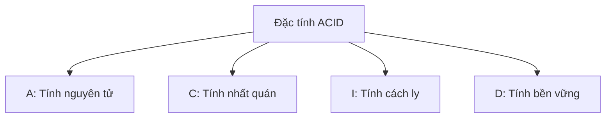

# 4.2.3 Tại sao chuyển tiền lại an toàn — Đặc tính Transaction: Thuộc tính ACID và mức độ cách ly

### Một câu giải thích

Transaction đảm bảo nhiều thao tác "hoặc toàn thành công, hoặc toàn thất bại" — đây là nền tảng của an toàn dữ liệu.

### Ví dụ kinh điển: Chuyển tiền ngân hàng

Trần Anh chuyển cho Lý Tứ 100 đồng, cần hai bước thao tác:

1. Tài khoản Trần Anh -100 đồng
2. Tài khoản Lý Tứ +100 đồng

**Nếu không có transaction**:
- Bước 1 thành công, bước 2 thất bại → Trần Anh mất 100, Lý Tứ không nhận được
- Hệ thống crash ở giữa → Dữ liệu không nhất quán

**Có bảo vệ transaction**:
- Hai bước hoặc đều thành công
- Hoặc đều rollback về trạng thái trước khi thao tác

### Bốn đặc tính ACID



| Đặc tính | Giải thích | Đảm bảo gì |
|------|------|----------|
| **A**tomicity | Tính nguyên tử | Toàn bộ thành công hoặc toàn bộ rollback |
| **C**onsistency | Tính nhất quán | Dữ liệu luôn tuân thủ quy tắc nghiệp vụ |
| **I**solation | Tính cách ly | Các transaction đồng thời không ảnh hưởng lẫn nhau |
| **D**urability | Tính bền vững | Sau khi commit dữ liệu được lưu vĩnh viễn |

### Sử dụng Transaction trong Prisma

**Cách một: Transaction tuần tự**

```typescript
// Tất cả thao tác thực thi trong cùng một transaction
const [user, post] = await prisma.$transaction([
  prisma.user.create({ data: { email: 'user@example.com' } }),
  prisma.post.create({ data: { title: 'Bài viết mới', authorId: 'xxx' } })
])
```

**Cách hai: Transaction tương tác (khuyến nghị)**

```typescript
// Linh hoạt hơn, có thể viết logic nghiệp vụ trong transaction
const result = await prisma.$transaction(async (tx) => {
  // 1. Trừ số dư của Trần Anh
  const sender = await tx.account.update({
    where: { userId: 'zhangsan' },
    data: { balance: { decrement: 100 } }
  })

  // 2. Kiểm tra số dư có đủ không
  if (sender.balance < 0) {
    throw new Error('Số dư không đủ')  // Throw exception sẽ tự động rollback
  }

  // 3. Cộng số dư cho Lý Tứ
  const receiver = await tx.account.update({
    where: { userId: 'lisi' },
    data: { balance: { increment: 100 } }
  })

  return { sender, receiver }
})
```

### Mức độ cách ly của Transaction

Các mức độ cách ly khác nhau quyết định transaction có thể "nhìn thấy" bao nhiêu về nhau:

| Mức độ cách ly | Dirty read | Non-repeatable read | Phantom read | Hiệu suất |
|----------|------|------------|------|------|
| Read Uncommitted | ✓ | ✓ | ✓ | Cao nhất |
| Read Committed | ✗ | ✓ | ✓ | Cao |
| Repeatable Read | ✗ | ✗ | ✓ | Trung bình |
| Serializable | ✗ | ✗ | ✗ | Thấp |

**Mặc định của PostgreSQL**: Read Committed

**Thiết lập mức độ cách ly** (Prisma):
```typescript
await prisma.$transaction(
  async (tx) => { /* ... */ },
  {
    isolationLevel: 'Serializable'
  }
)
```

### Giải thích các vấn đề phổ biến

**Dirty read (Đọc bẩn)**: Đọc được dữ liệu chưa commit của transaction khác

**Non-repeatable read (Đọc không lặp lại)**: Trong cùng một transaction, hai lần đọc cùng dữ liệu có kết quả khác nhau

**Phantom read (Đọc ma)**: Trong cùng một transaction, hai lần truy vấn có số lượng bản ghi khác nhau (có thêm hoặc xóa)

### Best practices của Transaction

1. **Transaction phải ngắn**: Transaction dài sẽ chiếm kết nối và tài nguyên lock của database

2. **Tránh gọi service bên ngoài trong transaction**:
   ```typescript
   // Ví dụ sai
   await prisma.$transaction(async (tx) => {
     await tx.order.create({ ... })
     await callPaymentAPI()  // Gọi external có thể rất chậm
   })

   // Cách làm đúng: Gọi service bên ngoài trước, sau đó cập nhật database trong transaction
   const paymentResult = await callPaymentAPI()
   await prisma.$transaction(async (tx) => {
     await tx.order.update({ data: { status: 'PAID' } })
   })
   ```

3. **Thiết lập timeout**:
   ```typescript
   await prisma.$transaction(
     async (tx) => { /* ... */ },
     { timeout: 5000 }  // Timeout 5 giây
   )
   ```

### Khi nào cần Transaction?

| Trường hợp | Có cần Transaction |
|------|-------------|
| CRUD đơn lẻ | Không cần (có tính nguyên tử sẵn) |
| Chuyển tiền (cập nhật nhiều bảng) | Cần |
| Tạo đơn hàng + Trừ tồn kho | Cần |
| Xóa cascade | Có thể dùng transaction hoặc cascade ở database |

### Tóm tắt phần này

- Transaction đảm bảo tính nguyên tử của nhiều thao tác
- ACID là bốn đặc tính của transaction
- Prisma cung cấp hai cách viết transaction
- Transaction phải ngắn, tránh gọi service bên ngoài trong transaction
