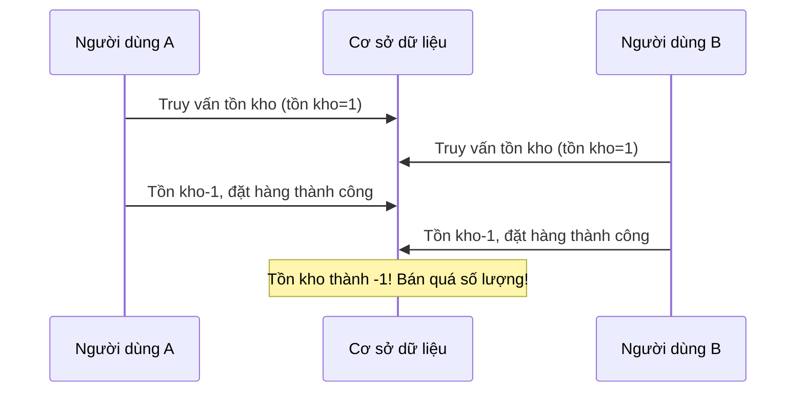
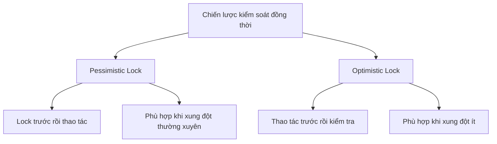
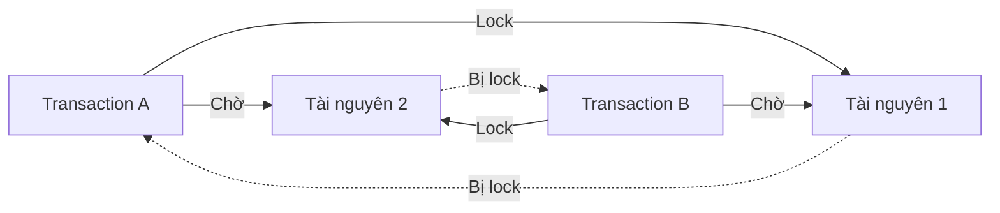

# 4.2.4 Thao tác dữ liệu đồng thời phải làm sao — Kiểm soát đồng thời: Cơ chế lock và phòng tránh deadlock

### Một câu giải thích

Khi nhiều người dùng cùng lúc sửa một dữ liệu, cơ chế lock quyết định ai trước ai sau — hiểu nó có thể giúp bạn tránh dữ liệu hỗn loạn và deadlock.

### Kịch bản vấn đề đồng thời

**Kịch bản**: Tồn kho sản phẩm chỉ còn 1, hai người dùng đặt hàng cùng lúc



### Các loại Lock

| Loại Lock | Giải thích | Trường hợp |
|--------|------|------|
| **Shared Lock** | Nhiều transaction có thể đọc cùng lúc | Truy vấn SELECT |
| **Exclusive Lock** | Chỉ một transaction có thể ghi | UPDATE/DELETE |
| **Row-level Lock** | Chỉ lock hàng cụ thể | Kiểm soát chính xác |
| **Table-level Lock** | Lock toàn bộ bảng | Thao tác hàng loạt |

### Pessimistic Lock vs Optimistic Lock



**Pessimistic Lock**: Giả định chắc chắn sẽ xung đột, lock trước đã

```typescript
// Sử dụng pessimistic lock trong Prisma (cần SQL gốc)
await prisma.$queryRaw`
  SELECT * FROM products WHERE id = ${productId} FOR UPDATE
`
```

**Optimistic Lock**: Giả định không xung đột, kiểm tra version khi cập nhật

```prisma
model Product {
  id        String @id
  stock     Int
  version   Int    @default(0)  // Trường số version
}
```

```typescript
// Cập nhật với optimistic lock
const updated = await prisma.product.updateMany({
  where: {
    id: productId,
    version: currentVersion  // Kiểm tra số version
  },
  data: {
    stock: { decrement: 1 },
    version: { increment: 1 }  // Version+1
  }
})

if (updated.count === 0) {
  throw new Error('Dữ liệu đã bị người khác sửa, vui lòng thử lại')
}
```

### Giải quyết vấn đề bán quá tồn kho

**Phương án một: Ràng buộc cơ sở dữ liệu**

```prisma
model Product {
  id    String @id
  stock Int    // Thêm ràng buộc CHECK: stock >= 0
}
```

```sql
ALTER TABLE products ADD CONSTRAINT stock_non_negative CHECK (stock >= 0);
```

**Phương án hai: Thao tác nguyên tử + Cập nhật có điều kiện**

```typescript
const result = await prisma.product.updateMany({
  where: {
    id: productId,
    stock: { gte: 1 }  // Chỉ cập nhật khi tồn kho >= 1
  },
  data: { stock: { decrement: 1 } }
})

if (result.count === 0) {
  throw new Error('Tồn kho không đủ')
}
```

### Deadlock và cách phòng tránh

**Kịch bản Deadlock**:



Transaction A lock tài nguyên 1, chờ tài nguyên 2; Transaction B lock tài nguyên 2, chờ tài nguyên 1 → Chờ lẫn nhau, deadlock!

**Phương pháp phòng tránh Deadlock**:

1. **Lấy lock theo thứ tự cố định**: Tất cả transaction đều lock tài nguyên 1 trước, sau đó lock tài nguyên 2

2. **Thiết lập timeout lock**: Tự động bỏ cuộc sau khi chờ timeout
   ```typescript
   await prisma.$transaction(
     async (tx) => { /* ... */ },
     { timeout: 5000 }
   )
   ```

3. **Giảm phạm vi và thời gian lock**: Transaction càng ngắn càng tốt

4. **Sử dụng optimistic lock**: Không lock, retry khi xung đột

### Xử lý đồng thời trong Prisma

**Cách làm khuyến nghị**: Sử dụng cập nhật có điều kiện

```typescript
// Trừ tồn kho an toàn
async function decrementStock(productId: string, quantity: number) {
  const result = await prisma.product.updateMany({
    where: {
      id: productId,
      stock: { gte: quantity }
    },
    data: {
      stock: { decrement: quantity }
    }
  })

  if (result.count === 0) {
    throw new Error('Tồn kho không đủ hoặc sản phẩm không tồn tại')
  }

  return result
}
```

### Hướng dẫn tránh lỗi

1. **Không kiểm tra ở tầng ứng dụng rồi mới cập nhật**:
   ```typescript
   // Sai: Có vấn đề đồng thời
   const product = await prisma.product.findUnique({ where: { id } })
   if (product.stock >= 1) {
     await prisma.product.update({ data: { stock: product.stock - 1 } })
   }

   // Đúng: Sử dụng thao tác nguyên tử
   await prisma.product.updateMany({
     where: { id, stock: { gte: 1 } },
     data: { stock: { decrement: 1 } }
   })
   ```

2. **Tránh transaction dài**: Transaction càng dài, giữ lock càng lâu, rủi ro deadlock càng cao

3. **Giám sát deadlock**: PostgreSQL sẽ tự động phát hiện và rollback một transaction trong deadlock

### Tóm tắt phần này

- Kiểm soát đồng thời ngăn dữ liệu hỗn loạn do nhiều người dùng thao tác cùng lúc
- Pessimistic lock lock trước rồi thao tác, Optimistic lock thao tác trước rồi kiểm tra
- Sử dụng cập nhật có điều kiện (updateMany + điều kiện where) là cách khuyến nghị xử lý đồng thời trong Prisma
- Tránh deadlock: Lock theo thứ tự, thiết lập timeout, rút ngắn transaction
