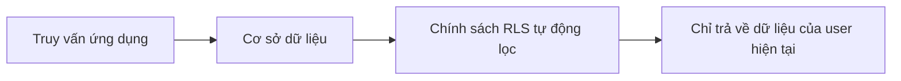
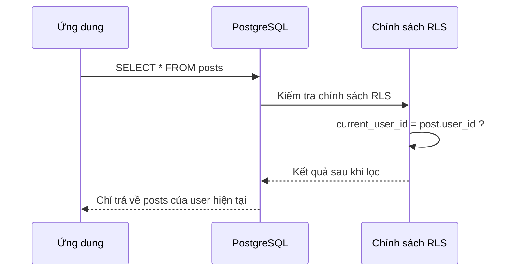

# 4.2.5 Tại sao Trần Anh không xem được dữ liệu của Lý Tứ — Bảo mật cấp hàng: Tính năng an ninh cốt lõi của PostgreSQL

### Một câu giải thích

Row Level Security (RLS - Bảo mật cấp hàng) để cơ sở dữ liệu tự động lọc dữ liệu — người dùng chỉ có thể xem bản ghi thuộc về mình, không cần thêm điều kiện WHERE thủ công trong mỗi truy vấn.

### Tại sao cần RLS?

**Cách làm truyền thống**: Mỗi truy vấn phải thêm lọc người dùng thủ công

```typescript
// Mỗi lần truy vấn phải nhớ thêm điều kiện userId
const posts = await prisma.post.findMany({
  where: { userId: currentUserId }  // Dễ quên!
})
```

**Vấn đề**:
- Developer có thể quên thêm điều kiện lọc
- Một khi thiếu sót, user có thể xem dữ liệu của người khác
- Rủi ro an ninh lớn

**Giải pháp RLS**: Tự động lọc ở tầng cơ sở dữ liệu



### Nguyên lý hoạt động của RLS



### Sử dụng RLS trong Supabase

Supabase tích hợp sẵn hỗ trợ RLS, đây cũng là một trong những lý do khóa học khuyến nghị sử dụng Supabase.

**Bước một: Kích hoạt RLS**

```sql
-- Kích hoạt RLS cho bảng
ALTER TABLE posts ENABLE ROW LEVEL SECURITY;
```

**Bước hai: Tạo chính sách**

```sql
-- User chỉ có thể xem bài viết của mình
CREATE POLICY "Users can view own posts"
ON posts FOR SELECT
USING (user_id = auth.uid());

-- User chỉ có thể tạo bài viết thuộc về mình
CREATE POLICY "Users can create own posts"
ON posts FOR INSERT
WITH CHECK (user_id = auth.uid());

-- User chỉ có thể cập nhật bài viết của mình
CREATE POLICY "Users can update own posts"
ON posts FOR UPDATE
USING (user_id = auth.uid());

-- User chỉ có thể xóa bài viết của mình
CREATE POLICY "Users can delete own posts"
ON posts FOR DELETE
USING (user_id = auth.uid());
```

### Các mẫu chính sách RLS phổ biến

**Mẫu một: Cách ly người dùng**

Mỗi người dùng chỉ có thể truy cập dữ liệu của mình:

```sql
CREATE POLICY "User isolation"
ON user_data FOR ALL
USING (user_id = auth.uid());
```

**Mẫu hai: Công khai + Riêng tư**

Dữ liệu công khai mọi người đều xem được, dữ liệu riêng tư chỉ tác giả xem được:

```sql
CREATE POLICY "Public or own posts"
ON posts FOR SELECT
USING (
  is_public = true
  OR user_id = auth.uid()
);
```

**Mẫu ba: Cách ly tổ chức/nhóm**

Thành viên cùng tổ chức có thể truy cập lẫn nhau:

```sql
CREATE POLICY "Team access"
ON documents FOR SELECT
USING (
  team_id IN (
    SELECT team_id FROM team_members
    WHERE user_id = auth.uid()
  )
);
```

**Mẫu bốn: Quyền vai trò**

Admin có thể truy cập tất cả dữ liệu:

```sql
CREATE POLICY "Admin full access"
ON posts FOR ALL
USING (
  auth.jwt() ->> 'role' = 'admin'
  OR user_id = auth.uid()
);
```

### Kết hợp sử dụng Prisma + Supabase

Mặc dù Prisma không hỗ trợ trực tiếp RLS, nhưng có thể kết hợp với Supabase:

**Phương án một: Dùng Supabase Client truy vấn trực tiếp**

```typescript
import { createClient } from '@supabase/supabase-js'

const supabase = createClient(url, anonKey)

// RLS sẽ tự động có hiệu lực
const { data } = await supabase
  .from('posts')
  .select('*')  // Tự động lọc, chỉ trả về dữ liệu của user hiện tại
```

**Phương án hai: Prisma + Lọc thủ công (dữ liệu không nhạy cảm)**

```typescript
// Đối với dữ liệu không quan trọng về bảo mật, có thể lọc ở tầng ứng dụng
const posts = await prisma.post.findMany({
  where: { userId: session.user.id }
})
```

### RLS vs Lọc tầng ứng dụng

| Đặc tính | RLS | Lọc tầng ứng dụng |
|------|-----|-----------|
| **Bảo mật** | Cưỡng chế thực thi ở tầng database | Phụ thuộc developer không thiếu sót |
| **Hiệu suất** | Tối ưu hóa database | Có thể truy vấn nhiều dữ liệu rồi mới lọc |
| **Độ phức tạp** | Cần học chính sách SQL | Đơn giản trực quan |
| **Tính linh hoạt** | Chính sách cố định | Có thể điều chỉnh động |

**Đề xuất**:
- Dữ liệu nhạy cảm (quyền riêng tư người dùng, dữ liệu tài chính) → Dùng RLS
- Dữ liệu thông thường → Lọc tầng ứng dụng là đủ

### Hướng dẫn tránh lỗi

1. **Quên kích hoạt RLS**: Sau khi tạo bảng nhớ thực thi `ALTER TABLE ... ENABLE ROW LEVEL SECURITY`

2. **Chính sách quá nghiêm ngặt**: Nếu không tạo chính sách nào, sau khi kích hoạt RLS tất cả truy vấn đều trả về rỗng

3. **Server bypass RLS**: Sử dụng service_role key sẽ bỏ qua RLS, chỉ dùng ở backend
   ```typescript
   // Thao tác quản trị backend, bỏ qua RLS
   const adminClient = createClient(url, serviceRoleKey)
   ```

4. **Cân nhắc hiệu suất**: Chính sách RLS phức tạp có thể ảnh hưởng hiệu suất truy vấn, cần tối ưu

### Tóm tắt phần này

- RLS để cơ sở dữ liệu tự động lọc dữ liệu, ngăn rò rỉ dữ liệu
- Supabase tích hợp sẵn hỗ trợ RLS, cấu hình đơn giản
- Chính sách phổ biến: cách ly user, công khai/riêng tư, truy cập nhóm, quyền vai trò
- Dữ liệu nhạy cảm đề nghị dùng RLS, dữ liệu thông thường có thể dùng lọc tầng ứng dụng
