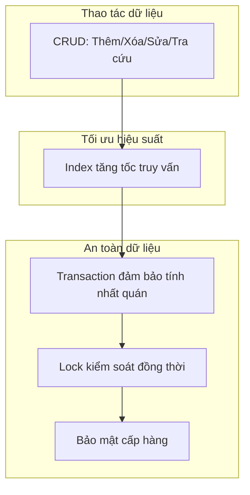
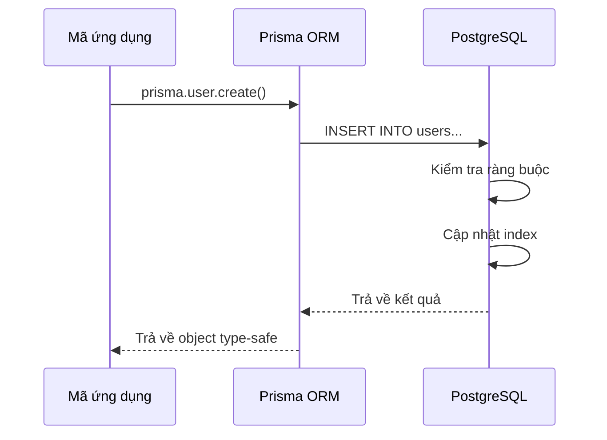

# 4.2 Cơ sở dữ liệu đang bận gì — Cơ sở dữ liệu quan hệ: CRUD/Index/Transaction

### Tái cấu trúc nhận thức

Cơ sở dữ liệu quan hệ không chỉ là "nơi lưu trữ dữ liệu", nó là một **hệ thống đảm bảo tính đúng đắn và nhất quán của dữ liệu**. Hiểu nguyên lý hoạt động của nó có thể giúp bạn viết code hiệu quả và an toàn hơn.

### Các khái niệm cốt lõi của cơ sở dữ liệu quan hệ



| Khái niệm | Vai trò | Vấn đề được giải quyết |
|------|------|------------|
| **CRUD** | Thao tác dữ liệu cơ bản | Làm sao đọc ghi dữ liệu |
| **Index** | Tăng tốc truy vấn | Truy vấn quá chậm phải làm sao |
| **Transaction** | Đảm bảo tính nhất quán | Nhiều bước thao tác làm sao thực thi nguyên tử |
| **Kiểm soát đồng thời** | Xử lý xung đột | Nhiều người thao tác cùng lúc phải làm sao |
| **RLS** | Cách ly dữ liệu | Làm sao hạn chế user chỉ xem dữ liệu của mình |

### Điều hướng chương con

| Chương | Chủ đề | Vấn đề cốt lõi |
|------|------|----------|
| 4.2.1 | Thao tác CRUD | Bản chất của thêm/xóa/sửa/tra cứu là gì? |
| 4.2.2 | Nguyên lý Index | Tại sao thêm index truy vấn lại nhanh? |
| 4.2.3 | Đặc tính Transaction | Tại sao chuyển tiền lại an toàn? |
| 4.2.4 | Kiểm soát đồng thời | Sửa dữ liệu cùng lúc phải làm sao? |
| 4.2.5 | Bảo mật cấp hàng | Tại sao Trần Anh không xem được dữ liệu của Lý Tứ? |

### Tại sao chọn cơ sở dữ liệu quan hệ?

| Đặc tính | Cơ sở dữ liệu quan hệ | NoSQL |
|------|-------------|-------|
| **Cấu trúc dữ liệu** | Bảng có cấu trúc | Document/Key-value linh hoạt |
| **Tính nhất quán dữ liệu** | Nhất quán mạnh (ACID) | Nhất quán cuối cùng |
| **Khả năng truy vấn** | SQL mạnh mẽ | Truy vấn đơn giản |
| **Trường hợp áp dụng** | Ứng dụng giao dịch | Big data/Ứng dụng realtime |

**Lý do khóa học chọn PostgreSQL**:

1. Cơ sở dữ liệu quan hệ mã nguồn mở đầy đủ tính năng nhất
2. Hỗ trợ JSON native, kiêm cả tính linh hoạt
3. Phối hợp tốt nhất với Prisma
4. Tích hợp sẵn Row Level Security (RLS), phù hợp với ứng dụng multi-tenant

### Toàn cảnh thao tác cơ sở dữ liệu



### Hướng dẫn cộng tác với AI

**Ý định cốt lõi**: Để AI giúp bạn hiểu khái niệm cơ sở dữ liệu hoặc tối ưu truy vấn.

**Template đặt câu hỏi thường dùng**:
```
Truy vấn của tôi rất chậm: [code truy vấn]
Cấu trúc bảng là: [cấu trúc bảng]
Lượng dữ liệu khoảng [X] bản ghi
Hãy giúp tôi phân tích nguyên nhân và đưa ra đề xuất tối ưu.
```

**Thuật ngữ quan trọng**: `index`, `transaction`, `ACID`, `lock`, `deadlock`, `RLS`

### Đề xuất học tập

- Nếu bạn chỉ dùng Prisma, có thể xem nhanh phần này, tập trung hiểu khái niệm
- Nếu bạn cần tối ưu hiệu suất, tập trung học 4.2.2 Nguyên lý Index
- Nếu bạn xử lý các thao tác nhạy cảm như thanh toán, tập trung học 4.2.3 Đặc tính Transaction
