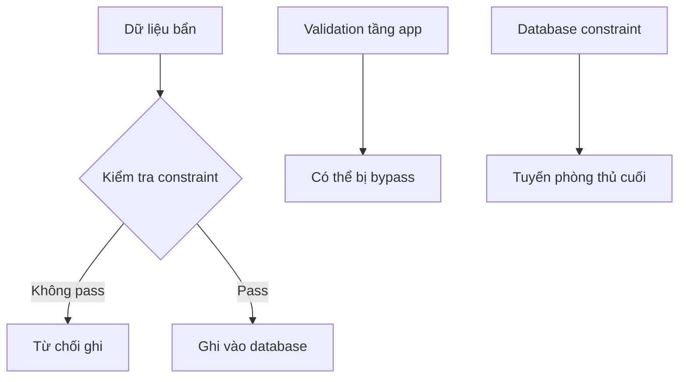

# 4.3.3 Làm sao thiết lập quy tắc cho dữ liệu——Constraint definitions: Primary key/Foreign key/Unique/Check constraints

### Tóm tắt một câu

Constraint là "quy tắc" của database——nó ép buộc business rules ở tầng dữ liệu, ngăn dữ liệu bẩn xâm nhập hệ thống.

### Tổng quan các loại constraint

| Constraint | Vai trò | SQL | Prisma |
|------|------|-----|--------|
| **Primary key** | Định danh duy nhất mỗi row | `PRIMARY KEY` | `@id` |
| **Foreign key** | Liên kết với bảng khác | `FOREIGN KEY` | `@relation` |
| **Unique** | Giá trị không được trùng | `UNIQUE` | `@unique` |
| **Not null** | Giá trị không được NULL | `NOT NULL` | Field không có `?` |
| **Check** | Điều kiện tùy chỉnh | `CHECK` | Cần raw SQL |
| **Default** | Giá trị mặc định khi chưa chỉ định | `DEFAULT` | `@default()` |

### Primary key constraint

**Vai trò**: Định danh duy nhất mỗi row trong bảng

**SQL**:
```sql
CREATE TABLE users (
  id VARCHAR(36) PRIMARY KEY,
  email VARCHAR(255)
);
```

**Prisma**:
```prisma
model User {
  id    String @id @default(cuid())
  email String
}
```

**Đặc điểm của primary key**:
- Phải unique
- Không được NULL
- Một bảng chỉ có một primary key

### Foreign key constraint

**Vai trò**: Đảm bảo tính toàn vẹn dữ liệu liên quan

**SQL**:
```sql
CREATE TABLE posts (
  id VARCHAR(36) PRIMARY KEY,
  author_id VARCHAR(36) REFERENCES users(id)
);
```

**Prisma**:
```prisma
model Post {
  id       String @id
  authorId String
  author   User   @relation(fields: [authorId], references: [id])
}
```

**Tùy chọn hành vi foreign key**:

| Hành vi | Giải thích | Prisma |
|------|------|--------|
| **CASCADE** | Xóa record cha, record con cũng xóa theo | `onDelete: Cascade` |
| **SET NULL** | Xóa record cha, foreign key record con set NULL | `onDelete: SetNull` |
| **RESTRICT** | Cấm xóa record cha khi còn record con | `onDelete: Restrict` |

```prisma
model Post {
  id       String @id
  authorId String
  author   User   @relation(fields: [authorId], references: [id], onDelete: Cascade)
}
```

### Unique constraint

**Vai trò**: Đảm bảo giá trị field không trùng lặp

**SQL**:
```sql
CREATE TABLE users (
  id VARCHAR(36) PRIMARY KEY,
  email VARCHAR(255) UNIQUE
);
```

**Prisma**:
```prisma
model User {
  id    String @id
  email String @unique
}
```

**Composite unique constraint**: Nhiều field kết hợp unique
```prisma
model TeamMember {
  id     String @id
  userId String
  teamId String

  @@unique([userId, teamId])  // Một user trong một team chỉ có một record
}
```

### Not null constraint

**Vai trò**: Field không được để trống

**SQL**:
```sql
CREATE TABLE users (
  id VARCHAR(36) PRIMARY KEY,
  email VARCHAR(255) NOT NULL
);
```

**Prisma**:
```prisma
model User {
  id    String @id
  email String      // Không có ? là NOT NULL
  name  String?     // Có ? là có thể NULL
}
```

### Check constraint

**Vai trò**: Quy tắc validation dữ liệu tùy chỉnh

**SQL**:
```sql
CREATE TABLE products (
  id VARCHAR(36) PRIMARY KEY,
  price DECIMAL(10,2) CHECK (price > 0),
  stock INTEGER CHECK (stock >= 0)
);
```

**Prisma không hỗ trợ trực tiếp, cần dùng raw SQL**:
```sql
ALTER TABLE products ADD CONSTRAINT price_positive CHECK (price > 0);
```

### Default value constraint

**Vai trò**: Giá trị mặc định khi chưa chỉ định

**SQL**:
```sql
CREATE TABLE users (
  id VARCHAR(36) PRIMARY KEY,
  status VARCHAR(20) DEFAULT 'ACTIVE',
  created_at TIMESTAMP DEFAULT CURRENT_TIMESTAMP
);
```

**Prisma**:
```prisma
model User {
  id        String   @id @default(cuid())
  status    String   @default("ACTIVE")
  createdAt DateTime @default(now())
}
```

### Giá trị của constraint



**Tại sao cần dùng constraint**:
1. Validation tầng app có thể bị bypass (API call trực tiếp, SQL injection)
2. Database constraint là tuyến phòng thủ cuối cùng
3. Constraint cung cấp error message tốt hơn

### Tóm tắt chương này

- Constraint ép buộc quy tắc ở tầng database
- Primary key định danh record, foreign key đảm bảo tính toàn vẹn liên quan
- Unique constraint ngăn trùng lặp, check constraint tùy chỉnh quy tắc
- Validation tầng app + database constraint = bảo vệ kép
