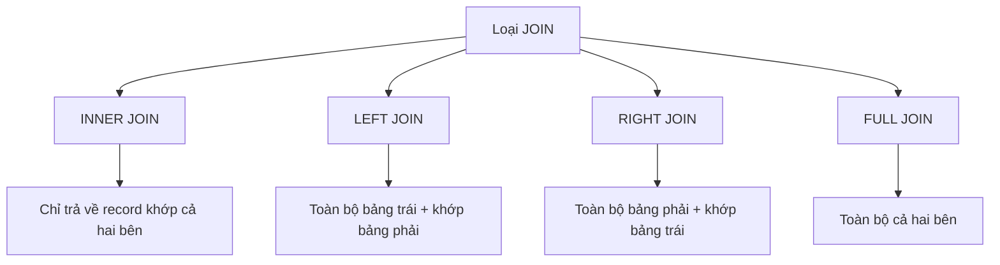

# 4.3.4 Làm sao liên kết nhiều bảng——JOIN queries: INNER/LEFT/RIGHT/FULL JOIN

### Tóm tắt một câu

JOIN "ghép" nhiều bảng lại với nhau để truy vấn——khi dữ liệu nằm rải rác ở các bảng khác nhau, đây là cách duy nhất để lấy thông tin đầy đủ.

### Tại sao cần JOIN?

**Tình huống**: Truy vấn danh sách bài viết, cần hiển thị tên tác giả

```
posts table              users table
┌────┬────────────┐   ┌────┬──────┐
│ id │ author_id  │   │ id │ name │
├────┼────────────┤   ├────┼──────┤
│ 1  │ u1         │   │ u1 │ John │
│ 2  │ u2         │   │ u2 │ Mary │
└────┴────────────┘   └────┴──────┘

Kết quả cần có:
┌────┬────────────┬──────┐
│ id │ author_id  │ name │
├────┼────────────┼──────┤
│ 1  │ u1         │ John │
│ 2  │ u2         │ Mary │
└────┴────────────┴──────┘
```

### Tổng quan các loại JOIN



### INNER JOIN: Inner join

**Chỉ trả về record khớp cả hai bên**

```sql
SELECT posts.id, posts.title, users.name
FROM posts
INNER JOIN users ON posts.author_id = users.id;
```

```
posts          users          Kết quả
┌──┬────┐     ┌──┬────┐     ┌──┬──────┬────┐
│1 │ u1 │     │u1│John│  →  │1 │title1│John│
│2 │ u2 │     │u2│Mary│     │2 │title2│Mary│
│3 │ u9 │     └──┴────┘     └──┴──────┴────┘
└──┴────┘     (u9 không tồn tại, nên post 3 không có trong kết quả)
```

### LEFT JOIN: Left join

**Toàn bộ bảng trái + record khớp bảng phải (không khớp thì NULL)**

```sql
SELECT posts.id, posts.title, users.name
FROM posts
LEFT JOIN users ON posts.author_id = users.id;
```

```
posts          users          Kết quả
┌──┬────┐     ┌──┬────┐     ┌──┬──────┬────┐
│1 │ u1 │     │u1│John│  →  │1 │title1│John│
│2 │ u2 │     │u2│Mary│     │2 │title2│Mary│
│3 │ u9 │     └──┴────┘     │3 │title3│NULL│
└──┴────┘                   └──┴──────┴────┘
                            (Dù u9 không tồn tại, post 3 vẫn giữ lại)
```

**Loại JOIN thường dùng nhất**, đảm bảo dữ liệu bảng trái đầy đủ.

### RIGHT JOIN: Right join

**Toàn bộ bảng phải + record khớp bảng trái**

```sql
SELECT posts.id, users.name
FROM posts
RIGHT JOIN users ON posts.author_id = users.id;
```

Thực tế ít dùng, thường thay bằng LEFT JOIN đổi thứ tự bảng.

### FULL JOIN: Full join

**Toàn bộ record cả hai bên, không khớp thì NULL**

```sql
SELECT posts.id, users.name
FROM posts
FULL JOIN users ON posts.author_id = users.id;
```

Trường hợp sử dụng khá ít.

### JOIN trong Prisma

Prisma dùng `include` để thực hiện JOIN:

```typescript
// Tương đương LEFT JOIN
const posts = await prisma.post.findMany({
  include: {
    author: true  // Tự động JOIN bảng users
  }
})

// Kết quả
// { id: '1', title: 'xxx', author: { id: 'u1', name: 'John' } }
```

**Nested nhiều cấp**:
```typescript
const posts = await prisma.post.findMany({
  include: {
    author: true,
    comments: {
      include: {
        author: true
      }
    }
  }
})
```

### Lưu ý hiệu năng JOIN

1. **Đảm bảo field liên kết có index**: Foreign key thường tự động tạo index

2. **Tránh quá nhiều JOIN**: JOIN quá nhiều sẽ ảnh hưởng hiệu năng
   ```sql
   -- Không khuyến khích: Quá nhiều JOIN
   SELECT * FROM posts
   JOIN users ON ...
   JOIN comments ON ...
   JOIN likes ON ...
   JOIN categories ON ...
   ```

3. **Chỉ chọn field cần thiết**:
   ```typescript
   const posts = await prisma.post.findMany({
     select: {
       id: true,
       title: true,
       author: {
         select: { name: true }  // Chỉ lấy name
       }
     }
   })
   ```

### Tóm tắt chương này

- JOIN dùng để liên kết nhiều bảng truy vấn
- LEFT JOIN thường dùng nhất, đảm bảo dữ liệu bảng trái đầy đủ
- Prisma dùng `include` để thực hiện JOIN
- Chú ý ảnh hưởng hiệu năng JOIN, đảm bảo có index
