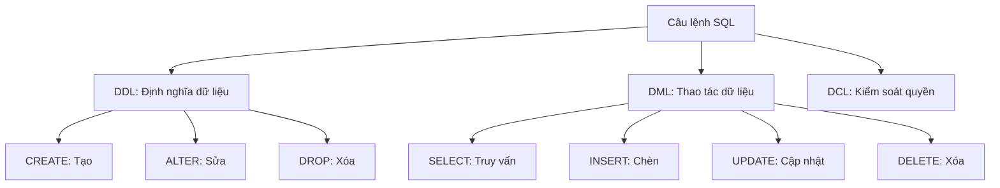

# 4.3 Làm sao ra lệnh cho cơ sở dữ liệu — Thao tác SQL cơ bản: Bảng/Hàng/Cột, Khóa chính/Khóa ngoại, Index, Transaction, JOIN, CRUD

### Tái cấu trúc nhận thức

SQL (Structured Query Language) là ngôn ngữ để đối thoại với cơ sở dữ liệu. Mặc dù Prisma đã giúp chúng ta tạo ra phần lớn SQL, nhưng hiểu cơ bản về SQL có thể giúp bạn debug tốt hơn và tối ưu hiệu suất.

### Phân loại câu lệnh SQL



| Phân loại | Giải thích | Câu lệnh thường dùng |
|------|------|----------|
| **DDL** | Định nghĩa cấu trúc cơ sở dữ liệu | CREATE, ALTER, DROP |
| **DML** | Thao tác dữ liệu | SELECT, INSERT, UPDATE, DELETE |
| **DCL** | Kiểm soát quyền | GRANT, REVOKE |

### Điều hướng chương con

| Chương | Chủ đề | Vấn đề cốt lõi |
|------|------|----------|
| 4.3.1 | DDL: Định nghĩa dữ liệu | Làm sao tạo và sửa cấu trúc bảng? |
| 4.3.2 | DML: Thao tác dữ liệu | Làm sao thêm/xóa/sửa/tra cứu dữ liệu? |
| 4.3.3 | Định nghĩa ràng buộc | Làm sao đảm bảo chất lượng dữ liệu? |
| 4.3.4 | Truy vấn JOIN | Làm sao liên kết nhiều bảng? |
| 4.3.5 | Hàm tổng hợp | Làm sao thống kê và tổng hợp dữ liệu? |

### Đối chiếu SQL vs Prisma

| Thao tác | SQL | Prisma |
|------|-----|--------|
| Tạo bảng | `CREATE TABLE` | `prisma migrate dev` |
| Chèn | `INSERT INTO` | `prisma.model.create()` |
| Truy vấn | `SELECT` | `prisma.model.findMany()` |
| Cập nhật | `UPDATE` | `prisma.model.update()` |
| Xóa | `DELETE` | `prisma.model.delete()` |
| Truy vấn quan hệ | `JOIN` | `include: {}` |

### Đề xuất học tập

**Nếu bạn chỉ dùng Prisma**:
- Xem nhanh phần này, hiểu khái niệm cơ bản về SQL
- Tập trung học khái niệm JOIN (4.3.4) và hàm tổng hợp (4.3.5)

**Nếu bạn cần viết SQL gốc**:
- Học kỹ từng chương con
- Thực hành thực thi SQL gốc trong Prisma

### Thực thi SQL gốc trong Prisma

```typescript
// Thực thi truy vấn gốc
const result = await prisma.$queryRaw`
  SELECT * FROM users WHERE email LIKE '%@gmail.com'
`

// Thực thi lệnh gốc (không có giá trị trả về)
await prisma.$executeRaw`
  UPDATE users SET status = 'ACTIVE' WHERE last_login > NOW() - INTERVAL '30 days'
`
```

### Hướng dẫn cộng tác với AI

**Ý định cốt lõi**: Để AI giúp bạn tạo hoặc giải thích SQL.

**Template đặt câu hỏi thường dùng**:
```
Giúp tôi viết truy vấn SQL:
- Cấu trúc bảng: [cấu trúc bảng]
- Yêu cầu: [yêu cầu truy vấn]
- Cơ sở dữ liệu: PostgreSQL
```

```
Câu lệnh SQL này nghĩa là gì? Hãy giải thích bằng tiếng Việt:
[Câu lệnh SQL]
```
