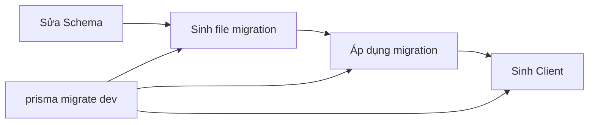

# 4.4.5 Migration và sinh type: db:generate / db:migrate

### Tóm tắt trong một câu

Migration là "version control" cho database — nó ghi lại mỗi lần thay đổi cấu trúc, giúp bạn phát triển database một cách an toàn.

### Quy trình Migration



### Migration trong môi trường development

**Tạo và áp dụng migration**:

```bash
npx prisma migrate dev --name init
```

Lệnh này sẽ:
1. Phát hiện thay đổi Schema
2. Sinh file SQL migration
3. Áp dụng migration vào database
4. Tạo lại Prisma Client

**Cấu trúc file migration**:

```
prisma/
├── migrations/
│   ├── 20240101120000_init/
│   │   └── migration.sql
│   ├── 20240102130000_add_posts/
│   │   └── migration.sql
│   └── migration_lock.toml
└── schema.prisma
```

**Xem nội dung file migration**:

```sql
-- 20240101120000_init/migration.sql
CREATE TABLE "User" (
    "id" TEXT NOT NULL,
    "email" TEXT NOT NULL,
    "name" TEXT,
    "createdAt" TIMESTAMP(3) NOT NULL DEFAULT CURRENT_TIMESTAMP,

    CONSTRAINT "User_pkey" PRIMARY KEY ("id")
);

CREATE UNIQUE INDEX "User_email_key" ON "User"("email");
```

### Sinh Prisma Client

```bash
npx prisma generate
```

**Khi nào cần chạy**:
- Sau khi sửa schema.prisma
- Sau khi cài dependencies (kết hợp với script `postinstall`)
- Khi build CI/CD

**Cấu hình tự động sinh**:

```json
// package.json
{
  "scripts": {
    "postinstall": "prisma generate"
  }
}
```

### db push vs migrate

| Lệnh | Mục đích | Tình huống |
|------|------|------|
| `prisma db push` | Đồng bộ trực tiếp Schema lên database | Prototype, iterating nhanh |
| `prisma migrate dev` | Sinh file migration rồi áp dụng | Development chính thức, làm việc nhóm |

```bash
# Giai đoạn prototype: Iterating nhanh, không sinh file migration
npx prisma db push

# Development chính thức: Sinh file migration, ghi lại lịch sử thay đổi
npx prisma migrate dev --name add_user_role
```

### Migration trong môi trường production

```bash
# Chỉ áp dụng các file migration có sẵn, không sinh mới
npx prisma migrate deploy
```

**Ví dụ cấu hình CI/CD**:

```yaml
# .github/workflows/deploy.yml
- name: Apply migrations
  run: npx prisma migrate deploy
  env:
    DATABASE_URL: ${{ secrets.DATABASE_URL }}
```

### Quản lý trạng thái migration

**Xem trạng thái migration**:

```bash
npx prisma migrate status
```

**Reset database** (môi trường development):

```bash
# Xóa tất cả dữ liệu, áp dụng lại tất cả migration
npx prisma migrate reset
```

::: danger Cảnh báo
`migrate reset` sẽ xóa tất cả dữ liệu! Chỉ dùng trong môi trường development.
:::

### Xử lý conflict migration

**Tình huống**: Các thành viên team đồng thời sửa Schema

```bash
# 1. Pull code mới nhất
git pull

# 2. Áp dụng migration của người khác
npx prisma migrate dev

# 3. Nếu có conflict, giải quyết thủ công rồi migrate lại
npx prisma migrate dev --name resolve_conflict
```

### Migration tùy chỉnh

**Tạo migration rỗng** (để viết SQL thủ công):

```bash
npx prisma migrate dev --create-only --name custom_migration
```

Sau đó chỉnh sửa file `migration.sql` được sinh ra:

```sql
-- Thêm SQL tùy chỉnh
ALTER TABLE "User" ADD CONSTRAINT "email_format"
CHECK (email ~* '^[A-Za-z0-9._%+-]+@[A-Za-z0-9.-]+\.[A-Za-z]{2,}$');
```

Rồi áp dụng:

```bash
npx prisma migrate dev
```

### Bảng tra cứu nhanh các lệnh thường dùng

| Lệnh | Công dụng |
|------|------|
| `prisma migrate dev` | Development: Sinh và áp dụng migration |
| `prisma migrate deploy` | Production: Áp dụng migration |
| `prisma migrate reset` | Reset database |
| `prisma migrate status` | Xem trạng thái migration |
| `prisma db push` | Đồng bộ trực tiếp Schema |
| `prisma generate` | Sinh Prisma Client |
| `prisma db pull` | Sinh Schema từ database |

### Hướng dẫn tránh lỗi

1. **Không sửa file migration đã áp dụng thủ công**: Sẽ dẫn đến trạng thái không nhất quán

2. **File migration phải commit vào Git**: Đảm bảo cấu trúc database của team nhất quán

3. **Production chỉ dùng `migrate deploy`**: Không chạy `migrate dev` trong production

4. **Migration lớn nên thực hiện từng phần**: Tránh lock table quá lâu

### Tóm tắt phần này

- `prisma migrate dev` dùng cho môi trường development migration
- `prisma migrate deploy` dùng để deploy production
- File migration cần commit vào version control
- `prisma generate` sinh Client có type-safety
