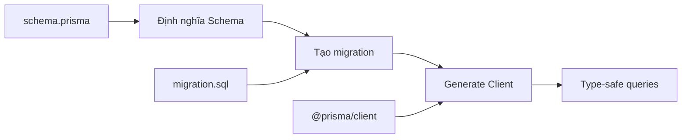
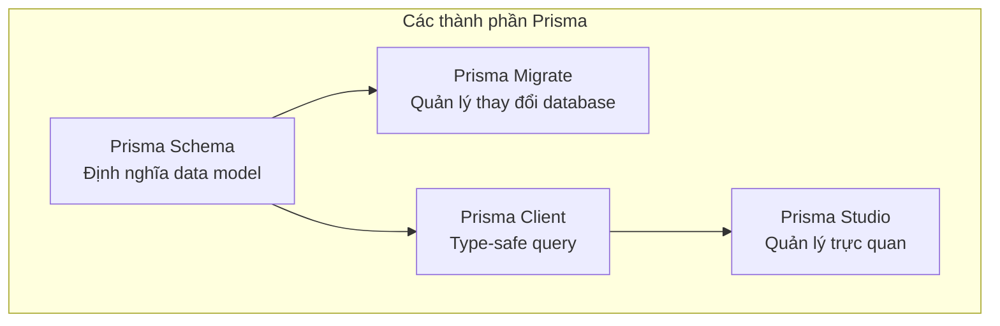

# 4.4 Tạm biệt SQL thủ công——Prisma thực chiến ứng dụng

### Chuyển đổi nhận thức

Prisma là ORM ưu tiên hàng đầu cho dự án TypeScript hiện đại——nó thay thế SQL thủ công bằng type-safe API, khiến thao tác database trở nên đơn giản, an toàn và dễ maintain.

### Tại sao chọn Prisma?

| Tính năng | Prisma | ORM truyền thống | Raw SQL |
|------|--------|----------|----------|
| **Type safety** | Hoàn toàn type-safe | Hỗ trợ một phần | Không |
| **Chi phí học** | Thấp | Trung bình | Cao |
| **Quản lý migration** | Tích hợp sẵn | Cần cấu hình | Thủ công |
| **Hiệu năng query** | Xuất sắc | Bình thường | Tốt nhất |
| **Developer experience** | Tuyệt vời | Bình thường | Kém |

### Workflow của Prisma



### Điều hướng chương con

| Chương | Chủ đề | Câu hỏi cốt lõi |
|------|------|----------|
| 4.4.1 | Cài đặt cấu hình | Làm sao khởi tạo dự án Prisma? |
| 4.4.2 | Cấu trúc Schema | File schema.prisma viết như thế nào? |
| 4.4.3 | Định nghĩa model | Làm sao định nghĩa bảng và quan hệ? |
| 4.4.4 | Kết nối database | Làm sao cấu hình kết nối database? |
| 4.4.5 | Quản lý migration | Làm sao quản lý thay đổi database? |
| 4.4.6 | Seed data | Làm sao khởi tạo test data? |
| 4.4.7 | Thực hành modeling | Dự án thực tế thiết kế model như thế nào? |
| 4.4.8 | Tối ưu query | Làm sao tối ưu Prisma query? |
| 4.4.9 | Xử lý transaction | Làm sao đảm bảo tính nhất quán dữ liệu? |

### Khái niệm cốt lõi Prisma



### Trải nghiệm nhanh

```bash
# 1. Cài đặt
npm install prisma @prisma/client

# 2. Khởi tạo
npx prisma init

# 3. Định nghĩa model (schema.prisma)
# 4. Tạo migration
npx prisma migrate dev --name init

# 5. Sử dụng
```

```typescript
import { PrismaClient } from '@prisma/client'
const prisma = new PrismaClient()

// Query hoàn toàn type-safe
const users = await prisma.user.findMany({
  where: { status: 'ACTIVE' },
  include: { posts: true }
})
```

### Hướng dẫn cộng tác AI

**Ý định cốt lõi**: Để AI giúp generate Prisma Schema hoặc query code.

**Template câu hỏi thường dùng**:
```
Giúp tôi viết Prisma Schema:
- Yêu cầu: [mô tả business requirement]
- Bảng: [các bảng cần thiết]
- Quan hệ: [quan hệ giữa các bảng]
```

```
Giúp tôi viết Prisma query:
- Model: [model liên quan]
- Yêu cầu: [yêu cầu query]
- Điều kiện: [điều kiện filter]
```

### Đề xuất lộ trình học

**Người mới**: 4.4.1 → 4.4.2 → 4.4.3 → 4.4.5 → 4.4.6
**Nâng cao**: 4.4.4 → 4.4.7 → 4.4.8 → 4.4.9
