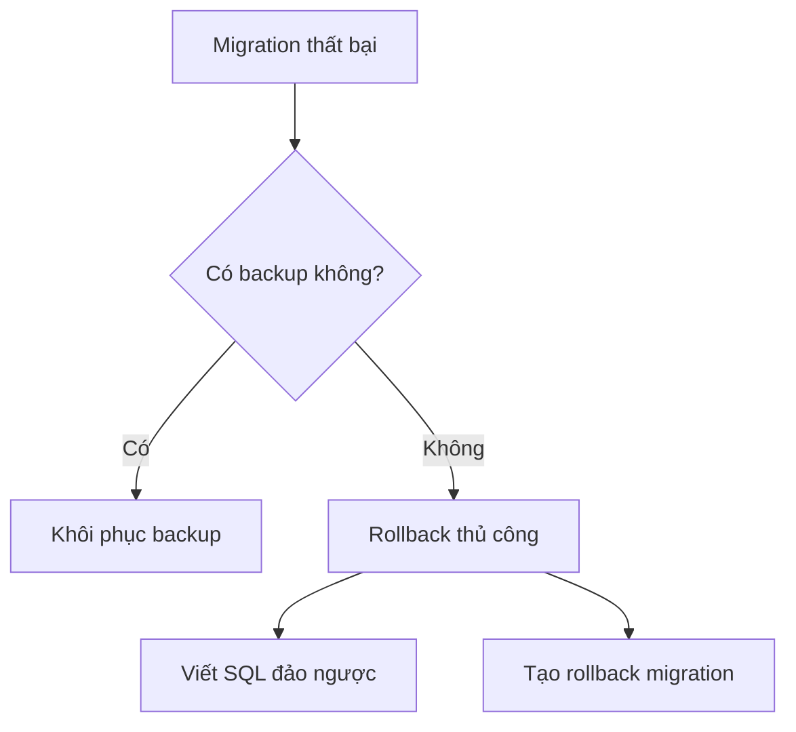

# 4.5.2 Phẫu thuật thất bại thì làm gì — Cơ chế Rollback: Phương án phục hồi khi Migration thất bại

### Phá đề một câu

Prisma không có lệnh rollback tự động — bạn cần tự chuẩn bị rollback script hoặc khôi phục từ backup.

### Chiến lược Rollback



### Biện pháp phòng ngừa: Backup

**Backup PostgreSQL**:
```bash
# Backup
pg_dump -U postgres -d myapp > backup_$(date +%Y%m%d_%H%M%S).sql

# Khôi phục
psql -U postgres -d myapp < backup_20240101_120000.sql
```

**Backup Supabase**:
- Tự động backup hàng ngày (gói Pro)
- Backup thủ công: Dashboard → Database → Backups

### Phương án Rollback 1: Khôi phục backup

```bash
# 1. Dừng ứng dụng
pm2 stop all

# 2. Khôi phục database
psql -U postgres -d myapp < backup.sql

# 3. Rollback phiên bản code
git checkout <previous-commit>

# 4. Deploy lại
npm run deploy
```

### Phương án Rollback 2: Rollback migration thủ công

**Tạo migration đảo ngược**:

Giả sử migration gốc là thêm trường:
```sql
-- Migration gốc
ALTER TABLE users ADD COLUMN avatar TEXT;
```

Tạo rollback migration:
```bash
npx prisma migrate dev --create-only --name rollback_avatar
```

Chỉnh sửa SQL đã tạo:
```sql
-- Rollback migration
ALTER TABLE users DROP COLUMN avatar;
```

Áp dụng rollback:
```bash
npx prisma migrate deploy
```

### Phương án Rollback 3: Đánh dấu migration thất bại

Nếu migration thực thi một nửa rồi thất bại:

```bash
# Đánh dấu migration đã được rollback
npx prisma migrate resolve --rolled-back "20240101120000_failed_migration"
```

Sau đó sửa migration file và thực thi lại.

### Mô hình Migration an toàn

**Migration theo từng giai đoạn** (tránh thay đổi phá vỡ):

```
Giai đoạn 1: Thêm trường mới (nullable)
Giai đoạn 2: Data migration
Giai đoạn 3: Đặt giá trị mặc định/ràng buộc NOT NULL
Giai đoạn 4: Xóa trường cũ
```

**Ví dụ: Đổi tên trường**

```sql
-- Giai đoạn 1: Thêm trường mới
ALTER TABLE users ADD COLUMN full_name TEXT;

-- Giai đoạn 2: Data migration
UPDATE users SET full_name = name;

-- Giai đoạn 3: Xóa trường cũ (migration tiếp theo)
ALTER TABLE users DROP COLUMN name;
```

### Nguyên nhân thất bại Migration thường gặp

| Nguyên nhân | Giải pháp |
|------|----------|
| Dữ liệu không phù hợp với ràng buộc mới | Dọn dẹp dữ liệu trước khi migration |
| Lock bảng timeout | Thực thi vào giờ thấp điểm |
| Hết dung lượng ổ đĩa | Dọn dẹp hoặc mở rộng dung lượng |
| Không đủ quyền | Kiểm tra quyền user database |

### Checklist Rollback

- [ ] Đã backup database trước khi migration
- [ ] Đã chuẩn bị rollback SQL script
- [ ] Đã ghi lại phiên bản ứng dụng hiện tại
- [ ] Đã thông báo cho các bên liên quan
- [ ] Đã chuẩn bị các bước xác minh sau rollback

### Tóm tắt phần này

- Prisma không có tự động rollback, cần chuẩn bị thủ công
- Bắt buộc phải backup trước khi migration production
- Chia các thay đổi lớn thành nhiều migration nhỏ
- Chuẩn bị sẵn rollback script và các bước xác minh
