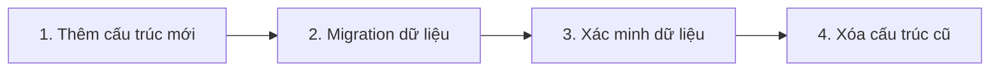

# 4.5.3 Khi đổi cấu trúc bảng thì dữ liệu ra sao — Data Migration: Xử lý dữ liệu khi thay đổi cấu trúc

### Phá đề một câu

Data migration là phần mở rộng của schema migration — không chỉ thay đổi cấu trúc bảng, mà còn đảm bảo dữ liệu hiện có được chuyển đổi đúng sang cấu trúc mới.

### Các tình huống Data Migration thường gặp

| Tình huống | Thách thức | Giải pháp |
|------|------|----------|
| Thêm trường NOT NULL | Dữ liệu hiện có không có giá trị | Đặt giá trị mặc định hoặc điền dữ liệu trước |
| Đổi tên trường | Cần sao chép dữ liệu | Thêm trường mới → Copy dữ liệu → Xóa trường cũ |
| Tách bảng | Cần phân phối dữ liệu | Tạo bảng mới → Migration dữ liệu → Thiết lập mối quan hệ |
| Gộp bảng | Cần tích hợp dữ liệu | Tạo bảng mới → Gộp dữ liệu → Xóa bảng cũ |

### Tình huống 1: Thêm trường NOT NULL

**Vấn đề**: Dữ liệu hiện có không có giá trị cho trường mới

```prisma
model User {
  id    String @id
  email String
  role  String // Trường NOT NULL mới thêm
}
```

**Giải pháp**: Migration theo từng bước

```bash
# Bước 1: Thêm trường nullable
npx prisma migrate dev --create-only --name add_role_nullable
```

```sql
-- migration.sql
ALTER TABLE "User" ADD COLUMN "role" TEXT;
```

```bash
# Bước 2: Điền dữ liệu
npx prisma migrate dev --create-only --name fill_role_data
```

```sql
-- migration.sql
UPDATE "User" SET "role" = 'USER' WHERE "role" IS NULL;
```

```bash
# Bước 3: Đặt ràng buộc NOT NULL
npx prisma migrate dev --create-only --name make_role_required
```

```sql
-- migration.sql
ALTER TABLE "User" ALTER COLUMN "role" SET NOT NULL;
```

### Tình huống 2: Đổi tên trường

```sql
-- Bước 1: Thêm trường mới
ALTER TABLE "User" ADD COLUMN "fullName" TEXT;

-- Bước 2: Copy dữ liệu
UPDATE "User" SET "fullName" = "name";

-- Bước 3: Xóa trường cũ (tùy chọn, migration tiếp theo)
ALTER TABLE "User" DROP COLUMN "name";
```

### Tình huống 3: Tách quan hệ một-nhiều

Tách mảng addresses trong bảng User thành bảng Address độc lập:

```sql
-- Bước 1: Tạo bảng mới
CREATE TABLE "Address" (
  "id" TEXT PRIMARY KEY,
  "userId" TEXT NOT NULL REFERENCES "User"("id"),
  "street" TEXT,
  "city" TEXT
);

-- Bước 2: Migration dữ liệu (xử lý ở tầng ứng dụng)
-- Cần viết script để duyệt qua User.addresses và insert vào bảng Address

-- Bước 3: Xóa trường cũ
ALTER TABLE "User" DROP COLUMN "addresses";
```

### Viết script Data Migration

```typescript
// scripts/migrate-data.ts
import { PrismaClient } from '@prisma/client'

const prisma = new PrismaClient()

async function migrateUserRoles() {
  const users = await prisma.user.findMany({
    where: { role: null }
  })

  console.log(`Tìm thấy ${users.length} users không có role`)

  for (const user of users) {
    await prisma.user.update({
      where: { id: user.id },
      data: { role: 'USER' }
    })
  }

  console.log('Migration hoàn thành')
}

migrateUserRoles()
  .catch(console.error)
  .finally(() => prisma.$disconnect())
```

Chạy script:
```bash
npx tsx scripts/migrate-data.ts
```

### Chiến lược Migration dữ liệu lớn

**Xử lý theo batch**:
```typescript
async function batchMigrate() {
  const batchSize = 1000
  let processed = 0

  while (true) {
    const users = await prisma.user.findMany({
      where: { role: null },
      take: batchSize
    })

    if (users.length === 0) break

    await prisma.user.updateMany({
      where: { id: { in: users.map(u => u.id) } },
      data: { role: 'USER' }
    })

    processed += users.length
    console.log(`Đã xử lý ${processed} users`)
  }
}
```

### Đề xuất thứ tự Migration



### Xác minh Data Migration

```typescript
async function verifyMigration() {
  const nullRoleCount = await prisma.user.count({
    where: { role: null }
  })

  if (nullRoleCount > 0) {
    throw new Error(`Vẫn còn ${nullRoleCount} users không có role`)
  }

  console.log('Xác minh thành công!')
}
```

### Tóm tắt phần này

- Data migration thường cần thực thi theo nhiều bước
- Thêm trường NOT NULL: nullable trước → điền dữ liệu → đặt NOT NULL
- Đổi tên trường: thêm mới → copy dữ liệu → xóa cũ
- Dữ liệu lớn nên xử lý theo batch
- Bắt buộc phải xác minh dữ liệu sau migration
