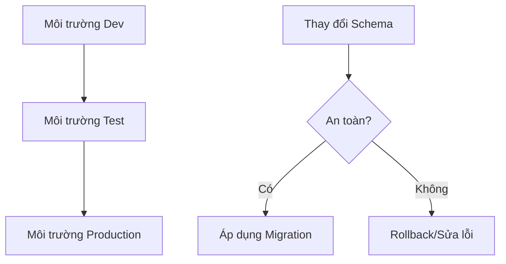

# 4.5 Phẫu thuật trên database production — Chiến lược Migration: Quản lý thay đổi trên môi trường production

### Tái cấu trúc nhận thức

Thay đổi database trên môi trường production giống như thay động cơ cho máy bay đang bay — cần chiến lược cực kỳ cẩn thận và chuẩn bị kỹ lưỡng.

### Tại sao Migration lại quan trọng?



**Hậu quả khi Migration thất bại**:
- Dịch vụ bị gián đoạn
- Mất dữ liệu
- Người dùng rời bỏ

### Điều hướng các chương con

| Chương | Chủ đề | Vấn đề cốt lõi |
|------|------|----------|
| 4.5.1 | Đồng bộ môi trường | Làm thế nào đảm bảo các môi trường dev/test/production nhất quán? |
| 4.5.2 | Cơ chế Rollback | Khi migration thất bại thì phục hồi như thế nào? |
| 4.5.3 | Data Migration | Khi thay đổi cấu trúc bảng thì xử lý dữ liệu ra sao? |

### Nguyên tắc cơ bản của Migration

1. **Backup trước**: Bắt buộc phải backup trước khi migration trên production
2. **Test trước**: Xác minh migration script trong môi trường test
3. **Từng bước nhỏ**: Chia các thay đổi lớn thành nhiều migration nhỏ
4. **Có thể Rollback**: Mỗi migration đều phải có phương án rollback

### Quy trình Migration của Prisma

**Môi trường Development**:
```bash
npx prisma migrate dev --name add_user_role
```

**Môi trường Production**:
```bash
npx prisma migrate deploy
```

| Lệnh | Môi trường | Tác dụng |
|------|------|------|
| `migrate dev` | Development | Tạo và áp dụng migration |
| `migrate deploy` | Production | Chỉ áp dụng migration đã có |
| `migrate reset` | Development | Reset database |

### Checklist trước khi Migration

- [ ] Đã test migration trên local
- [ ] Đã xác minh trên môi trường test
- [ ] Đã backup database production
- [ ] Đã hiểu thời gian thực thi ước tính của migration
- [ ] Đã chuẩn bị phương án rollback
- [ ] Đã lên lịch thực thi vào giờ thấp điểm

### Tóm tắt chương này

- Migration production cần chiến lược cẩn thận
- Sử dụng `migrate deploy` để triển khai môi trường production
- Luôn backup trước, test trước
- Chuẩn bị phương án rollback để đối phó với thất bại
