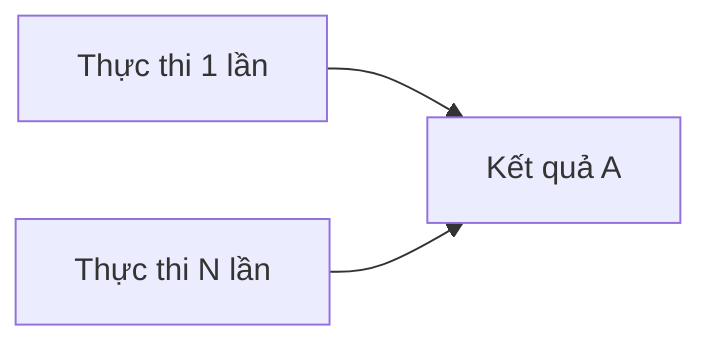

# 4.6.1 Chạy lặp lại cũng không sợ — Đa môi trường và Idempotency trong tạo dữ liệu

### Phá đề một câu

Cốt lõi của seed script có tính Idempotency là "dù thực thi bao nhiêu lần, kết quả đều giống nhau" — không tạo trùng lặp, cũng không báo lỗi thất bại.

### Idempotency là gì?



**Script không có Idempotency**: Mỗi lần chạy đều tạo dữ liệu mới, dẫn đến dữ liệu phình to hoặc lỗi unique constraint

**Script có Idempotency**: Đã tồn tại thì bỏ qua hoặc cập nhật, chưa tồn tại thì tạo

### Ba cách triển khai Idempotency

#### Cách 1: upsert (Khuyến nghị)

```typescript
await prisma.user.upsert({
  where: { email: 'admin@example.com' },
  update: { name: 'Admin User' },  // Đã tồn tại thì cập nhật
  create: {                        // Chưa tồn tại thì tạo
    email: 'admin@example.com',
    name: 'Admin User',
    role: 'ADMIN'
  }
})
```

#### Cách 2: createMany + skipDuplicates

```typescript
await prisma.user.createMany({
  data: [
    { email: 'user1@example.com', name: 'User 1' },
    { email: 'user2@example.com', name: 'User 2' }
  ],
  skipDuplicates: true  // Bỏ qua các record đã tồn tại
})
```

#### Cách 3: Query trước rồi quyết định

```typescript
const existingUser = await prisma.user.findUnique({
  where: { email: 'admin@example.com' }
})

if (!existingUser) {
  await prisma.user.create({
    data: { email: 'admin@example.com', name: 'Admin' }
  })
}
```

### Chiến lược Seed cho đa môi trường

```typescript
// prisma/seed.ts
async function main() {
  const env = process.env.NODE_ENV || 'development'

  // Dữ liệu cơ bản cần cho tất cả môi trường
  await seedBaseData()

  // Thực thi seed khác nhau theo môi trường
  switch (env) {
    case 'development':
      await seedDevelopmentData()
      break
    case 'test':
      await seedTestData()
      break
    case 'staging':
      await seedStagingData()
      break
  }
}

async function seedBaseData() {
  // Tài khoản admin, cấu hình hệ thống, v.v.
  await prisma.user.upsert({
    where: { email: 'admin@example.com' },
    update: {},
    create: {
      email: 'admin@example.com',
      name: 'Admin',
      role: 'ADMIN'
    }
  })
}

async function seedDevelopmentData() {
  // Môi trường dev: Nhiều dữ liệu test
  const users = Array.from({ length: 50 }, (_, i) => ({
    email: `user${i}@example.com`,
    name: faker.person.fullName()
  }))

  await prisma.user.createMany({
    data: users,
    skipDuplicates: true
  })
}

async function seedTestData() {
  // Môi trường test: Dữ liệu tối thiểu cần thiết
  await prisma.user.upsert({
    where: { email: 'test@example.com' },
    update: {},
    create: {
      email: 'test@example.com',
      name: 'Test User'
    }
  })
}
```

### Sử dụng ID cố định để đảm bảo nhất quán

```typescript
// Sử dụng UUID cố định để đảm bảo Idempotency
const ADMIN_ID = 'aaaaaaaa-0000-0000-0000-000000000001'
const TEST_USER_ID = 'aaaaaaaa-0000-0000-0000-000000000002'

await prisma.user.upsert({
  where: { id: ADMIN_ID },
  update: {},
  create: {
    id: ADMIN_ID,
    email: 'admin@example.com',
    name: 'Admin'
  }
})
```

### Xử lý dữ liệu có mối quan hệ

```typescript
async function seedWithRelations() {
  // Tạo dữ liệu cha trước
  const user = await prisma.user.upsert({
    where: { email: 'author@example.com' },
    update: {},
    create: {
      email: 'author@example.com',
      name: 'Author'
    }
  })

  // Sau đó tạo dữ liệu con (sử dụng unique identifier)
  await prisma.post.upsert({
    where: {
      // Cần composite unique index hoặc trường unique khác
      slug: 'first-post'
    },
    update: {},
    create: {
      slug: 'first-post',
      title: 'First Post',
      authorId: user.id
    }
  })
}
```

### Kiểm soát thứ tự thực thi

```typescript
async function main() {
  // Thực thi theo thứ tự phụ thuộc
  await seedUsers()      // 1. Users
  await seedCategories() // 2. Categories
  await seedPosts()      // 3. Posts (phụ thuộc users và categories)
  await seedComments()   // 4. Comments (phụ thuộc posts và users)
}
```

### Tóm tắt phần này

- Sử dụng `upsert` là phương án Idempotency đơn giản nhất
- `createMany + skipDuplicates` phù hợp cho insert hàng loạt
- Chuyển đổi chiến lược seed khác nhau theo biến môi trường
- Sử dụng ID cố định để đảm bảo nhất quán giữa các môi trường
