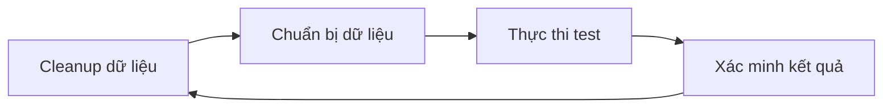

# 4.6.2 Cleanup trước và sau Test — Thứ tự thực thi và cleanup với Test/E2E

### Phá đề một câu

Tính lặp lại của test phụ thuộc vào "điểm khởi đầu sạch" — mỗi test đều nên bắt đầu ở trạng thái đã biết, tránh ảnh hưởng lẫn nhau giữa các test.

### Chiến lược quản lý dữ liệu Test



### So sánh các chiến lược Cleanup

| Chiến lược | Ưu điểm | Nhược điểm |
|------|------|------|
| Cleanup trước test | Đảm bảo điểm khởi đầu sạch | Cleanup có thể thất bại |
| Cleanup sau test | Giữ gọn gàng | Khi thất bại có thể để lại dữ liệu |
| Transaction rollback | Nhanh nhất và sạch nhất | Không áp dụng cho mọi trường hợp |
| Database độc lập | Cách ly hoàn toàn | Tốn tài nguyên |

### Cleanup trước test (Khuyến nghị)

```typescript
// tests/setup.ts
import { prisma } from '../src/lib/prisma'

export async function cleanDatabase() {
  // Xóa theo thứ tự ngược với phụ thuộc foreign key
  await prisma.comment.deleteMany()
  await prisma.post.deleteMany()
  await prisma.user.deleteMany()
}

export async function setupTestData() {
  // Tạo dữ liệu cơ bản cần cho test
  const user = await prisma.user.create({
    data: {
      email: 'test@example.com',
      name: 'Test User'
    }
  })
  return { user }
}
```

### Cấu hình Vitest

```typescript
// vitest.config.ts
import { defineConfig } from 'vitest/config'

export default defineConfig({
  test: {
    globalSetup: './tests/global-setup.ts',
    setupFiles: './tests/setup.ts',
    hookTimeout: 30000
  }
})
```

```typescript
// tests/global-setup.ts
export async function setup() {
  // Cài đặt toàn cục trước khi bắt đầu test suite
  console.log('Starting test suite...')
}

export async function teardown() {
  // Cleanup toàn cục sau khi kết thúc test suite
  console.log('Cleaning up...')
}
```

```typescript
// tests/setup.ts
import { beforeEach, afterAll } from 'vitest'
import { cleanDatabase, setupTestData } from './helpers'

beforeEach(async () => {
  await cleanDatabase()
})

afterAll(async () => {
  await prisma.$disconnect()
})
```

### Sử dụng transaction để cách ly

```typescript
// tests/helpers/with-transaction.ts
import { prisma } from '@/lib/prisma'

export async function withTransaction<T>(
  fn: (tx: typeof prisma) => Promise<T>
): Promise<T> {
  return prisma.$transaction(async (tx) => {
    const result = await fn(tx as typeof prisma)
    // Throw error để trigger rollback
    throw new Error('ROLLBACK')
  }).catch((error) => {
    if (error.message === 'ROLLBACK') {
      return undefined as T
    }
    throw error
  })
}
```

### Quản lý dữ liệu E2E Test

```typescript
// e2e/fixtures/user.ts
import { prisma } from '@/lib/prisma'

export async function createTestUser() {
  return prisma.user.create({
    data: {
      email: `test-${Date.now()}@example.com`,
      name: 'E2E Test User'
    }
  })
}

export async function cleanupTestUser(userId: string) {
  await prisma.user.delete({
    where: { id: userId }
  })
}
```

```typescript
// e2e/user.spec.ts
import { test, expect } from '@playwright/test'
import { createTestUser, cleanupTestUser } from './fixtures/user'

let testUser: { id: string; email: string }

test.beforeAll(async () => {
  testUser = await createTestUser()
})

test.afterAll(async () => {
  await cleanupTestUser(testUser.id)
})

test('should display user profile', async ({ page }) => {
  await page.goto(`/users/${testUser.id}`)
  await expect(page.getByText(testUser.email)).toBeVisible()
})
```

### Phương án Cleanup nhanh

**Sử dụng TRUNCATE (PostgreSQL)**:

```typescript
async function truncateAllTables() {
  const tables = ['Comment', 'Post', 'User']

  for (const table of tables) {
    await prisma.$executeRawUnsafe(
      `TRUNCATE TABLE "${table}" CASCADE`
    )
  }
}
```

**Reset database (môi trường dev/test)**:

```bash
# Reset và seed lại
npx prisma migrate reset --force
```

### Test data factory

```typescript
// tests/factories/user.ts
import { faker } from '@faker-js/faker'
import { prisma } from '@/lib/prisma'

export function createUserFactory(overrides = {}) {
  return prisma.user.create({
    data: {
      email: faker.internet.email(),
      name: faker.person.fullName(),
      ...overrides
    }
  })
}

// Sử dụng
const user = await createUserFactory({ role: 'ADMIN' })
```

### Lưu ý về thứ tự Cleanup

```typescript
// Xóa theo thứ tự ngược với phụ thuộc foreign key
const cleanupOrder = [
  'Comment',    // Phụ thuộc Post và User
  'Post',       // Phụ thuộc User
  'Profile',    // Phụ thuộc User
  'User'        // Bảng cơ bản
]

for (const model of cleanupOrder) {
  await (prisma as any)[model.toLowerCase()].deleteMany()
}
```

### Tóm tắt phần này

- Cleanup trước test đảm bảo điểm khởi đầu sạch
- Transaction rollback là cách cách ly nhanh nhất
- E2E test sử dụng unique identifier để tránh xung đột
- Cleanup dữ liệu theo thứ tự ngược với phụ thuộc foreign key
