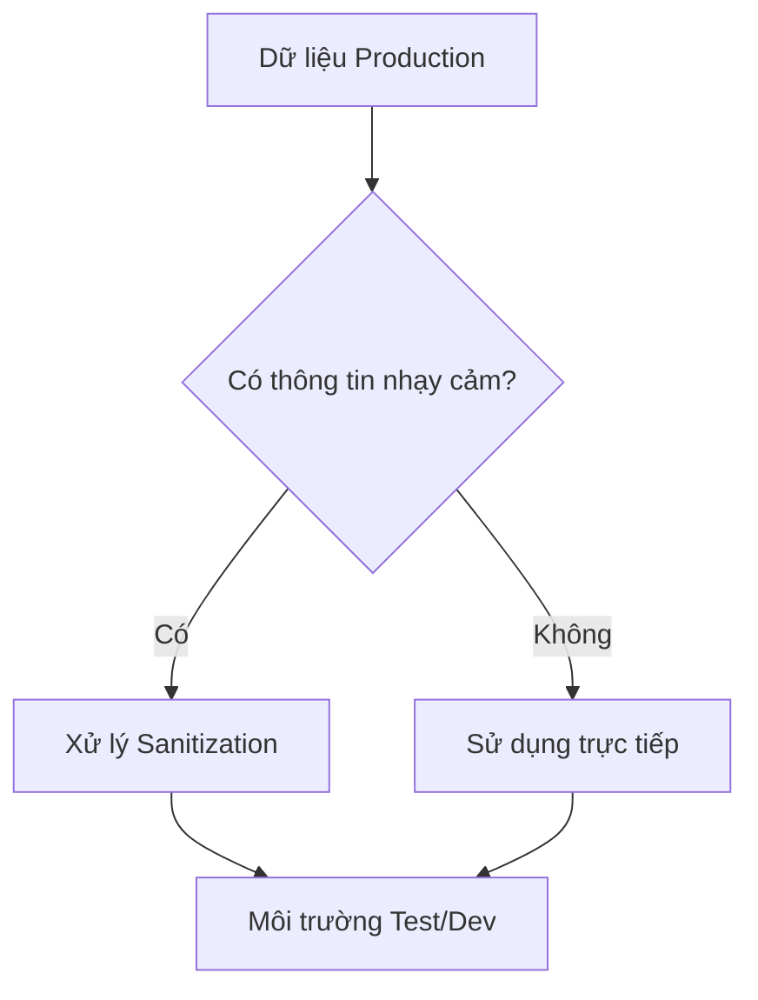
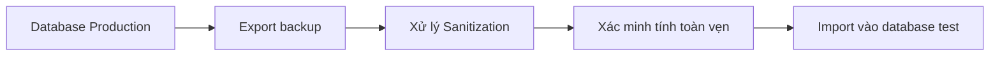

# 4.6.3 Dữ liệu production không thể cho test dạng plaintext — Sanitization dữ liệu production và tạo dữ liệu test

### Phá đề một câu

Dữ liệu production là tài liệu tốt nhất để debug, nhưng sử dụng trực tiếp sẽ rò rỉ thông tin riêng tư — sanitization là kỹ thuật then chốt để làm cho dữ liệu "có thể dùng nhưng không thể nhận diện".

### Tại sao cần Sanitization?



**Các loại thông tin nhạy cảm**:
- Thông tin nhận dạng cá nhân (tên, ID, số điện thoại)
- Thông tin xác thực (password, Token)
- Thông tin tài chính (thẻ ngân hàng, lịch sử giao dịch)
- Dữ liệu nhạy cảm về kinh doanh

### Chiến lược Sanitization

| Chiến lược | Mô tả | Ví dụ |
|------|------|------|
| **Thay thế** | Thay bằng dữ liệu giả | Trần Văn A → User A |
| **Che giấu** | Ẩn một phần | 0981234567 → 098****567 |
| **Hash** | Chuyển đổi không đảo ngược | email → hash(email) |
| **Ngẫu nhiên** | Hoàn toàn random | Dữ liệu thật → dữ liệu faker |
| **Giữ format** | Giữ format nhất quán | SĐT hợp lệ → SĐT giả |

### Ví dụ script Sanitization

```typescript
// scripts/sanitize.ts
import { PrismaClient } from '@prisma/client'
import { faker } from '@faker-js/faker'
import crypto from 'crypto'

const prisma = new PrismaClient()

async function sanitizeUsers() {
  const users = await prisma.user.findMany()

  for (const user of users) {
    await prisma.user.update({
      where: { id: user.id },
      data: {
        // Thay thế tên
        name: faker.person.fullName(),
        // Email giữ format
        email: `user_${hashId(user.id)}@example.com`,
        // Thay thế số điện thoại
        phone: faker.phone.number(),
        // Reset password thành password test thống nhất
        password: await hashPassword('test123456')
      }
    })
  }
}

function hashId(id: string): string {
  return crypto.createHash('md5').update(id).digest('hex').slice(0, 8)
}

async function main() {
  console.log('Starting data sanitization...')
  await sanitizeUsers()
  await sanitizeOrders()
  await sanitizePayments()
  console.log('Sanitization completed!')
}

main()
  .catch(console.error)
  .finally(() => prisma.$disconnect())
```

### Sanitization theo từng trường

```typescript
// lib/sanitizers.ts
export const sanitizers = {
  // Tên: Thay thế hoàn toàn
  name: () => faker.person.fullName(),

  // Email: Giữ cấu trúc domain
  email: (original: string) => {
    const domain = original.split('@')[1] || 'example.com'
    return `user_${faker.string.alphanumeric(8)}@${domain}`
  },

  // SĐT: Che giấu 4 số giữa
  phone: (original: string) => {
    return original.slice(0, 3) + '****' + original.slice(-4)
  },

  // CMND: Giữ 6 số đầu và 4 số cuối
  idCard: (original: string) => {
    return original.slice(0, 6) + '********' + original.slice(-4)
  },

  // Địa chỉ: Chỉ giữ thành phố
  address: (original: string) => {
    const city = original.match(/.+?(市|区)/)?.[0] || ''
    return city + faker.location.streetAddress()
  },

  // Số tiền: Giữ bậc số
  amount: (original: number) => {
    const magnitude = Math.floor(Math.log10(original))
    return faker.number.float({
      min: 10 ** magnitude,
      max: 10 ** (magnitude + 1),
      fractionDigits: 2
    })
  }
}
```

### Quy trình export dữ liệu Production



```bash
# 1. Export dữ liệu production
pg_dump -U postgres -d production > prod_backup.sql

# 2. Import vào database tạm
psql -U postgres -d temp_sanitize < prod_backup.sql

# 3. Chạy script sanitization
DATABASE_URL=postgresql://localhost/temp_sanitize npx tsx scripts/sanitize.ts

# 4. Export dữ liệu đã sanitize
pg_dump -U postgres -d temp_sanitize > sanitized_backup.sql

# 5. Import vào môi trường test
psql -U postgres -d test < sanitized_backup.sql
```

### Sử dụng Faker để tạo dữ liệu có vẻ thật

```typescript
import { faker } from '@faker-js/faker'

// Thiết lập môi trường tiếng Việt
faker.locale = 'vi'

// Tạo dữ liệu user
function generateUser() {
  return {
    name: faker.person.fullName(),
    email: faker.internet.email(),
    phone: faker.phone.number(),
    avatar: faker.image.avatar(),
    bio: faker.lorem.paragraph(),
    createdAt: faker.date.past()
  }
}

// Tạo dữ liệu order
function generateOrder(userId: string) {
  return {
    userId,
    orderNo: faker.string.alphanumeric(16).toUpperCase(),
    amount: faker.number.float({ min: 10, max: 1000, fractionDigits: 2 }),
    status: faker.helpers.arrayElement(['PENDING', 'PAID', 'SHIPPED', 'COMPLETED']),
    createdAt: faker.date.recent()
  }
}
```

### Kiểm tra xác minh Sanitization

```typescript
async function verifySanitization() {
  // Kiểm tra còn email thật không
  const realEmails = await prisma.user.count({
    where: {
      email: { not: { contains: '@example.com' } }
    }
  })

  if (realEmails > 0) {
    throw new Error(`Tìm thấy ${realEmails} email chưa được sanitize!`)
  }

  // Kiểm tra password đã được reset thống nhất chưa
  const users = await prisma.user.findMany({
    select: { password: true }
  })

  const uniquePasswords = new Set(users.map(u => u.password))
  if (uniquePasswords.size !== 1) {
    console.warn('Cảnh báo: Password chưa được reset thống nhất')
  }

  console.log('Xác minh sanitization thành công!')
}
```

### Pipeline Sanitization tự động

```yaml
# .github/workflows/sanitize.yml
name: Sanitize Production Data

on:
  schedule:
    - cron: '0 0 * * 0'  # Chạy mỗi Chủ nhật

jobs:
  sanitize:
    runs-on: ubuntu-latest
    steps:
      - uses: actions/checkout@v4

      - name: Export production data
        run: |
          pg_dump $PROD_DATABASE_URL > backup.sql
        env:
          PROD_DATABASE_URL: ${{ secrets.PROD_DATABASE_URL }}

      - name: Create temp database
        run: |
          createdb temp_sanitize
          psql -d temp_sanitize < backup.sql

      - name: Run sanitization
        run: npx tsx scripts/sanitize.ts
        env:
          DATABASE_URL: postgresql://localhost/temp_sanitize

      - name: Export sanitized data
        run: pg_dump temp_sanitize > sanitized.sql

      - name: Upload artifact
        uses: actions/upload-artifact@v4
        with:
          name: sanitized-data
          path: sanitized.sql
```

### Tóm tắt phần này

- Sanitization dữ liệu production là bước cần thiết để tuân thủ và bảo mật
- Chọn chiến lược sanitization phù hợp theo loại dữ liệu
- Sử dụng Faker để tạo dữ liệu test có vẻ thật
- Xây dựng pipeline sanitization tự động để giữ dữ liệu luôn mới
