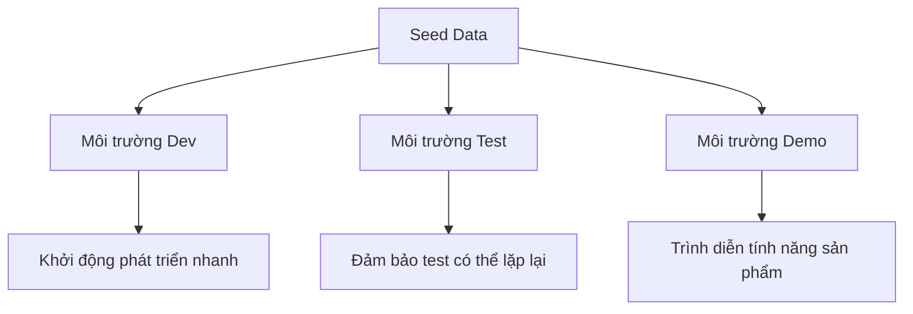

# 4.6 Cách tạo fake data hàng loạt — Seed Data nâng cao: Quản lý dữ liệu đa môi trường

### Tái cấu trúc nhận thức

Seed data không chỉ là "tạo dữ liệu giả" — nó là công cụ nhân đôi hiệu suất phát triển, đảm bảo chất lượng testing, và nền tảng cho sự cộng tác của team.

### Nhiều vai trò của Seed Data



### Điều hướng các chương con

| Chương | Chủ đề | Vấn đề cốt lõi |
|------|------|----------|
| 4.6.1 | Idempotency trong tạo dữ liệu | Làm thế nào để seed script có thể chạy lặp lại? |
| 4.6.2 | Test cleanup | Quản lý dữ liệu trước và sau test như thế nào? |
| 4.6.3 | Data Sanitization | Làm thế nào để an toàn khi dùng dữ liệu production cho test? |

### Ôn tập Seed script cơ bản

```typescript
// prisma/seed.ts
import { PrismaClient } from '@prisma/client'
import { faker } from '@faker-js/faker'

const prisma = new PrismaClient()

async function main() {
  // Tạo user
  const user = await prisma.user.upsert({
    where: { email: 'admin@example.com' },
    update: {},
    create: {
      email: 'admin@example.com',
      name: 'Admin',
      role: 'ADMIN'
    }
  })

  // Tạo dữ liệu test hàng loạt
  for (let i = 0; i < 10; i++) {
    await prisma.post.create({
      data: {
        title: faker.lorem.sentence(),
        content: faker.lorem.paragraphs(3),
        authorId: user.id
      }
    })
  }
}

main()
  .catch(console.error)
  .finally(() => prisma.$disconnect())
```

### Chạy Seed

```bash
# Thực thi seed script
npx prisma db seed

# Reset database và chạy seed
npx prisma migrate reset
```

### Tóm tắt chương này

- Seed data phục vụ nhiều kịch bản: development, testing, demo
- Sử dụng `upsert` để đạt được tính Idempotency
- Sử dụng Faker để tạo dữ liệu test có vẻ thật
- Tùy chỉnh chiến lược dữ liệu khác nhau theo môi trường
