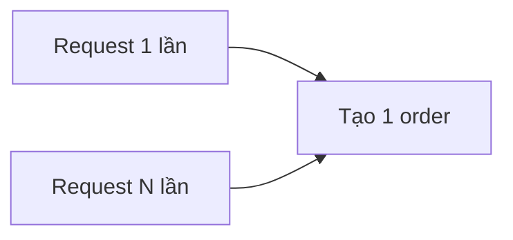

# 4.7.1 Submit trùng lặp thì làm sao — Thiết kế Idempotency: Xử lý an toàn request trùng lặp

### Phá đề một câu

Idempotency cho phép API xử lý an toàn request trùng lặp — dù gọi một lần hay nhiều lần, kết quả đều giống nhau.

### Idempotency là gì?



**Thao tác Idempotent**: Thực thi nhiều lần và thực thi một lần có hiệu quả giống nhau

- `GET /users/1` - Idempotent tự nhiên
- `PUT /users/1` - Idempotent tự nhiên
- `DELETE /users/1` - Idempotent tự nhiên
- `POST /orders` - **Không Idempotent!** Cần xử lý đặc biệt

### Tại sao cần Idempotency?

1. **Network jitter**: Retry sau khi request timeout
2. **Hành vi user**: Double click nút submit
3. **Message queue**: Message bị consume trùng lặp
4. **Service retry**: Retry khi microservice call thất bại

### Triển khai cốt lõi: Idempotency Key

```typescript
// Frontend tạo idempotency key
const idempotencyKey = crypto.randomUUID()

fetch('/api/orders', {
  method: 'POST',
  headers: {
    'X-Idempotency-Key': idempotencyKey
  },
  body: JSON.stringify(orderData)
})
```

```typescript
// Backend xử lý idempotency key
// app/api/orders/route.ts
export async function POST(request: Request) {
  const idempotencyKey = request.headers.get('X-Idempotency-Key')

  if (!idempotencyKey) {
    return Response.json(
      { error: 'Thiếu idempotency key' },
      { status: 400 }
    )
  }

  // Kiểm tra đã xử lý chưa
  const existing = await prisma.idempotencyRecord.findUnique({
    where: { key: idempotencyKey }
  })

  if (existing) {
    // Trả về kết quả trước đó
    return Response.json(existing.response)
  }

  // Tạo order
  const order = await prisma.$transaction(async (tx) => {
    const order = await tx.order.create({
      data: orderData
    })

    // Ghi lại idempotency key và response
    await tx.idempotencyRecord.create({
      data: {
        key: idempotencyKey,
        response: order,
        expiresAt: new Date(Date.now() + 24 * 60 * 60 * 1000) // Hết hạn sau 24h
      }
    })

    return order
  })

  return Response.json(order)
}
```

### Model ghi lại Idempotency

```prisma
model IdempotencyRecord {
  id        String   @id @default(cuid())
  key       String   @unique
  response  Json
  createdAt DateTime @default(now())
  expiresAt DateTime

  @@index([expiresAt])
}
```

### Sử dụng unique constraint của database

Với một số tình huống, có thể dùng unique constraint của database để triển khai idempotency:

```prisma
model Payment {
  id            String @id @default(cuid())
  orderId       String
  transactionNo String @unique // Số giao dịch unique
  amount        Float

  order Order @relation(fields: [orderId], references: [id])
}
```

```typescript
async function processPayment(orderId: string, transactionNo: string) {
  try {
    return await prisma.payment.create({
      data: {
        orderId,
        transactionNo,
        amount: 100
      }
    })
  } catch (error) {
    if (error.code === 'P2002') {
      // Xung đột unique constraint = Request trùng lặp
      return prisma.payment.findUnique({
        where: { transactionNo }
      })
    }
    throw error
  }
}
```

### Sử dụng upsert để triển khai Idempotency

```typescript
async function updateUserProfile(userId: string, data: ProfileData) {
  return prisma.profile.upsert({
    where: { userId },
    update: data,
    create: { userId, ...data }
  })
}
```

### Frontend chống submit trùng lặp

```typescript
// Sử dụng React Hook để chống submit trùng lặp
function useSubmit() {
  const [isSubmitting, setIsSubmitting] = useState(false)
  const idempotencyKeyRef = useRef<string>()

  const submit = async (data: FormData) => {
    if (isSubmitting) return

    setIsSubmitting(true)
    idempotencyKeyRef.current = crypto.randomUUID()

    try {
      const response = await fetch('/api/orders', {
        method: 'POST',
        headers: {
          'X-Idempotency-Key': idempotencyKeyRef.current
        },
        body: JSON.stringify(data)
      })
      return response.json()
    } finally {
      setIsSubmitting(false)
    }
  }

  return { submit, isSubmitting }
}
```

### Cleanup các record đã hết hạn

```typescript
// Định kỳ cleanup các idempotency record đã hết hạn
async function cleanupIdempotencyRecords() {
  await prisma.idempotencyRecord.deleteMany({
    where: {
      expiresAt: { lt: new Date() }
    }
  })
}
```

### Tóm tắt phần này

- Idempotency đảm bảo request trùng lặp không gây ra side effect
- Sử dụng Idempotency Key là phương án tổng quát nhất
- Database unique constraint có thể làm phương án dự phòng cho tình huống đơn giản
- Frontend và backend phối hợp mới triển khai được idempotency hoàn chỉnh
