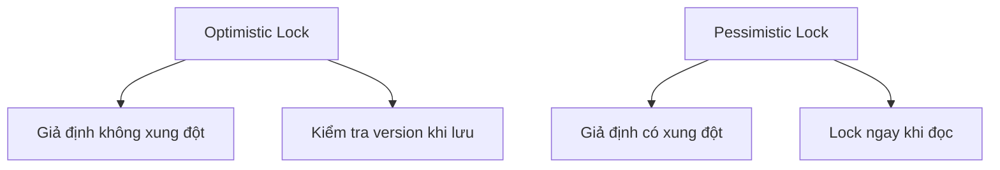

# 4.7.2 Cùng sửa thì làm sao — Phát hiện xung đột: Cơ chế nhận diện chỉnh sửa đồng thời

### Phá đề một câu

Cốt lõi của phát hiện xung đột là "biết dữ liệu đã bị sửa" — thông qua version number hoặc timestamp, khi lưu sẽ kiểm tra xem dữ liệu đã bị người khác thay đổi chưa.

### Optimistic Lock vs Pessimistic Lock



| Loại | Chiến lược | Tình huống áp dụng |
|------|------|----------|
| **Optimistic Lock** | Sửa trước, phát hiện xung đột khi lưu | Xác suất xung đột thấp |
| **Pessimistic Lock** | Lock trước, đảm bảo độc quyền sửa | Xác suất xung đột cao |

### Optimistic Lock: Phương án Version Number

```prisma
model Post {
  id        String   @id @default(cuid())
  title     String
  content   String
  version   Int      @default(1)
  updatedAt DateTime @updatedAt
}
```

```typescript
// Kiểm tra version khi update
async function updatePost(id: string, data: PostData, version: number) {
  const result = await prisma.post.updateMany({
    where: {
      id,
      version  // Chỉ update khi version khớp
    },
    data: {
      ...data,
      version: { increment: 1 }
    }
  })

  if (result.count === 0) {
    throw new Error('CONFLICT: Dữ liệu đã bị người khác sửa')
  }

  return prisma.post.findUnique({ where: { id } })
}
```

### Triển khai ở tầng API

```typescript
// app/api/posts/[id]/route.ts
export async function PUT(
  request: Request,
  { params }: { params: { id: string } }
) {
  const body = await request.json()
  const { title, content, version } = body

  try {
    const post = await updatePost(params.id, { title, content }, version)
    return Response.json(post)
  } catch (error) {
    if (error.message.includes('CONFLICT')) {
      return Response.json(
        { error: 'Dữ liệu đã bị người khác sửa, vui lòng refresh và thử lại' },
        { status: 409 }
      )
    }
    throw error
  }
}
```

### Frontend xử lý xung đột

```typescript
async function savePost(post: Post) {
  const response = await fetch(`/api/posts/${post.id}`, {
    method: 'PUT',
    body: JSON.stringify({
      title: post.title,
      content: post.content,
      version: post.version  // Mang theo version hiện tại
    })
  })

  if (response.status === 409) {
    // Xử lý xung đột
    const confirmRefresh = confirm('Dữ liệu đã bị người khác sửa, có refresh để lấy dữ liệu mới nhất không?')
    if (confirmRefresh) {
      await refreshPost(post.id)
    }
    return
  }

  return response.json()
}
```

### Sử dụng updatedAt làm version

```typescript
async function updatePost(id: string, data: PostData, lastUpdatedAt: Date) {
  const result = await prisma.post.updateMany({
    where: {
      id,
      updatedAt: lastUpdatedAt  // Timestamp làm version
    },
    data
  })

  if (result.count === 0) {
    throw new Error('CONFLICT')
  }

  return prisma.post.findUnique({ where: { id } })
}
```

### Pessimistic Lock: SELECT FOR UPDATE

```typescript
async function transferBalance(fromId: string, toId: string, amount: number) {
  return prisma.$transaction(async (tx) => {
    // Lock các record
    const [from, to] = await Promise.all([
      tx.$queryRaw`SELECT * FROM "Account" WHERE id = ${fromId} FOR UPDATE`,
      tx.$queryRaw`SELECT * FROM "Account" WHERE id = ${toId} FOR UPDATE`
    ])

    if (from.balance < amount) {
      throw new Error('Số dư không đủ')
    }

    // Thực hiện chuyển tiền
    await tx.account.update({
      where: { id: fromId },
      data: { balance: { decrement: amount } }
    })

    await tx.account.update({
      where: { id: toId },
      data: { balance: { increment: amount } }
    })
  })
}
```

### Sử dụng ETag header

```typescript
// Trả về ETag trong GET response
export async function GET(
  request: Request,
  { params }: { params: { id: string } }
) {
  const post = await prisma.post.findUnique({
    where: { id: params.id }
  })

  const etag = `"${post.version}"`

  return Response.json(post, {
    headers: { 'ETag': etag }
  })
}

// Sử dụng If-Match trong PUT request
export async function PUT(
  request: Request,
  { params }: { params: { id: string } }
) {
  const ifMatch = request.headers.get('If-Match')
  const version = ifMatch ? parseInt(ifMatch.replace(/"/g, '')) : null

  if (!version) {
    return Response.json(
      { error: 'Thiếu If-Match header' },
      { status: 428 }
    )
  }

  // ... sử dụng version để optimistic lock update
}
```

### Lựa chọn chiến lược phát hiện

| Tình huống | Chiến lược đề xuất |
|------|----------|
| Chỉnh sửa form thông thường | Optimistic Lock + Version Number |
| Chỉnh sửa document cộng tác | Optimistic Lock + OT/CRDT |
| Giao dịch tài chính | Pessimistic Lock |
| Trừ tồn kho | Pessimistic Lock hoặc Optimistic Lock retry |

### Tóm tắt phần này

- Optimistic Lock phù hợp với tình huống xác suất xung đột thấp
- Pessimistic Lock phù hợp với nghiệp vụ quan trọng có xác suất xung đột cao
- Version Number hoặc updatedAt là identifier phổ biến nhất cho optimistic lock
- HTTP status code 409 biểu thị xung đột
