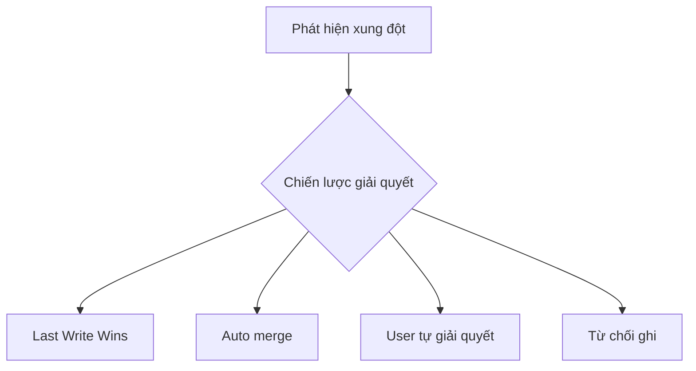
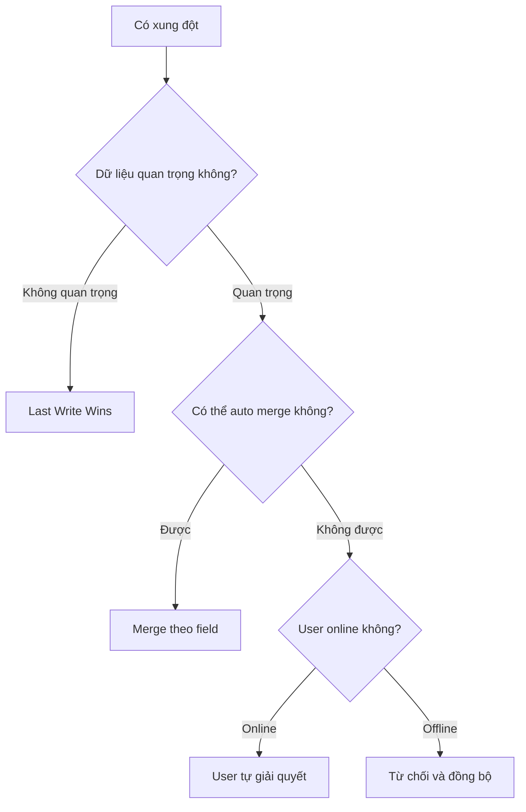

# 4.7.3 Xung đột thì nghe theo ai — Giải quyết xung đột: Last Write Wins vs chiến lược merge

### Phá đề một câu

Giải quyết xung đột không có chiến lược "tốt nhất" — cần chọn lựa giữa "ai thắng", "merge", "user quyết định" dựa trên tình huống kinh doanh.

### Các chiến lược giải quyết xung đột



| Chiến lược | Mô tả | Tình huống áp dụng |
|------|------|----------|
| **Last Write Wins** | Request sau ghi đè request trước | Tình huống đơn giản, dữ liệu không quan trọng |
| **Auto merge** | Merge theo field hoặc rule | Các field độc lập chỉnh sửa |
| **User tự giải quyết** | Hiển thị sự khác biệt để user chọn | Chỉnh sửa nội dung phức tạp |
| **Từ chối ghi** | Trả về 409 yêu cầu refresh | Ưu tiên độ chính xác dữ liệu |

### Last Write Wins (LWW)

```typescript
// Đơn giản thô bạo: Ghi đè trực tiếp
async function updatePost(id: string, data: PostData) {
  return prisma.post.update({
    where: { id },
    data
  })
}
```

**Tình huống áp dụng**:
- Cài đặt cá nhân của user
- Metadata không quá quan trọng
- Đồng bộ app offline-first

### Merge theo field

```typescript
async function mergePost(
  id: string,
  updates: Partial<PostData>,
  baseVersion: number
) {
  const current = await prisma.post.findUnique({
    where: { id }
  })

  if (!current || current.version === baseVersion) {
    // Không có xung đột, update trực tiếp
    return prisma.post.update({
      where: { id },
      data: { ...updates, version: { increment: 1 } }
    })
  }

  // Merge theo field
  const merged: Partial<PostData> = {}

  for (const [key, value] of Object.entries(updates)) {
    // Nếu field này chưa bị người khác sửa, thì áp dụng update lần này
    // Logic đơn giản hóa: ở đây cần ghi lại lịch sử thay đổi của từng field
    merged[key] = value
  }

  return prisma.post.update({
    where: { id },
    data: { ...merged, version: { increment: 1 } }
  })
}
```

### User tự giải quyết

```typescript
// Phát hiện xung đột và trả về hai version để user chọn
async function updateWithConflictDetection(
  id: string,
  data: PostData,
  version: number
) {
  const current = await prisma.post.findUnique({
    where: { id }
  })

  if (current.version !== version) {
    // Trả về thông tin xung đột
    return {
      conflict: true,
      yourVersion: data,
      serverVersion: current,
      message: 'Dữ liệu đã bị người khác sửa'
    }
  }

  return prisma.post.update({
    where: { id },
    data: { ...data, version: { increment: 1 } }
  })
}
```

```typescript
// Frontend hiển thị giao diện giải quyết xung đột
function ConflictResolver({ yourVersion, serverVersion, onResolve }) {
  return (
    <div className="conflict-modal">
      <h3>Phát hiện xung đột</h3>
      <div className="versions">
        <div className="your-version">
          <h4>Phiên bản của bạn</h4>
          <pre>{JSON.stringify(yourVersion, null, 2)}</pre>
        </div>
        <div className="server-version">
          <h4>Phiên bản server</h4>
          <pre>{JSON.stringify(serverVersion, null, 2)}</pre>
        </div>
      </div>
      <div className="actions">
        <button onClick={() => onResolve('mine')}>Dùng phiên bản của tôi</button>
        <button onClick={() => onResolve('theirs')}>Dùng phiên bản server</button>
        <button onClick={() => onResolve('manual')}>Merge thủ công</button>
      </div>
    </div>
  )
}
```

### Merge dựa trên timestamp

```typescript
interface FieldWithTimestamp<T> {
  value: T
  updatedAt: Date
}

// Mỗi field ghi lại thời gian update cuối cùng
async function mergeByTimestamp(
  id: string,
  updates: Record<string, FieldWithTimestamp<any>>
) {
  const current = await prisma.post.findUnique({
    where: { id }
  })

  const merged: Record<string, any> = {}

  for (const [field, update] of Object.entries(updates)) {
    const currentField = current[field + 'UpdatedAt']

    // Timestamp nào mới hơn thì dùng giá trị đó
    if (!currentField || update.updatedAt > currentField) {
      merged[field] = update.value
      merged[field + 'UpdatedAt'] = update.updatedAt
    }
  }

  return prisma.post.update({
    where: { id },
    data: merged
  })
}
```

### Business rule ưu tiên

```typescript
// Trừ tồn kho: Không được bán vượt quá
async function reduceStock(productId: string, quantity: number) {
  return prisma.$transaction(async (tx) => {
    const product = await tx.product.findUnique({
      where: { id: productId }
    })

    // Business rule: Tồn kho không được âm
    if (product.stock < quantity) {
      throw new Error('Tồn kho không đủ')
    }

    return tx.product.update({
      where: { id: productId },
      data: { stock: { decrement: quantity } }
    })
  })
}

// Đếm like: Có thể merge
async function incrementLikes(postId: string) {
  // Sử dụng atomic operation, không có xung đột
  return prisma.post.update({
    where: { id: postId },
    data: { likes: { increment: 1 } }
  })
}
```

### Cây quyết định lựa chọn chiến lược



### Tóm tắt phần này

- Last Write Wins đơn giản nhất, nhưng có thể mất dữ liệu
- Merge theo field phù hợp với tình huống các field độc lập chỉnh sửa
- Xung đột nội dung phức tạp cần user tự giải quyết
- Atomic operation (increment/decrement) có thể tránh xung đột số
