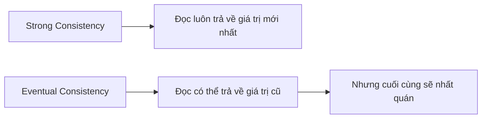
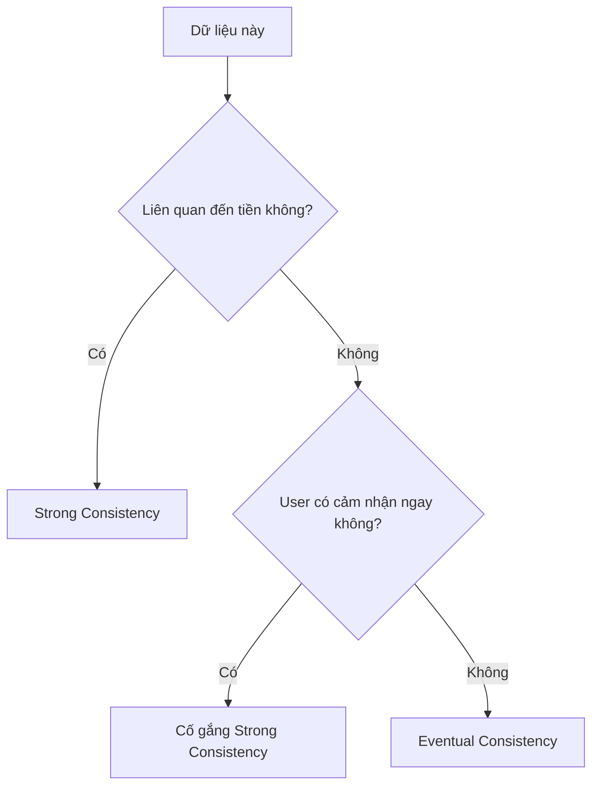

# 4.7.4 Dữ liệu không nhất quán thì làm sao — Tính nhất quán dữ liệu: Eventual Consistency và Strong Consistency

### Phá đề một câu

Strong Consistency đảm bảo "lập tức thấy dữ liệu mới nhất", Eventual Consistency đảm bảo "sớm muộn sẽ thấy dữ liệu mới nhất" — lựa chọn phụ thuộc vào yêu cầu "thời gian thực" của nghiệp vụ.

### Các cấp độ nhất quán



| Loại | Mô tả | Ví dụ |
|------|------|------|
| **Strong Consistency** | Ghi xong thấy ngay | Chuyển tiền ngân hàng |
| **Eventual Consistency** | Ghi xong chưa chắc thấy ngay | Số lượt like mạng xã hội |

### Tại sao lại không nhất quán?

1. **Độ trễ cache**: Database đã update, nhưng cache vẫn là dữ liệu cũ
2. **Độ trễ replication**: Primary database đã update, replica chưa đồng bộ
3. **Cache phía client**: Server đã update, trình duyệt vẫn là dữ liệu cũ

### Tình huống 1: Không nhất quán do cache

```typescript
// Vấn đề: Sau khi update cache chưa invalidate
async function updateUser(id: string, data: UserData) {
  await prisma.user.update({
    where: { id },
    data
  })
  // Cache vẫn là dữ liệu cũ!
}

// Giải pháp: Invalidate cache sau khi update
async function updateUser(id: string, data: UserData) {
  const user = await prisma.user.update({
    where: { id },
    data
  })

  // Invalidate cache
  await redis.del(`user:${id}`)

  return user
}
```

### Tình huống 2: Không nhất quán do read-write splitting

```typescript
// Vấn đề: Ghi vào primary rồi đọc ngay từ replica
async function createPostAndRedirect(data: PostData) {
  const post = await prisma.post.create({ data })  // Ghi vào primary

  // Redirect ngay sang trang chi tiết
  redirect(`/posts/${post.id}`)  // Replica có thể chưa đồng bộ
}

// Giải pháp 1: Đọc sau khi ghi đi qua primary
async function getPost(id: string, forceMain = false) {
  if (forceMain) {
    return prismaMain.post.findUnique({ where: { id } })
  }
  return prismaReplica.post.findUnique({ where: { id } })
}

// Giải pháp 2: Tạo xong delay một chút rồi redirect
async function createPostAndRedirect(data: PostData) {
  const post = await prisma.post.create({ data })

  // Chờ đồng bộ một chút
  await new Promise(resolve => setTimeout(resolve, 100))

  redirect(`/posts/${post.id}`)
}
```

### Tình huống 3: Không nhất quán do cache frontend

```typescript
// Sử dụng optimistic update của SWR
import useSWR, { mutate } from 'swr'

function usePost(id: string) {
  return useSWR(`/api/posts/${id}`)
}

async function updatePost(id: string, data: PostData) {
  // Optimistic update: Cập nhật ngay local cache
  mutate(
    `/api/posts/${id}`,
    { ...data },
    false  // Không revalidate
  )

  // Gửi request
  await fetch(`/api/posts/${id}`, {
    method: 'PUT',
    body: JSON.stringify(data)
  })

  // Revalidate để đảm bảo nhất quán
  mutate(`/api/posts/${id}`)
}
```

### Tình huống đảm bảo Strong Consistency

**Giao dịch tài chính**:

```typescript
async function transfer(from: string, to: string, amount: number) {
  return prisma.$transaction(async (tx) => {
    // Hoàn thành tất cả thao tác trong transaction
    const fromAccount = await tx.account.update({
      where: { id: from },
      data: { balance: { decrement: amount } }
    })

    if (fromAccount.balance < 0) {
      throw new Error('Số dư không đủ')
    }

    await tx.account.update({
      where: { id: to },
      data: { balance: { increment: amount } }
    })

    // Ghi log giao dịch
    await tx.transaction.create({
      data: { from, to, amount }
    })
  }, {
    isolationLevel: 'Serializable'  // Mức cách ly cao nhất
  })
}
```

### Tình huống chấp nhận Eventual Consistency

**Đếm lượt like**:

```typescript
// Trả về ngay, update bất đồng bộ ở background
async function likePost(postId: string, userId: string) {
  // Ghi lại like
  await prisma.like.create({
    data: { postId, userId }
  })

  // Update số lượng bất đồng bộ (có thể có độ trễ)
  updateLikeCountAsync(postId)

  return { success: true }
}

async function updateLikeCountAsync(postId: string) {
  const count = await prisma.like.count({
    where: { postId }
  })

  await prisma.post.update({
    where: { id: postId },
    data: { likeCount: count }
  })
}
```

### Các chiến lược đảm bảo nhất quán

| Chiến lược | Cách triển khai | Chi phí |
|------|----------|------|
| Transaction | `$transaction` | Overhead hiệu năng |
| Đọc từ primary sau khi ghi | Route về primary | Áp lực lên primary |
| Invalidate cache | Xóa cache sau khi update | Giảm tỷ lệ cache hit |
| Validate bằng version | Optimistic lock | Retry khi xung đột |

### Làm thế nào để chọn?



### Tóm tắt phần này

- Strong Consistency đảm bảo tính thời gian thực, nhưng có chi phí hiệu năng
- Eventual Consistency hiệu năng tốt, nhưng phải chấp nhận không nhất quán tạm thời
- Tình huống tài chính bắt buộc Strong Consistency
- Dữ liệu mạng xã hội/thống kê có thể dùng Eventual Consistency
- Nhớ xử lý cache sau khi update
