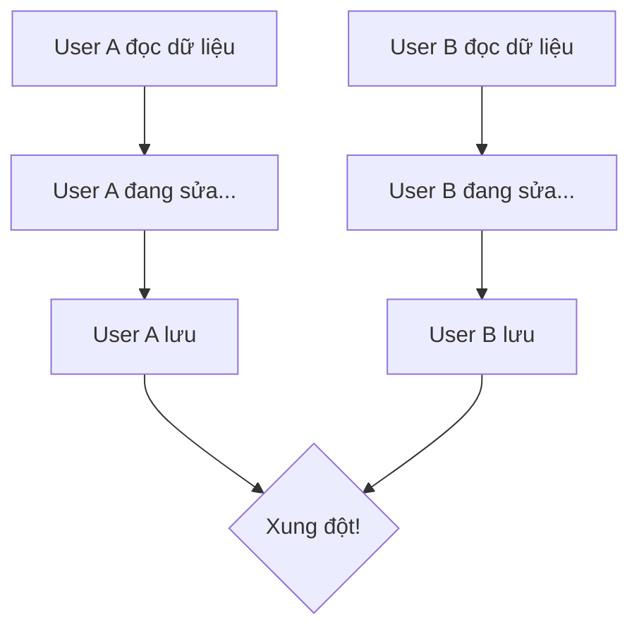

# 4.7 Dữ liệu đánh nhau thì làm sao — Đồng bộ dữ liệu: Idempotency và xử lý xung đột

### Tái cấu trúc nhận thức

Trong hệ thống phân tán và kịch bản nhiều người dùng, dữ liệu "đánh nhau" là điều bình thường chứ không phải ngoại lệ — học cách xử lý xung đột là bài học bắt buộc để xây dựng ứng dụng mạnh mẽ.

### Các tình huống xung đột dữ liệu điển hình

**Tình huống xung đột thường gặp**:
- Hai user cùng sửa một bài viết
- User click nút submit nhiều lần
- Độ trễ mạng dẫn đến request bị gửi lại
- Đồng bộ dữ liệu từ app offline

### Điều hướng các chương con

| Chương | Chủ đề | Vấn đề cốt lõi |
|------|------|----------|
| 4.7.1 | Thiết kế Idempotency | Làm thế nào để request lặp lại an toàn và vô hại? |
| 4.7.2 | Phát hiện xung đột | Làm thế nào biết dữ liệu đã bị người khác sửa? |
| 4.7.3 | Giải quyết xung đột | Khi xung đột thì nghe theo ai? |
| 4.7.4 | Tính nhất quán dữ liệu | Làm thế nào đảm bảo dữ liệu cuối cùng là đúng? |

### Tổng quan các chiến lược xử lý xung đột

| Chiến lược | Tình huống áp dụng | Ưu điểm | Nhược điểm |
|------|----------|------|------|
| Pessimistic Lock | Tình huống xung đột cao | Tránh xung đột triệt để | Hiệu năng kém |
| Optimistic Lock | Tình huống xung đột thấp | Hiệu năng tốt | Cần xử lý xung đột |
| Idempotency Key | Submit form trùng lặp | Đơn giản hiệu quả | Cần lưu trữ thêm |
| Version Number | Chỉnh sửa đồng thời | Triển khai đơn giản | Cần frontend phối hợp |

### Định vị của chương này

Chương này tập trung vào vấn đề đồng bộ dữ liệu ở **tầng ứng dụng**, không liên quan đến cơ chế nhân bản database ở tầng dưới. Chúng ta quan tâm đến:

1. Làm thế nào để API an toàn khi đối mặt với request trùng lặp
2. Làm thế nào phát hiện và giải quyết xung đột dữ liệu ở cấp độ user
3. Làm thế nào cân bằng giữa trải nghiệm người dùng và tính đúng đắn của dữ liệu

### Tóm tắt chương này

- Xung đột dữ liệu không thể tránh khỏi trong hệ thống nhiều user
- Chọn chiến lược xử lý xung đột phù hợp theo tình huống kinh doanh
- Thiết kế Idempotency là nền tảng cho tính mạnh mẽ của API
- Phát hiện và giải quyết xung đột cần frontend và backend phối hợp
