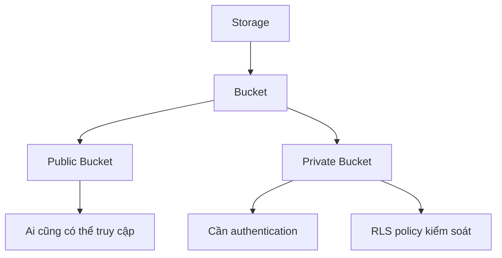

# 4.8.1 Mở rộng: File gắn với quyền hạn như thế nào — Storage Bucket: Upload file và kiểm soát quyền

### Phá đề một câu

Tinh hoa của Supabase Storage là "quyền file thống nhất với quyền user" — thông qua RLS policy, user chỉ có thể truy cập file mà họ có quyền.

### Khái niệm cốt lõi của Storage



### Tạo Storage Bucket

**Cách dùng Dashboard**:
1. Vào Supabase Dashboard
2. Storage → Create new bucket
3. Đặt tên và quyền truy cập

**Cách dùng SQL**:

```sql
-- Tạo private bucket
INSERT INTO storage.buckets (id, name, public)
VALUES ('avatars', 'avatars', false);

-- Tạo public bucket
INSERT INTO storage.buckets (id, name, public)
VALUES ('public-images', 'public-images', true);
```

### Cấu hình RLS Policy

```sql
-- Cho phép user upload vào thư mục của chính mình
CREATE POLICY "Users can upload own files"
ON storage.objects
FOR INSERT
WITH CHECK (
  bucket_id = 'avatars' AND
  auth.uid()::text = (storage.foldername(name))[1]
);

-- Cho phép user đọc file của chính mình
CREATE POLICY "Users can view own files"
ON storage.objects
FOR SELECT
USING (
  bucket_id = 'avatars' AND
  auth.uid()::text = (storage.foldername(name))[1]
);

-- Cho phép user xóa file của chính mình
CREATE POLICY "Users can delete own files"
ON storage.objects
FOR DELETE
USING (
  bucket_id = 'avatars' AND
  auth.uid()::text = (storage.foldername(name))[1]
);
```

### Upload file

```typescript
import { supabase } from '@/lib/supabase'

async function uploadAvatar(file: File, userId: string) {
  const fileExt = file.name.split('.').pop()
  const fileName = `${userId}/${Date.now()}.${fileExt}`

  const { data, error } = await supabase.storage
    .from('avatars')
    .upload(fileName, file, {
      cacheControl: '3600',
      upsert: true
    })

  if (error) throw error

  return data.path
}
```

### Lấy URL file

```typescript
// Public bucket: Lấy public URL trực tiếp
function getPublicUrl(path: string) {
  const { data } = supabase.storage
    .from('public-images')
    .getPublicUrl(path)

  return data.publicUrl
}

// Private bucket: Lấy signed URL (có thời hạn)
async function getSignedUrl(path: string) {
  const { data, error } = await supabase.storage
    .from('avatars')
    .createSignedUrl(path, 3600)  // Hiệu lực 1 giờ

  if (error) throw error
  return data.signedUrl
}
```

### Download file

```typescript
async function downloadFile(path: string) {
  const { data, error } = await supabase.storage
    .from('avatars')
    .download(path)

  if (error) throw error
  return data  // Blob
}
```

### Xóa file

```typescript
async function deleteFile(path: string) {
  const { error } = await supabase.storage
    .from('avatars')
    .remove([path])

  if (error) throw error
}

// Xóa hàng loạt
async function deleteFiles(paths: string[]) {
  const { error } = await supabase.storage
    .from('avatars')
    .remove(paths)

  if (error) throw error
}
```

### Liệt kê file

```typescript
async function listUserFiles(userId: string) {
  const { data, error } = await supabase.storage
    .from('avatars')
    .list(userId, {
      limit: 100,
      offset: 0,
      sortBy: { column: 'created_at', order: 'desc' }
    })

  if (error) throw error
  return data
}
```

### Ví dụ React component

```typescript
'use client'

import { useState } from 'react'
import { supabase } from '@/lib/supabase'

export function AvatarUpload({ userId }: { userId: string }) {
  const [uploading, setUploading] = useState(false)
  const [avatarUrl, setAvatarUrl] = useState<string | null>(null)

  async function handleUpload(e: React.ChangeEvent<HTMLInputElement>) {
    const file = e.target.files?.[0]
    if (!file) return

    setUploading(true)

    try {
      const path = `${userId}/${Date.now()}.${file.name.split('.').pop()}`

      const { error } = await supabase.storage
        .from('avatars')
        .upload(path, file)

      if (error) throw error

      const { data } = await supabase.storage
        .from('avatars')
        .createSignedUrl(path, 3600)

      setAvatarUrl(data?.signedUrl ?? null)
    } catch (error) {
      console.error('Upload thất bại:', error)
    } finally {
      setUploading(false)
    }
  }

  return (
    <div>
      <input
        type="file"
        accept="image/*"
        onChange={handleUpload}
        disabled={uploading}
      />
      {avatarUrl && }
    </div>
  )
}
```

### Giới hạn loại file

```typescript
// Validate loại file và kích thước
function validateFile(file: File) {
  const allowedTypes = ['image/jpeg', 'image/png', 'image/webp']
  const maxSize = 5 * 1024 * 1024 // 5MB

  if (!allowedTypes.includes(file.type)) {
    throw new Error('Chỉ hỗ trợ định dạng JPG, PNG, WebP')
  }

  if (file.size > maxSize) {
    throw new Error('Kích thước file không được vượt quá 5MB')
  }
}
```

### Tóm tắt phần này

- Sử dụng RLS policy để kiểm soát quyền truy cập file
- Public bucket dùng cho tài nguyên không cần authentication
- Private bucket kết hợp signed URL để cung cấp truy cập tạm thời
- Đề xuất tổ chức file path theo user ID
