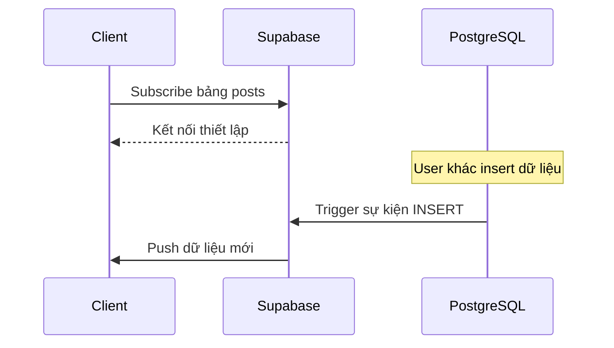

# 4.8.2 Mở rộng: Dữ liệu thay đổi thì thông báo ngay — Realtime Subscription: Push thay đổi dữ liệu

### Phá đề một câu

Supabase Realtime cho phép ứng dụng của bạn "lắng nghe" sự thay đổi của database — khi dữ liệu thay đổi, client lập tức biết được mà không cần polling.

### Nguyên lý hoạt động của Realtime



### Kích hoạt Realtime

**Kích hoạt trong Dashboard**:
1. Vào Table Editor
2. Chọn bảng cần lắng nghe
3. Bật Realtime

**Sử dụng SQL để kích hoạt**:

```sql
-- Kích hoạt realtime cho bảng
ALTER PUBLICATION supabase_realtime ADD TABLE posts;

-- Xác minh
SELECT * FROM pg_publication_tables WHERE pubname = 'supabase_realtime';
```

### Subscribe thay đổi bảng

```typescript
import { supabase } from '@/lib/supabase'

// Subscribe tất cả thay đổi
const channel = supabase
  .channel('posts-changes')
  .on(
    'postgres_changes',
    {
      event: '*',  // 'INSERT' | 'UPDATE' | 'DELETE' | '*'
      schema: 'public',
      table: 'posts'
    },
    (payload) => {
      console.log('Nhận thay đổi!', payload)
    }
  )
  .subscribe()

// Hủy subscribe
channel.unsubscribe()
```

### Lắng nghe sự kiện cụ thể

```typescript
// Chỉ lắng nghe dữ liệu mới insert
const channel = supabase
  .channel('new-posts')
  .on(
    'postgres_changes',
    {
      event: 'INSERT',
      schema: 'public',
      table: 'posts'
    },
    (payload) => {
      console.log('Bài viết mới:', payload.new)
    }
  )
  .subscribe()
```

### Filter subscription

```typescript
// Chỉ lắng nghe bài viết của user cụ thể
const channel = supabase
  .channel('user-posts')
  .on(
    'postgres_changes',
    {
      event: '*',
      schema: 'public',
      table: 'posts',
      filter: `author_id=eq.${userId}`
    },
    (payload) => {
      console.log('Bài viết của user thay đổi:', payload)
    }
  )
  .subscribe()
```

### Đóng gói React Hook

```typescript
'use client'

import { useEffect, useState } from 'react'
import { supabase } from '@/lib/supabase'
import { RealtimePostgresChangesPayload } from '@supabase/supabase-js'

interface Post {
  id: string
  title: string
  content: string
}

export function usePosts() {
  const [posts, setPosts] = useState<Post[]>([])

  useEffect(() => {
    // Load ban đầu
    async function loadPosts() {
      const { data } = await supabase
        .from('posts')
        .select('*')
        .order('created_at', { ascending: false })

      setPosts(data ?? [])
    }

    loadPosts()

    // Subscribe thay đổi
    const channel = supabase
      .channel('posts-realtime')
      .on(
        'postgres_changes',
        { event: '*', schema: 'public', table: 'posts' },
        (payload: RealtimePostgresChangesPayload<Post>) => {
          if (payload.eventType === 'INSERT') {
            setPosts(prev => [payload.new, ...prev])
          } else if (payload.eventType === 'UPDATE') {
            setPosts(prev =>
              prev.map(p => p.id === payload.new.id ? payload.new : p)
            )
          } else if (payload.eventType === 'DELETE') {
            setPosts(prev =>
              prev.filter(p => p.id !== payload.old.id)
            )
          }
        }
      )
      .subscribe()

    return () => {
      channel.unsubscribe()
    }
  }, [])

  return posts
}
```

### Presence: Trạng thái online

```typescript
// Theo dõi trạng thái online của user
const channel = supabase.channel('online-users')

// Theo dõi user hiện tại
channel.on('presence', { event: 'sync' }, () => {
  const state = channel.presenceState()
  console.log('User online:', Object.keys(state))
})

channel.on('presence', { event: 'join' }, ({ key, newPresences }) => {
  console.log('User online:', key, newPresences)
})

channel.on('presence', { event: 'leave' }, ({ key, leftPresences }) => {
  console.log('User offline:', key, leftPresences)
})

// Subscribe và join
channel.subscribe(async (status) => {
  if (status === 'SUBSCRIBED') {
    await channel.track({
      user_id: userId,
      online_at: new Date().toISOString()
    })
  }
})
```

### Broadcast: Broadcast message

```typescript
// Tạo chat room
const channel = supabase.channel('chat-room')

// Lắng nghe message
channel.on('broadcast', { event: 'message' }, ({ payload }) => {
  console.log('Nhận message:', payload)
})

channel.subscribe()

// Gửi message
channel.send({
  type: 'broadcast',
  event: 'message',
  payload: {
    user: 'Alice',
    text: 'Xin chào!'
  }
})
```

### Ví dụ hoàn chỉnh Chat Room

```typescript
'use client'

import { useEffect, useState, useRef } from 'react'
import { supabase } from '@/lib/supabase'

interface Message {
  id: string
  user: string
  text: string
  timestamp: string
}

export function ChatRoom({ userId }: { userId: string }) {
  const [messages, setMessages] = useState<Message[]>([])
  const [input, setInput] = useState('')
  const channelRef = useRef<ReturnType<typeof supabase.channel>>()

  useEffect(() => {
    const channel = supabase.channel('chat-room')

    channel.on('broadcast', { event: 'message' }, ({ payload }) => {
      setMessages(prev => [...prev, payload as Message])
    })

    channel.subscribe()
    channelRef.current = channel

    return () => {
      channel.unsubscribe()
    }
  }, [])

  async function sendMessage() {
    if (!input.trim() || !channelRef.current) return

    const message: Message = {
      id: crypto.randomUUID(),
      user: userId,
      text: input,
      timestamp: new Date().toISOString()
    }

    await channelRef.current.send({
      type: 'broadcast',
      event: 'message',
      payload: message
    })

    setInput('')
  }

  return (
    <div>
      <div className="messages">
        {messages.map(msg => (
          <div key={msg.id}>
            <strong>{msg.user}:</strong> {msg.text}
          </div>
        ))}
      </div>
      <input
        value={input}
        onChange={e => setInput(e.target.value)}
        onKeyDown={e => e.key === 'Enter' && sendMessage()}
      />
      <button onClick={sendMessage}>Gửi</button>
    </div>
  )
}
```

### Tóm tắt phần này

- `postgres_changes` lắng nghe thay đổi của bảng database
- `presence` theo dõi trạng thái online của user
- `broadcast` triển khai broadcast message
- Nhớ unsubscribe khi component unmount
