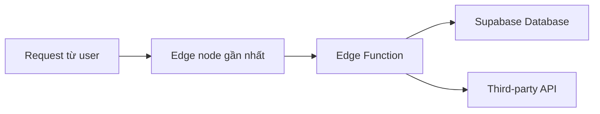

# 4.8.3 Mở rộng: Tính toán gần user nhất — Edge Functions: Hàm tính toán biên

### Phá đề một câu

Edge Functions cho phép code chạy trên các edge node toàn cầu — gần user nhất, phản hồi nhanh nhất, còn có thể truy cập API nhạy cảm một cách an toàn.

### Edge Functions là gì?



**Đặc điểm**:
- Dựa trên Deno runtime
- Deploy phân tán toàn cầu
- Cold start nhanh (millisecond)
- Hỗ trợ TypeScript

### Tạo Edge Function

```bash
# Cài đặt Supabase CLI
npm install -g supabase

# Khởi tạo project (nếu chưa có)
supabase init

# Tạo function
supabase functions new hello-world
```

**Cấu trúc thư mục**:
```
supabase/
└── functions/
    └── hello-world/
        └── index.ts
```

### Ví dụ function cơ bản

```typescript
// supabase/functions/hello-world/index.ts
import { serve } from "https://deno.land/std@0.168.0/http/server.ts"

serve(async (req: Request) => {
  const { name } = await req.json()

  return new Response(
    JSON.stringify({ message: `Xin chào ${name}!` }),
    { headers: { "Content-Type": "application/json" } }
  )
})
```

### Phát triển local

```bash
# Khởi động function service local
supabase functions serve

# Test function
curl -i --location --request POST \
  'http://localhost:54321/functions/v1/hello-world' \
  --header 'Content-Type: application/json' \
  --data '{"name":"Thế giới"}'
```

### Deploy function

```bash
# Deploy function đơn lẻ
supabase functions deploy hello-world

# Deploy tất cả function
supabase functions deploy
```

### Truy cập dịch vụ Supabase

```typescript
// supabase/functions/get-user/index.ts
import { serve } from "https://deno.land/std@0.168.0/http/server.ts"
import { createClient } from "https://esm.sh/@supabase/supabase-js@2"

serve(async (req: Request) => {
  const supabase = createClient(
    Deno.env.get('SUPABASE_URL') ?? '',
    Deno.env.get('SUPABASE_SERVICE_ROLE_KEY') ?? ''
  )

  const authHeader = req.headers.get('Authorization')!
  const token = authHeader.replace('Bearer ', '')

  const { data: { user } } = await supabase.auth.getUser(token)

  if (!user) {
    return new Response(
      JSON.stringify({ error: 'Unauthorized' }),
      { status: 401 }
    )
  }

  const { data, error } = await supabase
    .from('profiles')
    .select('*')
    .eq('id', user.id)
    .single()

  return new Response(
    JSON.stringify(data),
    { headers: { "Content-Type": "application/json" } }
  )
})
```

### Gọi API bên thứ ba

```typescript
// supabase/functions/send-email/index.ts
import { serve } from "https://deno.land/std@0.168.0/http/server.ts"

serve(async (req: Request) => {
  const { to, subject, body } = await req.json()

  const response = await fetch('https://api.resend.com/emails', {
    method: 'POST',
    headers: {
      'Authorization': `Bearer ${Deno.env.get('RESEND_API_KEY')}`,
      'Content-Type': 'application/json'
    },
    body: JSON.stringify({
      from: 'noreply@example.com',
      to,
      subject,
      html: body
    })
  })

  const result = await response.json()

  return new Response(
    JSON.stringify(result),
    { headers: { "Content-Type": "application/json" } }
  )
})
```

### Cài đặt biến môi trường

```bash
# Đặt secret
supabase secrets set RESEND_API_KEY=re_xxxx

# Xem tất cả secret
supabase secrets list
```

### Gọi từ frontend

```typescript
import { supabase } from '@/lib/supabase'

async function sendWelcomeEmail(userEmail: string) {
  const { data, error } = await supabase.functions.invoke('send-email', {
    body: {
      to: userEmail,
      subject: 'Chào mừng bạn',
      body: '<h1>Chào mừng!</h1>'
    }
  })

  if (error) throw error
  return data
}
```

### Xử lý Webhook

```typescript
// supabase/functions/stripe-webhook/index.ts
import { serve } from "https://deno.land/std@0.168.0/http/server.ts"
import Stripe from "https://esm.sh/stripe@12.0.0?target=deno"

const stripe = new Stripe(Deno.env.get('STRIPE_SECRET_KEY')!, {
  apiVersion: '2023-10-16'
})

serve(async (req: Request) => {
  const signature = req.headers.get('stripe-signature')!
  const body = await req.text()

  let event: Stripe.Event

  try {
    event = stripe.webhooks.constructEvent(
      body,
      signature,
      Deno.env.get('STRIPE_WEBHOOK_SECRET')!
    )
  } catch (err) {
    return new Response(
      JSON.stringify({ error: 'Chữ ký không hợp lệ' }),
      { status: 400 }
    )
  }

  switch (event.type) {
    case 'checkout.session.completed':
      // Xử lý thanh toán thành công
      break
    case 'customer.subscription.deleted':
      // Xử lý hủy subscription
      break
  }

  return new Response(JSON.stringify({ received: true }))
})
```

### Các use case thường gặp

| Use case | Mô tả |
|------|------|
| Gửi email | Gọi Resend/SendGrid, v.v. |
| Xử lý thanh toán | Stripe/PayPal Webhook |
| Xử lý ảnh | Tạo thumbnail, watermark |
| Gọi AI | Gọi OpenAI, v.v. |
| Scheduled task | Kết hợp Cron trigger |

### Tóm tắt phần này

- Edge Functions dựa trên Deno, sử dụng TypeScript
- Phù hợp để gọi API bên thứ ba, xử lý Webhook
- Sử dụng `supabase secrets` để quản lý cấu hình nhạy cảm
- Gọi từ frontend thông qua `supabase.functions.invoke`
