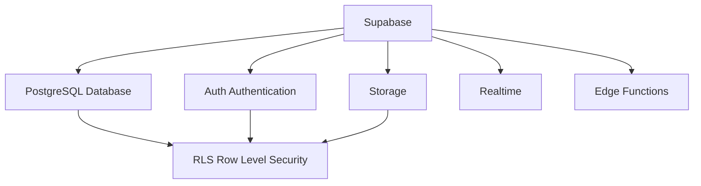
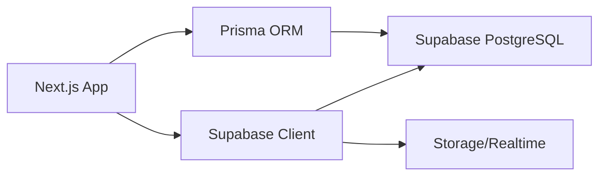

# 4.8 Mở rộng: Tại sao Supabase mạnh mẽ đến vậy — Liên kết Storage với Authentication

### Tái cấu trúc nhận thức

Supabase không chỉ là "Firebase mã nguồn mở" — nó là nền tảng backend fullstack dựa trên PostgreSQL, tích hợp hoàn hảo database, authentication, storage, và realtime subscription.

### Toàn cảnh hệ sinh thái Supabase



### Điều hướng các chương con

| Chương | Chủ đề | Vấn đề cốt lõi |
|------|------|----------|
| 4.8.1 | Storage | Làm thế nào lưu trữ và truy cập file một cách an toàn? |
| 4.8.2 | Realtime | Làm thế nào push thời gian thực khi dữ liệu thay đổi? |
| 4.8.3 | Edge Functions | Làm thế nào chạy custom logic tại edge? |

### Tại sao chọn Supabase?

| Tính năng | Supabase | Phương án truyền thống |
|------|----------|----------|
| Database | PostgreSQL (cấp doanh nghiệp) | Nhiều lựa chọn |
| Authentication | Tích hợp sẵn + liên kết RLS | Phải tự triển khai |
| File Storage | Tích hợp sẵn + kiểm soát quyền | Cần dịch vụ riêng |
| Realtime Subscription | Tích hợp sẵn WebSocket | Phải tự dựng |
| Pricing | Gói miễn phí đủ dùng | Chi phí khó kiểm soát |

### Ưu thế cốt lõi: RLS thống nhất quyền hạn

Vũ khí tối thượng của Supabase là **Row Level Security** (RLS - Bảo mật cấp hàng), cho phép database, storage, realtime subscription chia sẻ cùng một bộ quy tắc quyền hạn:

```sql
-- Tạo policy: User chỉ có thể truy cập dữ liệu của chính mình
CREATE POLICY "Users can view own data"
ON users
FOR SELECT
USING (auth.uid() = id);

-- Cùng policy này tự động áp dụng cho:
-- - Truy vấn database
-- - Truy cập file storage
-- - Filter realtime subscription
```

### Bắt đầu nhanh

**Cài đặt SDK**:

```bash
npm install @supabase/supabase-js
```

**Khởi tạo client**:

```typescript
// lib/supabase.ts
import { createClient } from '@supabase/supabase-js'

export const supabase = createClient(
  process.env.NEXT_PUBLIC_SUPABASE_URL!,
  process.env.NEXT_PUBLIC_SUPABASE_ANON_KEY!
)
```

### Mối quan hệ với Prisma



- **Prisma**: Dùng cho thao tác database phức tạp
- **Supabase Client**: Dùng cho storage, realtime subscription, authentication, v.v.

### Tóm tắt chương này

- Supabase cung cấp giải pháp backend toàn diện một cửa
- RLS là cốt lõi kiểm soát quyền thống nhất
- Có thể phối hợp sử dụng với Prisma
- Thích hợp để xây dựng nhanh ứng dụng fullstack
