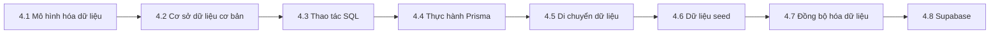

# 4 ｜Cơ sở dữ liệu và Vòng đời dữ liệu

### Tái cấu trúc nhận thức

Cơ sở dữ liệu không phải là "nơi lưu trữ dữ liệu", mà là **trung tâm bộ nhớ** của ứng dụng. Nó quyết định ứng dụng của bạn có thể "ghi nhớ" gì, "nhớ lại" gì, và làm thế nào để đảm bảo "trí nhớ" chính xác.

### Mục tiêu học tập chương này

Sau khi hoàn thành chương này, bạn sẽ có thể:

- Hiểu các khái niệm cốt lõi của mô hình hóa dữ liệu, thiết kế cấu trúc dữ liệu hợp lý
- Nắm vững các nguyên lý cơ bản và thao tác của cơ sở dữ liệu quan hệ
- Sử dụng thành thạo Prisma ORM để phát triển cơ sở dữ liệu
- Xử lý các vấn đề về di chuyển dữ liệu, dữ liệu seed và đồng bộ hóa dữ liệu
- Hiểu các tính năng nâng cao của Supabase

### Điều hướng chương

| Chương | Chủ đề | Nội dung cốt lõi |
|------|------|----------|
| 4.1 | Mô hình hóa dữ liệu | Sơ đồ ER, quan hệ thực thể, lý thuyết chuẩn hóa |
| 4.2 | Cơ sở dữ liệu cơ bản | CRUD, chỉ mục, giao dịch, kiểm soát đồng thời |
| 4.3 | SQL cơ bản | DDL, DML, ràng buộc, JOIN, tổng hợp |
| 4.4 | Thực hành Prisma | Schema, migration, truy vấn, giao dịch |
| 4.5 | Di chuyển dữ liệu | Đồng bộ môi trường, rollback, xử lý dữ liệu |
| 4.6 | Dữ liệu seed | Tạo dữ liệu idempotent, dữ liệu test, làm sạch dữ liệu nhạy cảm |
| 4.7 | Đồng bộ hóa dữ liệu | Tính idempotent, xử lý xung đột, tính nhất quán |
| 4.8 | Supabase | Storage bucket, đăng ký realtime, edge functions |

### Giải thích về Tech Stack

Tech stack được sử dụng trong chương này:

- **ORM**: Prisma (truy cập cơ sở dữ liệu an toàn về kiểu)
- **Cơ sở dữ liệu**: PostgreSQL (môi trường production) / SQLite (môi trường development)
- **BaaS**: Supabase (giải pháp fullstack tùy chọn)

### Đề xuất lộ trình học tập

- **Không có nền tảng**: Học theo thứ tự 4.1 → 4.2 → 4.3 → 4.4
- **Có nền tảng SQL**: Có thể bỏ qua 4.2, 4.3, tập trung học 4.4 Prisma
- **Sử dụng Supabase**: Sau khi hoàn thành phần cơ bản, tập trung học 4.8
