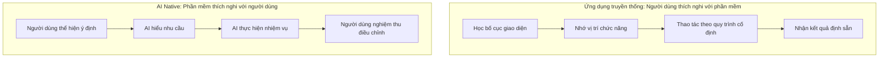

# 5.1.1 Tại sao ứng dụng AI khác biệt — Đặc điểm của ứng dụng AI Native

### Ý chính trong một câu

Sự khác biệt bản chất của ứng dụng AI Native: **Người dùng từ "học cách vận hành phần mềm" chuyển sang "nói cho phần mềm biết mình muốn gì"**.

### Giá trị cốt lõi

Hiểu được đặc điểm của AI Native sẽ giúp bạn:
- Thiết kế tương tác sản phẩm phù hợp hơn với thời đại AI
- Khi làm việc với AI, tận dụng tốt hơn khả năng "hiểu ý định" của nó
- Tránh dùng tư duy phần mềm truyền thống để thiết kế tính năng hỗ trợ AI

### Ứng dụng truyền thống vs Ứng dụng AI Native



| Khía cạnh | Ứng dụng truyền thống | Ứng dụng AI Native |
|------|----------|----------------|
| **Phương thức tương tác** | Click menu, điền form | Đối thoại ngôn ngữ tự nhiên |
| **Chi phí học tập** | Cần đào tạo và ghi nhớ | Biết nói là biết dùng |
| **Ranh giới chức năng** | Phát triển gì thì có nấy | Phản hồi linh hoạt trong phạm vi khả năng |
| **Cá nhân hóa** | Tùy chọn cấu hình hạn chế | Tự động thích nghi theo ngữ cảnh |

### Ba đặc trưng cốt lõi của AI Native

#### 1. Ngôn ngữ tự nhiên là giao diện chính

```
Cách truyền thống:
File → Export → Chọn PDF → Thiết lập lề → Chọn phạm vi trang → Xác nhận

AI Native:
"Xuất tài liệu này thành PDF, lề 2cm, chỉ lấy trang 1-5"
```

**Gợi ý**: Khi làm việc với AI để viết code, bạn không cần nhớ tất cả API, chỉ cần mô tả hiệu quả bạn mong muốn.

#### 2. Nhận thức và ghi nhớ ngữ cảnh

AI có thể nhớ cuộc trò chuyện trước đó, hiểu mối quan hệ chỉ định:

```
Bạn: Giúp tôi tạo bảng user, bao gồm id, name, email
AI: [Tạo Prisma schema]

Bạn: Thêm trường thời gian tạo nữa
AI: [Hiểu là thêm createdAt vào bảng vừa tạo]
```

**Gợi ý**: Khi đối thoại với AI, bạn có thể bổ sung yêu cầu từng bước, không cần nói hết tất cả chi tiết một lần.

#### 3. Suy luận ý định và hoàn thiện thông minh

AI có thể suy luận ý định thực sự của bạn từ mô tả chưa đầy đủ:

```
Bạn: Nút này click không phản hồi gì
AI: [Hiểu bạn có thể muốn thêm hàm xử lý sự kiện click]
```

**Gợi ý**: AI sẽ "đoán" ý định của bạn, nhưng có thể đoán sai. Yêu cầu quan trọng cần nói rõ ràng, đừng dựa vào suy luận.

### Hướng dẫn tránh lỗi

**Nhầm lẫn phổ biến: Cho rằng AI có thể "tự động hiểu mọi thứ"**

AI chỉ hiểu được nội dung bạn **đã thể hiện**. Nếu bạn nói "làm một trang đẹp", AI không biết bạn cho cái gì là "đẹp".

**Cách làm đúng**: Cung cấp tham khảo và ràng buộc cụ thể:
- "Tham khảo phong cách Stripe"
- "Dùng bảng màu mặc định của Tailwind"
- "Card bo góc 8px, khoảng cách 16px"

### Ảnh hưởng đến thiết kế sản phẩm

Nếu sau này bạn thiết kế sản phẩm AI Native, hãy nhớ những nguyên tắc này:

1. **Giảm bước thao tác**: Làm được bằng một câu nói thì đừng thiết kế form nhiều bước
2. **Cung cấp phản hồi rõ ràng**: AI đang làm gì, làm xong chưa, kết quả đúng không
3. **Cho phép điều chỉnh**: Khi người dùng nói "không đúng, tôi muốn..." thì dễ dàng chỉnh sửa
4. **Thiết lập ranh giới**: Làm rõ AI có thể làm gì, không thể làm gì, tránh người dùng kỳ vọng sai
