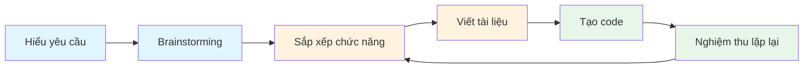

# 5.1.2 AI gói trọn việc phát triển — AI hỗ trợ toàn bộ quy trình phát triển sản phẩm

### Ý chính trong một câu

AI có thể tham gia từ "hiểu yêu cầu" đến "tạo code" trong toàn bộ quy trình, nhưng **bạn luôn là người quyết định và nghiệm thu**.

### Bản đồ cộng tác toàn quy trình



| Giai đoạn | Trách nhiệm của bạn | Vai trò của AI |
|------|----------|-----------|
| **Hiểu yêu cầu** | Cung cấp thông tin gốc | Giúp bạn phân tách, đặt câu hỏi, làm rõ |
| **Brainstorming** | Chọn hướng đi | Đưa ý tưởng, phân tích khả thi |
| **Sắp xếp chức năng** | Xác định ưu tiên | Tổ chức có cấu trúc, kiểm tra bổ sung |
| **Viết tài liệu** | Kiểm duyệt xác nhận | Tạo bản nháp, chuẩn hóa định dạng |
| **Tạo code** | Nghiệm thu kiểm tra | Viết code, xử lý chi tiết |
| **Nghiệm thu lặp lại** | Phản hồi vấn đề | Sửa lỗi điều chỉnh, tối ưu cải tiến |

### Giai đoạn một: Hiểu yêu cầu

**Tình huống**: Bạn nhận được yêu cầu mơ hồ, ví dụ "làm hệ thống blog".

**Cách cộng tác với AI**:

```
Bạn: Tôi muốn làm hệ thống blog, hãy giúp tôi sắp xếp yêu cầu cốt lõi

AI sẽ giúp bạn:
1. Đặt câu hỏi làm rõ: Dành cho cá nhân hay nhiều người dùng? Cần comment không?
2. Liệt kê danh sách chức năng: Quản lý bài viết, phân loại tag, hệ thống user...
3. Nhận diện ràng buộc kỹ thuật: Yêu cầu SEO, cân nhắc hiệu năng...
```

**Điểm quyết định của bạn**: Chọn từ các tùy chọn AI cung cấp, làm rõ ranh giới.

### Giai đoạn hai: Brainstorming

**Tình huống**: Sau khi làm rõ yêu cầu, cần quyết định phương án thực hiện cụ thể.

**Cách cộng tác với AI**:

```
Bạn: Editor bài viết của hệ thống blog có những phương án thực hiện nào?

AI sẽ cung cấp:
1. So sánh phương án: Markdown vs Rich text vs Block editor
2. Phân tích ưu nhược: Chi phí học tập, độ khó phát triển, trải nghiệm người dùng
3. Gợi ý đề xuất: Đề xuất phương án phù hợp theo tình huống của bạn
```

**Điểm quyết định của bạn**: Chọn phương án phù hợp nhất với tình huống của bạn.

### Giai đoạn ba: Sắp xếp chức năng

**Tình huống**: Sắp xếp các ý tưởng lộn xộn thành danh sách chức năng có cấu trúc.

**Cách cộng tác với AI**:

```
Bạn: Giúp tôi sắp xếp chức năng của hệ thống blog thành hai phần MVP và phát triển tiếp theo

AI sẽ giúp bạn:
1. Phân loại theo ưu tiên: Chức năng cốt lõi vs điểm nhấn
2. Nhận diện quan hệ phụ thuộc: Chức năng nào phụ thuộc vào chức năng khác
3. Ước lượng độ phức tạp: Đơn giản/Trung bình/Phức tạp
```

**Ví dụ đầu ra**:

```markdown
## MVP (Phiên bản đầu)
- [ ] CRUD bài viết
- [ ] Markdown editor
- [ ] Trang danh sách bài viết

## V1.1 (Phiên bản hai)
- [ ] Phân loại và tag
- [ ] Chức năng tìm kiếm

## V1.2 (Phiên bản ba)
- [ ] Hệ thống comment
- [ ] Đăng ký RSS
```

### Giai đoạn bốn: Viết tài liệu

**Tình huống**: Chuyển danh sách chức năng thành tài liệu có cấu trúc mà AI có thể thực thi.

**Cách cộng tác với AI**:

```
Bạn: Giúp tôi viết phương án kỹ thuật cho chức năng "CRUD bài viết"

AI sẽ tạo:
1. Thiết kế mô hình dữ liệu
2. Định nghĩa API interface
3. Kế hoạch trang frontend
4. Xử lý trường hợp biên
```

**Điểm kiểm duyệt của bạn**:
- Cấu trúc dữ liệu có hợp lý không?
- Thiết kế interface có tuân thủ chuẩn RESTful không?
- Có bỏ sót tình huống quan trọng nào không?

### Giai đoạn năm: Tạo code

**Tình huống**: Dựa trên tài liệu để AI tạo code.

**Cách cộng tác với AI**:

```
Bạn: Dựa trên phương án kỹ thuật ở trên, tạo Prisma schema và API routes

AI sẽ tạo:
- prisma/schema.prisma
- app/api/posts/route.ts
- app/api/posts/[id]/route.ts
```

**Điểm nghiệm thu của bạn**:
- Code có chạy được không?
- Logic có đúng không?
- Có tuân thủ quy chuẩn dự án không?

### Giai đoạn sáu: Nghiệm thu lặp lại

**Tình huống**: Phát hiện vấn đề, để AI sửa.

**Cách phản hồi hiệu quả**:

```
❌ Phản hồi không tốt: "Cái này không đúng"

✅ Phản hồi tốt: "Khi tạo bài viết, nếu tiêu đề rỗng, nên trả về lỗi 400,
nhưng hiện tại trả về 500. Hãy kiểm tra logic validate tham số."
```

**Kỹ thuật lặp lại**:
1. **Một lần chỉ phản hồi một vấn đề**: Tránh AI bỏ sót
2. **Cung cấp thông tin lỗi cụ thể**: Log lỗi, screenshot
3. **Nói rõ hành vi mong đợi**: Bạn mong muốn nó thành như thế nào

### Tâm pháp cộng tác

1. **Từ thô đến chi tiết**: Bắt đầu từ khung tổng thể, dần dần chi tiết hóa
2. **Nghiệm thu từng bước**: Đừng đợi hoàn thành hết mới kiểm tra, mỗi giai đoạn đều phải nghiệm thu
3. **Giữ chủ động**: AI là trợ lý, không phải sếp, bạn quyết định hướng đi
4. **Ghi lại quyết định**: Những lựa chọn quan trọng hãy ghi lại, tiện cho việc xem lại sau này
