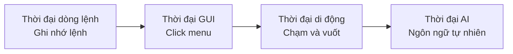

# 5.1.3 Tạm biệt việc click chuột rườm rà — AI tái cấu trúc phương thức tương tác

### Ý chính trong một câu

Cốt lõi thiết kế tương tác thời đại AI: **Dùng một câu hoàn thành thao tác trước đây cần click mười lần**.

### Sự tiến hóa của mô hình tương tác



| Thời đại | Tương tác chính | Chi phí học tập | Tính linh hoạt |
|------|----------|----------|--------|
| Dòng lệnh | Nhập lệnh | Cao | Cao |
| Giao diện đồ họa | Click nút | Trung bình | Trung bình |
| Mobile | Chạm cử chỉ | Thấp | Thấp |
| AI | Ngôn ngữ tự nhiên | Thấp nhất | Cao nhất |

### Điểm đau của tương tác truyền thống

Lấy "xuất PDF" làm ví dụ:

```
Cách truyền thống (6 bước):
1. Click menu "Tệp"
2. Tìm tùy chọn "Xuất"
3. Chọn "Định dạng PDF"
4. Thiết lập lề trang
5. Chọn phạm vi trang
6. Click "Xác nhận"

Cách AI (1 bước):
"Xuất thành PDF, lề 2cm, chỉ lấy 5 trang đầu"
```

### Ưu điểm cốt lõi của tương tác AI

#### 1. Trực tiếp đến ý định

Người dùng không cần biết chức năng nằm ở menu nào, chỉ cần nói trực tiếp mình muốn kết quả gì:

```
Truyền thống: Tôi phải tìm chức năng này ở đâu?
AI: Tôi nói trực tiếp tôi muốn gì
```

#### 2. Tham số nội tuyến

Không cần điền từng trường một, tất cả điều kiện nói trong một câu:

```
Truyền thống: Điền form → Ngày tháng, số tiền, danh mục chọn riêng
AI: "Giúp tôi thống kê chi tiêu ăn uống tháng trước vượt quá 100 đồng"
```

#### 3. Thao tác phức hợp

Nhiều bước có thể gộp thành một chỉ thị:

```
Truyền thống: Tạo thư mục → Di chuyển tệp → Đổi tên
AI: "Xếp các ảnh này theo ngày tháng vào từng thư mục khác nhau"
```

### Gợi ý cho lập trình viên

Khi dùng AI hỗ trợ lập trình, cũng có thể:

**Cách truyền thống**:
1. Mở tài liệu tra API
2. Sao chép code mẫu
3. Sửa tham số
4. Chạy debug

**Cách AI**:
```
"Dùng Prisma tạo bảng user, bao gồm id, email, password hash,
thời gian tạo, email cần unique index"
```

### Thiết kế sản phẩm AI thân thiện

Nếu sau này bạn thiết kế sản phẩm hỗ trợ tương tác AI, hãy nhớ những nguyên tắc này:

1. **Giảm bước thao tác**: Làm được bằng một câu nói thì đừng thiết kế form nhiều bước
2. **Cung cấp phản hồi rõ ràng**: AI đang làm gì, làm xong chưa, kết quả đúng không
3. **Cho phép điều chỉnh**: Khi người dùng nói "không đúng, tôi muốn..." thì dễ dàng chỉnh sửa
4. **Thiết lập ranh giới**: Làm rõ AI có thể làm gì, không thể làm gì, tránh người dùng kỳ vọng sai
