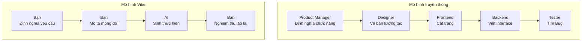

# 5.1.4 Vibe thay đổi thiết kế sản phẩm như thế nào

### Ý chính trong một câu

Lý niệm cốt lõi của Vibe Coding: **Bạn chịu trách nhiệm định nghĩa "làm gì" và "làm thành như thế nào", AI chịu trách nhiệm "làm thế nào"**.

### Thiết kế sản phẩm truyền thống vs Thiết kế sản phẩm Vibe



| Chiều | Mô hình truyền thống | Mô hình Vibe |
|------|----------|-----------|
| **Điểm chú ý** | Chi tiết thực hiện | Hiệu quả cuối cùng |
| **Đối tượng giao tiếp** | Thành viên nhóm | AI trợ lý |
| **Tốc độ lặp lại** | Ngày/tuần | Phút/giờ |
| **Chi phí thử sai** | Cao | Thấp |

### Ba nguyên tắc cốt lõi của thiết kế Vibe

#### 1. Hướng hiệu quả, không hướng quy trình

**Tư duy truyền thống**: Nghĩ rõ từng bước làm thế nào trước, rồi mới bắt đầu thực thi
**Tư duy Vibe**: Mô tả hiệu quả muốn đạt được trước, để AI tìm con đường tối ưu nhất

```
Truyền thống: "Tôi cần thư viện quản lý state, cân nhắc dùng Redux hay Zustand..."

Vibe: "Tôi cần chia sẻ state đăng nhập user giữa nhiều component,
làm sao để state vẫn giữ nguyên sau khi refresh trang, giúp tôi thực hiện"
```

#### 2. Chi tiết hóa dần dần, không phải một lần đạt tới

**Tư duy truyền thống**: Viết một bản PRD đầy đủ, rồi bắt đầu phát triển
**Tư duy Vibe**: Chạy thông vòng lặp nhỏ nhất trước, rồi từng bước thêm chi tiết

```
Vòng một: "Làm một blog, có thể đăng bài viết là được"
Vòng hai: "Thêm hỗ trợ Markdown"
Vòng ba: "Bài viết cần có thể phân loại và gắn tag"
Vòng bốn: "Thêm chức năng tìm kiếm"
```

#### 3. Xác minh nhanh, không phải lập kế hoạch hoàn hảo

**Tư duy truyền thống**: Lập kế hoạch chu đáo rồi mới động tay, tránh làm lại
**Tư duy Vibe**: Cho ra nguyên mẫu nhanh, phát hiện vấn đề qua sử dụng thực tế

```
Truyền thống: Mất một tuần viết PRD → một tuần thiết kế → hai tuần phát triển → phát hiện hiểu nhầm yêu cầu

Vibe: 30 phút ra nguyên mẫu → dùng thử phát hiện vấn đề → 10 phút điều chỉnh → dùng thử lại
```

### Ảnh hưởng đến định nghĩa sản phẩm

Trong mô hình Vibe, trọng tâm định nghĩa sản phẩm chuyển từ "làm thế nào thực hiện" sang:

1. **Người dùng là ai**: Chức năng này cho ai dùng?
2. **Tình huống là gì**: Người dùng dùng trong tình huống nào?
3. **Mong đợi là gì**: Người dùng mong muốn nhận được kết quả gì?
4. **Tiêu chuẩn thành công**: Làm thế nào để đánh giá chức năng này làm tốt hay không?

### Gợi ý thực hành

1. **Làm phiên bản nhỏ nhất khả dụng trước**: Phiên bản thô nhưng chạy được, giá trị hơn kế hoạch hoàn hảo
2. **Để AI đưa ra các lựa chọn**: Không chắc chắn thì để AI đưa ra 2-3 phương án cho bạn chọn
3. **Giữ nhịp độ lặp lại**: Mỗi lần chỉ sửa một phần nhỏ, xác minh xong mới tiếp tục
4. **Ghi lại lý do quyết định**: Tại sao chọn A không chọn B, sau này có thể dùng đến

### Thay đổi tâm thái

Từ "tôi phải nghĩ rõ từng chi tiết" chuyển sang "tôi nói rõ yêu cầu cốt lõi trước, chi tiết sẽ hoàn thiện trong quá trình lặp lại".

Đây không phải lười biếng, mà là cách làm việc hiệu quả hơn. Thời gian của bạn nên dành cho việc suy nghĩ "làm gì" và "tại sao làm", chứ không phải vướng vào chi tiết thực hiện.
