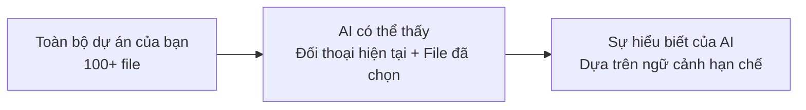

# 5.1.6 Làm thế nào để AI nhớ dự án của bạn — Chiến lược quản lý ngữ cảnh

### Ý chính trong một câu

"Trí nhớ" của AI có giới hạn, **tổ chức và cung cấp ngữ cảnh hiệu quả** là chìa khóa cho cộng tác hiệu quả.

### Hiểu giới hạn "trí nhớ" của AI

AI không thực sự "nhớ" dự án của bạn. Mỗi lần đối thoại, nó chỉ có thể thấy:
1. **Lịch sử đối thoại hiện tại** (có giới hạn số lượng token)
2. **Nội dung file bạn chủ động cung cấp**
3. **Đoạn code được tool đọc**



### Ba cấp độ quản lý ngữ cảnh

#### Cấp độ một: Ngữ cảnh cấp dự án

Tạo file `CONTEXT.md` hoặc `AI_INSTRUCTIONS.md` ở thư mục gốc dự án:

```markdown
# Tổng quan dự án
Đây là hệ thống blog, sử dụng Next.js 16 + Prisma + PostgreSQL

# Quy chuẩn kỹ thuật
- Sử dụng App Router, không dùng Pages Router
- Style thống nhất dùng Tailwind CSS
- Thao tác database thống nhất dùng Prisma
- API tuân thủ quy chuẩn RESTful

# Cấu trúc thư mục
- app/: Trang và API routes
- components/: Component có thể tái sử dụng
- lib/: Hàm công cụ
- prisma/: Database schema

# Quy chuẩn code
- Component dùng PascalCase đặt tên
- File dùng kebab-case đặt tên
- Ưu tiên dùng server component
```

#### Cấp độ hai: Ngữ cảnh cấp module

Tạo `README.md` trong thư mục module phức tạp:

```markdown
# Module xác thực người dùng

## Chức năng
- Đăng nhập bằng email và mật khẩu
- OAuth bên thứ ba (GitHub, Google)
- Quản lý JWT Token

## File liên quan
- app/api/auth/: API liên quan xác thực
- lib/auth.ts: Hàm công cụ xác thực
- middleware.ts: Bảo vệ route
```

#### Cấp độ ba: Ngữ cảnh cấp nhiệm vụ

Mỗi lần bắt đầu đối thoại, cung cấp ngữ cảnh nhiệm vụ hiện tại:

```
Nhiệm vụ hiện tại: Thực hiện chức năng tìm kiếm bài viết

File liên quan:
- app/api/posts/route.ts (đã có API danh sách bài viết)
- prisma/schema.prisma (Model Post)

Yêu cầu: Thêm tham số search vào interface GET /api/posts,
hỗ trợ tìm kiếm mờ theo tiêu đề và nội dung
```

### Kỹ thuật thực dụng

#### 1. Sử dụng @ tham chiếu file

Trong Cursor và các AI IDE khác, dùng `@tên-file` để nhanh chóng đưa ngữ cảnh:

```
@schema.prisma @route.ts
Hãy thêm chức năng phân loại trên cơ sở này
```

#### 2. Tạo snapshot ngữ cảnh

Lưu mô tả trạng thái hiện tại tại các mốc quan trọng:

```markdown
## Snapshot trạng thái 2024-01-15

### Đã hoàn thành
- Đăng ký đăng nhập user
- CRUD bài viết
- UI cơ bản

### Đang tiến hành
- Chức năng comment

### Chưa bắt đầu
- Tìm kiếm
- RSS
```

#### 3. Cung cấp từng đoạn

Nếu ngữ cảnh quá dài, chia thành nhiều lần cung cấp:

```
Lần thứ nhất: Tôi sẽ giới thiệu cho bạn về bối cảnh dự án...
Lần thứ hai: Đây là model dữ liệu liên quan...
Lần thứ ba: Bây giờ xin hãy giúp tôi thực hiện chức năng này...
```

### Câu hỏi thường gặp

**Q: AI quên nội dung đã nói trước đó phải làm sao?**

A: Cung cấp lại thông tin quan trọng, hoặc tóm tắt tiến độ trước đó khi bắt đầu đối thoại mới.

**Q: Dự án quá lớn, AI không thể hiểu toàn cảnh phải làm sao?**

A: Chỉ cung cấp file liên quan đến nhiệm vụ hiện tại, không cần để AI hiểu toàn bộ dự án.

**Q: Làm thế nào để biết ngữ cảnh có đủ không?**

A: Nếu câu trả lời của AI rõ ràng lệch khỏi mong đợi, rất có thể là ngữ cảnh chưa đủ. Bổ sung thông tin liên quan rồi thử lại.
