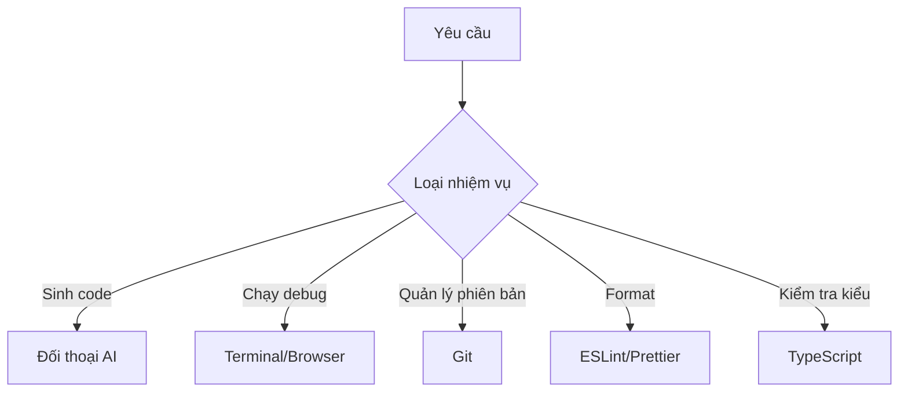

# 5.1.7 Đừng làm AI quá tải — Chiến lược gọi công cụ

### Ý chính trong một câu

AI không phải vạn năng, **giao nhiệm vụ phù hợp cho công cụ phù hợp** mới là bí quyết cộng tác hiệu quả.

### Điều AI giỏi và không giỏi

| AI giỏi | AI không giỏi |
|---------|-----------|
| Sinh khung code | Refactor phức tạp nhiều file |
| Giải thích khái niệm và nguyên lý | Debug lỗi runtime thời gian thực |
| Cung cấp ý tưởng thực hiện | Truy cập dịch vụ và API bên ngoài |
| Gợi ý review code | Nhớ state xuyên suốt các đối thoại |
| Chuyển đổi định dạng và chuẩn hóa | Tính toán toán học chính xác |

### Chiến lược phân công công cụ



#### 1. AI chịu trách nhiệm sinh, công cụ chịu trách nhiệm xác minh

```
Quy trình làm việc:
1. [AI] Sinh code
2. [TypeScript] Kiểm tra lỗi kiểu
3. [ESLint] Kiểm tra quy chuẩn code
4. [Browser] Xác minh tính đúng đắn của chức năng
5. [AI] Sửa vấn đề dựa trên phản hồi
```

#### 2. Đừng để AI làm công việc lặp đi lặp lại

```
❌ Mỗi lần đều để AI format lại code

✅ Cấu hình Prettier, tự động format khi lưu
```

#### 3. Tận dụng điểm mạnh của AI

```
✅ Sinh code boilerplate
✅ Giải thích thông báo lỗi phức tạp
✅ Cung cấp nhiều phương án thực hiện
✅ Gợi ý refactor code
```

### Lựa chọn công cụ cho các tình huống thường gặp

| Tình huống | Công cụ đề xuất | Lý do |
|------|----------|------|
| **Tạo file mới** | AI | Sinh template hoàn chỉnh |
| **Sửa đổi nhỏ** | Chỉnh sửa thủ công | Nhanh hơn mô tả |
| **Đổi tên hàng loạt** | Chức năng refactor IDE | Đáng tin cậy hơn |
| **Hiểu code lạ** | AI | Giỏi giải thích |
| **Tối ưu hiệu năng** | Profiler + AI | AI phân tích kết quả |
| **Cài đặt dependency** | Package manager | Đáng tin cậy hơn |

### Mô hình cộng tác hiệu quả

#### Mô hình một: AI viết khung, bạn điền chi tiết

```
Bạn: Giúp tôi tạo khung API CRUD quản lý user

AI: [Sinh cấu trúc cơ bản]

Bạn: [Tự điền logic nghiệp vụ, xử lý lỗi và các chi tiết khác]
```

#### Mô hình hai: Bạn viết code, AI review

```
Bạn: Giúp tôi review đoạn code này, xem có vấn đề gì

AI: [Chỉ ra vấn đề tiềm ẩn và gợi ý cải thiện]

Bạn: [Sửa đổi theo gợi ý]
```

#### Mô hình ba: AI giải thích, bạn quyết định

```
Bạn: Lỗi này nghĩa là gì? Có những phương án giải quyết nào?

AI: [Giải thích nguyên nhân, cung cấp 2-3 phương án]

Bạn: [Chọn phương án phù hợp để thực thi]
```

### Tránh các anti-pattern

**Anti-pattern 1: Để AI làm điều nó không giỏi**

```
❌ "Giúp tôi kết nối database thử xem"
(AI không thể thực thi thao tác thực tế)

✅ "Giúp tôi viết script test kết nối database, tôi sẽ chạy"
```

**Anti-pattern 2: Phụ thuộc quá mức vào AI**

```
❌ Mỗi thay đổi nhỏ đều hỏi AI

✅ Sửa đổi đơn giản tự làm, chỉ hỏi AI khi gặp vấn đề phức tạp
```

**Anti-pattern 3: Không cung cấp đủ thông tin cho AI**

```
❌ "Cái này không được"

✅ "Chạy báo lỗi: TypeError: Cannot read property 'id' of undefined
tại app/api/posts/route.ts dòng 15"
```

### Cấu hình toolchain đề xuất

```json
// package.json
{
  "scripts": {
    "dev": "next dev",
    "lint": "eslint .",
    "format": "prettier --write .",
    "typecheck": "tsc --noEmit"
  }
}
```

Chạy các kiểm tra này trước khi commit code, chứ không phải kỳ vọng AI giúp bạn phát hiện tất cả vấn đề.
