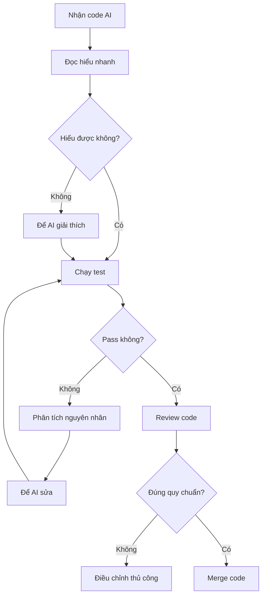

# 5.1.9 Code AI viết có dùng được không — Kiểm soát chất lượng code

### Ý chính trong một câu

Code AI sinh ra **không thể dùng trực tiếp**, phải trải qua review, test và tối ưu.

### Vấn đề thường gặp của code AI

| Loại vấn đề | Biểu hiện | Cấp độ rủi ro |
|----------|------|----------|
| **API ảo giác** | Dùng thư viện hoặc phương thức không tồn tại | Cao |
| **Cú pháp cũ** | Dùng cách viết phiên bản cũ | Trung bình |
| **Lỗ hổng logic** | Không xử lý trường hợp biên | Cao |
| **Rủi ro bảo mật** | Lộ thông tin nhạy cảm, rủi ro injection | Nghiêm trọng |
| **Vấn đề hiệu năng** | Thuật toán không hiệu quả, query lặp | Trung bình |
| **Style không nhất quán** | Không tuân theo quy chuẩn dự án | Thấp |

### Checklist review

Sau khi nhận code AI sinh, kiểm tra từng mục:

#### 1. Kiểm tra dependency

```
□ Thư viện được import có tồn tại trong package.json không?
□ Phương thức API có tồn tại trong phiên bản hiện tại không?
□ Đường dẫn import có đúng không?
```

#### 2. Kiểm tra logic

```
□ Đã xử lý null/undefined chưa?
□ Đã xử lý trường hợp mảng rỗng chưa?
□ Thao tác bất đồng bộ có xử lý lỗi không?
□ Vòng lặp có điều kiện kết thúc không?
```

#### 3. Kiểm tra bảo mật

```
□ Input người dùng có được validate và lọc không?
□ Thông tin nhạy cảm (key, password) không hardcode chứ?
□ Đã loại bỏ rủi ro SQL/NoSQL injection chưa?
□ Đã loại bỏ rủi ro XSS chưa?
```

#### 4. Kiểm tra hiệu năng

```
□ Query database có index cần thiết không?
□ Đã giải quyết vấn đề N+1 query chưa?
□ Dữ liệu lớn có phân trang không?
□ Không có tính toán lặp lại không cần thiết chứ?
```

### Quy trình review



### Ví dụ thực chiến

**Code AI sinh**:

```typescript
// Lấy danh sách user
export async function GET() {
  const users = await prisma.user.findMany()
  return Response.json(users)
}
```

**Phân tích vấn đề**:

1. ❌ Không có phân trang, khi dữ liệu lớn sẽ crash
2. ❌ Trả về tất cả trường, có thể lộ thông tin nhạy cảm
3. ❌ Không có xử lý lỗi

**Sau khi sửa**:

```typescript
export async function GET(request: Request) {
  try {
    const { searchParams } = new URL(request.url)
    const page = parseInt(searchParams.get('page') || '1')
    const limit = parseInt(searchParams.get('limit') || '10')

    const users = await prisma.user.findMany({
      skip: (page - 1) * limit,
      take: limit,
      select: {
        id: true,
        name: true,
        email: true,
        // Không trả về password và các trường nhạy cảm khác
      }
    })

    return Response.json(users)
  } catch (error) {
    console.error('Failed to fetch users:', error)
    return Response.json(
      { error: 'Internal server error' },
      { status: 500 }
    )
  }
}
```

### Rèn luyện khả năng review code

1. **Đọc nhiều code tốt**: Đọc dự án open source, học best practice
2. **Hiểu nguyên lý**: Biết tại sao phải viết thế này, chứ không chỉ sao chép
3. **Tổng kết kinh nghiệm**: Ghi lại lỗi AI thường mắc, lần sau kiểm tra trọng tâm
4. **Học tập liên tục**: Theo dõi công bố bảo mật, cập nhật best practice

### Xây dựng thói quen review

```
Mỗi lần nhận code AI:
1. Đừng vội chạy
2. Dành 2 phút review nhanh
3. Có nghi ngờ thì hỏi AI tại sao viết thế
4. Chạy và quan sát hành vi có đúng mong đợi không
5. Pass test mới merge
```
