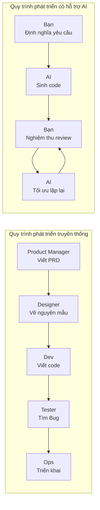

# 5.1 Nói rõ điều muốn làm trước — Lý niệm phát triển sản phẩm thời đại AI

Trong phát triển truyền thống, con đường từ "ý tưởng" đến "sản phẩm" là: **Ý tưởng → Tài liệu yêu cầu → Bản thiết kế → Code → Kiểm thử → Triển khai**. Mỗi bước đều cần nhân sự chuyên môn, mỗi bước đều có thể xuất hiện sai lệch trong hiểu biết.

Trong thời đại AI, con đường này được nén lại rất nhiều: **Ý tưởng → Mô tả có cấu trúc → AI sinh code → Người nghiệm thu → Tối ưu lặp lại**.

### Chuyển đổi cốt lõi: Từ "người thực thi" đến "người ra quyết định"

| Vai trò | Mô hình truyền thống | Thời đại AI |
|------|----------|---------|
| **Trách nhiệm của bạn** | Viết code, sửa Bug | Định nghĩa yêu cầu, nghiệm thu kết quả |
| **Năng lực cốt lõi** | Kỹ năng lập trình | Định nghĩa vấn đề, giao tiếp diễn đạt |
| **Phân bổ thời gian** | 80% code, 20% suy nghĩ | 30% mô tả, 70% nghiệm thu và lặp lại |

### Mục tiêu của phần này

Sau khi học xong phần này, bạn sẽ nắm được:

1. **Tư duy AI Native**: Hiểu sự khác biệt bản chất giữa ứng dụng AI và ứng dụng truyền thống
2. **Cộng tác toàn quy trình**: Học cách cộng tác hiệu quả với AI ở các giai đoạn "hiểu yêu cầu → thiết kế chức năng → sinh code → nghiệm thu lặp lại"
3. **Cơ bản về Prompt engineering**: Nắm các nguyên tắc cốt lõi để giao tiếp hiệu quả với AI
4. **Kiểm soát chất lượng**: Học cách review đầu ra của AI, nhận diện lỗi, đưa ra phản hồi

**Ghi nhớ**: AI là người thực thi hiệu quả của bạn, nhưng bạn mới là chủ nhân của sản phẩm. Bạn cần biết rõ "muốn làm gì", "tại sao làm", "làm thành như thế nào", AI mới có thể giúp bạn biến ý tưởng thành hiện thực.
