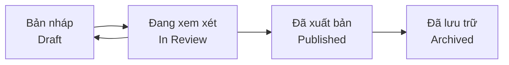

# 5.2.1 Liệu tài liệu này có tính pháp lý không — Quản lý trạng thái tài liệu

### Giải quyết vấn đề trong một câu

Trạng thái tài liệu cho mọi người biết: **liệu tài liệu này có thể lấy làm cơ sở hay không**.

### Tại sao cần quản lý trạng thái

Tài liệu không có nhãn trạng thái sẽ dẫn đến:

- **Sử dụng sai thông tin cũ**: Tưởng là phiên bản mới nhất, nhưng thực ra đã bị loại bỏ
- **Thực hiện quá sớm**: Bắt đầu phát triển dựa trên bản nháp chưa được xác nhận
- **Công việc trùng lặp**: Không biết người khác đã đang sửa đổi tài liệu này

### Các trạng thái tài liệu phổ biến



| Trạng thái | Ý nghĩa | Có thể thực hiện được |
|------|------|----------|
| **Bản nháp** | Tác giả vẫn đang viết, nội dung chưa hoàn chỉnh | ❌ Không |
| **Đang xem xét** | Chờ người khác xem xét và xác nhận | ❌ Không |
| **Đã xuất bản** | Đã được xác nhận, có thể dùng làm cơ sở | ✅ Có |
| **Đã lưu trữ** | Phiên bản cũ, chỉ để tham khảo | ❌ Không |

### Ghi chú trạng thái trong tài liệu

**Cách thứ nhất: Dữ liệu meta ở đầu tài liệu**

```markdown
status: draft  # draft | review | published | archived
author: Nguyễn Văn A
last_updated: 2024-01-15
```

**Cách thứ hai: Khung cảnh báo nổi bật**

```markdown
> ⚠️ **Trạng thái tài liệu: Bản nháp**
>
> Tài liệu này chưa hoàn thành xem xét, nội dung có thể thay đổi.
> Vui lòng không bắt đầu phát triển dựa trên tài liệu này.
```

**Cách thứ ba: Quy ước đặt tên tệp**

```
feature-login.md          # Đã xuất bản
feature-login.draft.md    # Bản nháp
feature-login.v1.md       # Phiên bản cũ đã lưu trữ
```

### Quy tắc chuyển đổi trạng thái

```
1. Tạo tài liệu mới → Bản nháp
2. Bản nháp hoàn thành → Gửi xem xét
3. Xem xét thông qua → Xuất bản
4. Xem xét không thông qua → Quay lại bản nháp để sửa đổi
5. Yêu cầu thay đổi → Bản xuất bản đổi thành bản nháp, xem xét lại
6. Tính năng bị tắt → Lưu trữ
```

### Tác động đến hợp tác với AI

Khi bạn cho AI xem tài liệu:

- **Bản nháp**: Nói với AI "Đây là bản nháp ban đầu, hãy giúp tôi hoàn thiện"
- **Đã xuất bản**: Nói với AI "Hãy thực hiện mã dựa trên tài liệu này"

```
Mẫu Prompt:

Đây là tài liệu PRD đã xuất bản, vui lòng tạo mã theo đúng yêu cầu của tài liệu,
không được tự ý thêm hoặc sửa đổi tính năng.

[Nội dung tài liệu]
```

### Gợi ý thực tiễn

1. **Dự án đơn giản**: Hai trạng thái Bản nháp → Xuất bản là đủ
2. **Hợp tác nhóm**: Thêm trạng thái "Đang xem xét", xác định rõ trách nhiệm
3. **Bảo trì lâu dài**: Thêm trạng thái "Đã lưu trữ" để giữ lịch sử
4. **Trạng thái phải nổi bật**: Đặt ở đầu tài liệu, dễ thấy một cái nhìn
