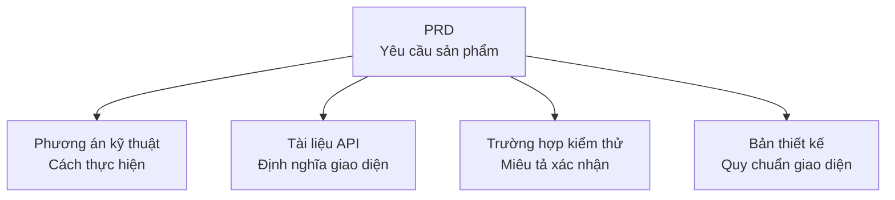

# 5.2.3 Đi đâu để tìm tài liệu liên quan — Lập chỉ mục tài liệu liên quan

### Giải quyết vấn đề trong một câu

Chỉ mục tài liệu liên quan cho bạn biết: **tính năng này còn có những tài liệu liên quan nào**.

### Tại sao cần lập chỉ mục tài liệu

Một tính năng thường liên quan đến nhiều tài liệu:



Nếu không có chỉ mục, bạn phải tìm kiếm tài liệu liên quan ở khắp nơi. Có chỉ mục, **tất cả tài liệu liên quan sẽ hiển thị rõ ràng**.

### Định dạng tiêu chuẩn của chỉ mục

```markdown
## Tài liệu liên quan

| Loại tài liệu | Liên kết | Giải thích |
|----------|------|------|
| Phương án kỹ thuật | [user-auth-tech.md](./tech/user-auth-tech.md) | Thiết kế kỹ thuật quy trình xác thực |
| Tài liệu API | [api/auth.md](./api/auth.md) | Định nghĩa giao diện đăng nhập, đăng ký |
| Trường hợp kiểm thử | [tests/auth.md](./tests/auth.md) | Trường hợp kiểm thử chức năng |
| Bản thiết kế | [Liên kết Figma](https://figma.com/...) | Quy chuẩn thiết kế giao diện người dùng |
```

### Các loại tài liệu liên quan phổ biến

| Loại | Nội dung | Ai chịu trách nhiệm |
|------|------|--------|
| **PRD** | Mô tả yêu cầu chức năng | Người sản phẩm/bạn tự mình |
| **Phương án kỹ thuật** | Ý tưởng thực hiện, thiết kế kiến trúc | Nhà phát triển/bạn tự mình |
| **Tài liệu API** | Định nghĩa giao diện, giải thích tham số | Backend/bạn tự mình |
| **Trường hợp kiểm thử** | Tiêu chuẩn xác nhận, kiểm thử biên giới | Bộ phận kiểm thử/bạn tự mình |
| **Bản thiết kế** | Quy chuẩn giao diện, giải thích tương tác | Nhà thiết kế/bạn tự mình |

### Ứng dụng trong Vibe Coding

Đối với dự án cá nhân, có thể đơn giản hóa cấu trúc tài liệu:

```
docs/
├── features/
│   ├── user-auth/
│   │   ├── prd.md          # Tài liệu yêu cầu
│   │   ├── tech-spec.md    # Phương án kỹ thuật
│   │   └── api.md          # Định nghĩa API
│   └── blog-posts/
│       ├── prd.md
│       └── tech-spec.md
└── shared/
    └── glossary.md         # Bảng thuật ngữ toàn cầu
```

### Nguyên tắc duy trì chỉ mục

1. **Thêm khi tạo**: Khi tạo tài liệu mới, cũng cập nhật chỉ mục của tài liệu liên quan
2. **Dọn dẹp khi xóa**: Khi xóa tài liệu, kiểm tra và xóa các liên kết bị hỏng
3. **Kiểm tra định kỳ**: Đảm bảo rằng các liên kết vẫn còn hiệu lực
4. **Liên kết hai chiều**: Nếu A liên kết đến B, thì B cũng nên liên kết đến A

### Tác động đến hợp tác với AI

Cung cấp tài liệu liên quan cho AI để nó có thể hiểu toàn bộ tình huống tốt hơn:

```
Tôi muốn thực hiện chức năng xác thực người dùng.

Tài liệu liên quan:
- PRD: [Dán nội dung hoặc liên kết]
- Phương án kỹ thuật: [Dán nội dung hoặc liên kết]
- Định nghĩa API đã có: [Dán nội dung hoặc liên kết]

Vui lòng tạo mã xác thực dựa trên tài liệu trên.
```

### Gợi ý thực tiễn

1. **Sử dụng đường dẫn tương đối**: `./tech-spec.md` thay vì đường dẫn tuyệt đối
2. **Giải thích mục đích tài liệu**: Không chỉ cho liên kết, mà còn giải thích tài liệu này để làm gì
3. **Phân biệt bắt buộc và tham khảo**: Ghi chú rõ tài liệu nào bắt buộc phải đọc, tài liệu nào là tham khảo tùy chọn
