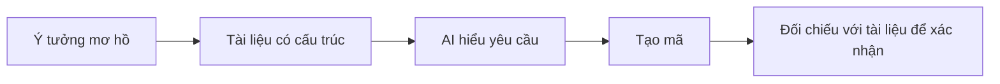

# 5.2 Tại sao phải viết tài liệu trước mã hóa — PRD Cơ bản

### Giá trị của việc viết tài liệu trước tiên

Trong Vibe Coding, tài liệu không phải là "chủ nghĩa hình thức để qua loa", mà là **giao diện cốt lõi để giao tiếp với AI**.



**Lợi ích của việc viết tài liệu trước tiên**:

1. **Buộc bạn suy nghĩ rõ ràng**: Không viết được có nghĩa chưa hiểu rõ
2. **Giảm chi phí giao tiếp**: AI hiểu ngay lần đầu, không cần giải thích lặp lại
3. **Dễ dàng xác nhận**: Có tài liệu mới biết "có thực hiện đúng không"
4. **Thuận tiện lặp lại**: Lần sau sửa đổi, bạn sẽ biết tại sao lại thiết kế như vậy

### Các thành phần cơ bản của tài liệu PRD

Một tài liệu PRD hợp lệ nên chứa các thông tin meta sau:

| Phần tử | Chức năng | Ví dụ |
|------|------|------|
| **Trạng thái tài liệu** | Xác định giai đoạn hiện tại của tài liệu | Bản nháp / Đang xem xét / Đã xuất bản |
| **Lịch sử cập nhật** | Theo dõi lịch sử thay đổi | v1.1: Thêm chức năng tìm kiếm |
| **Tài liệu liên quan** | Liên kết tài liệu nguồn và đích | Phương án kỹ thuật, tài liệu API |
| **Bảng thuật ngữ** | Thống nhất định nghĩa khái niệm | "Người dùng" là tài khoản đã đăng ký |

### Mẫu tài liệu ví dụ

```markdown
# [Tên tính năng] PRD

## Thông tin tài liệu
- **Trạng thái**: Bản nháp
- **Phiên bản**: v0.1
- **Tác giả**: [Tên của bạn]
- **Cập nhật cuối cùng**: 2024-01-15

## Lịch sử cập nhật
| Phiên bản | Ngày tháng | Nội dung thay đổi | Tác giả |
|------|------|----------|------|
| v0.1 | 2024-01-15 | Bản nháp ban đầu | xxx |

## Tài liệu liên quan
- [Phương án kỹ thuật](./tech-spec.md)
- [Tài liệu API](./api.md)

## Bảng thuật ngữ
| Thuật ngữ | Định nghĩa |
|------|------|
| Người dùng | Tài khoản đã hoàn thành đăng ký |
| Khách truy cập | Người duyệt chưa đăng nhập |

## Nội dung chính
[Mô tả tính năng, giải thích yêu cầu...]
```

### Mục tiêu của phần này

Sau khi hoàn thành phần này, bạn sẽ nắm vững:

1. **Quản lý trạng thái tài liệu**: Biết tài liệu đang ở giai đoạn nào
2. **Chuẩn mực ghi lịch sử cập nhật**: Mỗi lần sửa đổi đều có thể truy vết được
3. **Phương pháp lập chỉ mục tài liệu**: Tìm kiếm nhanh các tài liệu liên quan
4. **Duy trì bảng thuật ngữ**: Tránh sự nhầm lẫn khái niệm trong giao tiếp

**Hãy nhớ**: Viết tài liệu không phải để qua loa, mà để giúp AI hiểu rõ hơn yêu cầu của bạn. Một tài liệu tốt chính là một Prompt tốt.
