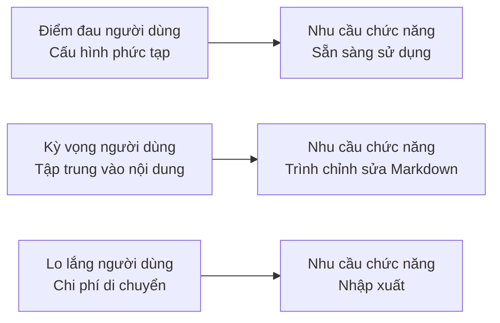

# 5.3.3 Người dùng thực sự muốn gì — AI hỗ trợ khai thác người dùng

### Giải phóng trong một câu

Để AI giúp bạn **đứng từ góc độ người dùng suy nghĩ**, khám phá những nhu cầu mà bạn là nhà phát triển không thấy được.

### Tại sao cần khai thác người dùng

Góc độ của nhà phát triển và góc độ người dùng thường có sự sai lệch:

| Nhu cầu mà bạn tưởng | Nhu cầu thực sự của người dùng |
|--------------|----------------|
| Tính năng càng nhiều càng tốt | Tính năng cốt lõi tốt là được |
| Giao diện phải lấp lánh | Tìm được tính năng muốn là được |
| Công nghệ phải tiên tiến | Tải nhanh, không lag là được |
| Cấu trúc dữ liệu phải hoàn hảo | Ít bước hoạt động là được |

### Sử dụng AI để xây dựng hình dung người dùng

**Mẫu Prompt**:

```markdown
Tôi muốn làm [mô tả sản phẩm].

Vui lòng giúp tôi phân tích người dùng mục tiêu:
1. Người dùng là ai? (đặc điểm nhân khẩu học)
2. Người dùng sử dụng trong tình huống nào?
3. Điểm đau chính của người dùng là gì?
4. Người dùng kỳ vọng nhận được giá trị gì?
5. Mối lo ngại có thể của người dùng là gì?
```

**Ví dụ đối thoại**:

```
Bạn: Tôi muốn làm một hệ thống blog cá nhân, người dùng mục tiêu là nhân viên kỹ thuật

AI: ## Phân tích hình dung người dùng

### 1. Người dùng là ai
- Tuổi: 25-40
- Nghề: Lập trình viên, quản lý kỹ thuật, tự truyền thông kỹ thuật
- Kỹ năng kỹ thuật: Quen với Markdown, Git, có khả năng phát triển nhất định
- Đặc điểm: Theo đuổi hiệu quả, có "bệnh sạch sẽ" kỹ thuật

### 2. Tình huống sử dụng
- Ghi chép bài học kỹ thuật và kinh nghiệm không may
- Chia sẻ dự án mã nguồn mở và phương án kỹ thuật
- Xây dựng thương hiệu kỹ thuật cá nhân
- Khi tìm việc, thể hiện khả năng kỹ thuật

### 3. Điểm đau chính
- Nền tảng bên thứ ba kiểm duyệt chặt chẽ, hạn chế nhiều
- Lo lắng nền tảng đóng cửa dẫn đến mất nội dung
- Muốn tùy chỉnh tên miền và phong cách
- Phương án hiện tại (như Hexo) cấu hình phức tạp

### 4. Giá trị kỳ vọng
- Xuất bản bài viết nhanh, tập trung vào nội dung
- SEO tốt, được công cụ tìm kiếm thu thập
- Tô sáng mã, hỗ trợ Markdown
- Chạy ổn định, không phải lo lắng bảo trì

### 5. Mối lo ngại có thể
- Chi phí máy chủ tự xây dựng blog
- Công sức bảo trì (cập nhật, bảo mật)
- Chi phí di chuyển (nội dung hiện tại cách nhập khẩu)
```

### Suy luận tính năng từ hình dung người dùng

Hình dung người dùng không phải là điểm kết thúc, mà là điểm bắt đầu để suy luận tính năng:



**Ánh xạ từ điểm đau đến chức năng**:

| Điểm đau người dùng | Tính năng tương ứng |
|----------|----------|
| Kiểm duyệt nền tảng nhiều | Hoàn toàn tự chủ có thể kiểm soát |
| Lo lắng bị mất | Sao lưu cục bộ, xuất khẩu |
| Cấu hình phức tạp | Triển khai một cú click, cấu hình mặc định |
| SEO kém | Tự động tạo sơ đồ trang, meta |

### Sử dụng AI để xác thực nhu cầu

Sau khi xác định tính năng, có thể để AI xác thực từ góc độ người dùng:

```
Bạn: Tôi dự định triển khai các tính năng sau trong hệ thống blog:
- Trình chỉnh sửa Markdown
- Danh mục bài viết
- Hệ thống bình luận

Vui lòng đánh giá từ góc độ người dùng, có nhu cầu quan trọng nào bị bỏ sót không?

AI: Từ góc độ người dùng, cũng đề xuất xem xét:

## Bỏ sót mức độ ưu tiên cao
1. **Tính năng tìm kiếm**: Khi bài viết nhiều, người dùng cần tìm nhanh nội dung lịch sử
2. **Lưu bản nháp**: Khi viết bài dài, nếu đóng trang ngoài ý muốn, nội dung không thể bị mất

## Gợi ý mức độ ưu tiên trung bình
3. **Đăng ký RSS**: Người dùng kỹ thuật quen dùng trình đọc RSS
4. **Sao chép khối mã**: Một cú click sao chép đoạn mã

## Có thể lặp lại sau
5. **Thống kê lượt đọc**: Hiểu bài viết nào được yêu thích
6. **Bài viết loạt**: Tổ chức bài viết liên quan thành loạt
```

### Phỏng vấn người dùng thay thế AI

Nếu không có điều kiện để phỏng vấn người dùng thực, có thể để AI mô phỏng:

```
Bạn: Vui lòng đóng vai một lập trình viên muốn xây dựng blog kỹ thuật, trả lời các câu hỏi của tôi.

AI: Được, tôi là một kỹ sư backend có 5 năm kinh nghiệm, gần đây muốn xây dựng một blog kỹ thuật...

Bạn: Bạn đánh giá cao tính năng nào nhất trong hệ thống blog?

AI: Trước tiên là hỗ trợ Markdown, điều này là bắt buộc. Thứ hai là triển khai phải đơn giản,
tôi không muốn dành quá nhiều thời gian cho vận hành. Ngoài ra, tốc độ tải phải nhanh,
tôi tự mình truy cập một trang web, nếu vượt quá 3 giây tôi sẽ đóng...
```

### Lời khuyên thực tế

1. **Phân biệt người dùng và khách hàng**: Người sử dụng sản phẩm và người trả tiền có thể không giống nhau
2. **Tránh tự thay thế**: Bạn không phải người dùng điển hình, nhu cầu của bạn không đại diện cho phần lớn
3. **Tập trung vào hành động chứ không phải thái độ**: Người dùng nói "tôi muốn X" không nhất thiết có nghĩa là họ sẽ sử dụng
4. **Xác thực liên tục**: Sau khi phát hành, thu thập phản hồi thực, sửa hình dung người dùng
