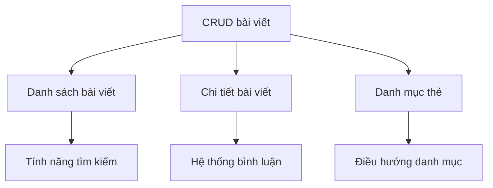

# 5.3.4 Từ ý tưởng đến danh sách tính năng — AI hỗ trợ sắp xếp tính năng

### Giải phóng trong một câu

Để AI giúp bạn sắp xếp những ý tưởng lộn xộn **thành danh sách tính năng có cấu trúc, có thể thực hiện được**.

### Chuyển đổi từ mơ hồ đến cụ thể


### Để AI giúp bạn sắp xếp tính năng

**Mẫu Prompt**:

```markdown
Tôi muốn làm [mô tả sản phẩm].

Vui lòng giúp tôi sắp xếp danh sách tính năng:
1. Phân loại theo mô-đun chức năng
2. Mỗi tính năng giải thích: mô tả tính năng, giá trị người dùng, độ phức tạp thực hiện
3. Đánh dấu tính năng nào là cốt lõi, tính năng nào có thể chọn
```

**Ví dụ đối thoại**:

```
Bạn: Tôi muốn làm một hệ thống blog cá nhân

AI: ## Danh sách chức năng

### Mô-đun một: Quản lý bài viết
| Tính năng | Mô tả | Giá trị người dùng | Độ phức tạp | Ưu tiên |
|------|------|----------|--------|--------|
| Tạo bài viết | Tạo bài viết mới và lưu | Tính năng cốt lõi | ⭐ | P0 |
| Chỉnh sửa bài viết | Sửa bài viết đã xuất bản | Tính năng cốt lõi | ⭐ | P0 |
| Xóa bài viết | Xóa bài viết không cần thiết | Tính năng cốt lõi | ⭐ | P0 |
| Lưu bản nháp | Lưu bài viết chưa xuất bản thành bản nháp | Ngăn mất nội dung | ⭐ | P1 |
| Xuất bản theo lịch | Đặt thời gian xuất bản | Lập kế hoạch nội dung | ⭐⭐ | P2 |

### Mô-đun hai: Hiển thị nội dung
| Tính năng | Mô tả | Giá trị người dùng | Độ phức tạp | Ưu tiên |
|------|------|----------|--------|--------|
| Danh sách bài viết | Hiển thị tất cả bài viết đã xuất bản | Tính năng cốt lõi | ⭐ | P0 |
| Chi tiết bài viết | Nội dung đầy đủ một bài viết | Tính năng cốt lõi | ⭐ | P0 |
| Điều hướng danh mục | Lọc bài viết theo danh mục | Tổ chức nội dung | ⭐ | P1 |
| Hệ thống thẻ | Đánh dấu bài viết đa chiều | Khám phá nội dung | ⭐ | P1 |
| Tính năng tìm kiếm | Tìm kiếm từ khóa bài viết | Định vị nhanh | ⭐⭐ | P1 |

### Mô-đun ba: Tương tác người dùng
| Tính năng | Mô tả | Giá trị người dùng | Độ phức tạp | Ưu tiên |
|------|------|----------|--------|--------|
| Hệ thống bình luận | Bình luận tương tác của người đọc | Cảm giác cộng đồng | ⭐⭐ | P2 |
| Thích/Yêu thích | Đánh dấu bài viết yêu thích | Tham gia người dùng | ⭐ | P2 |
| Tính năng chia sẻ | Chia sẻ sang nền tảng xã hội | Truyền tải nội dung | ⭐ | P2 |
```

### Cấu trúc phân lớp chức năng

Sắp xếp tính năng theo cấp, tiện lợi cho phát triển sau:

```
Hệ thống blog
├── Tính năng cốt lõi (P0 - bắt buộc)
│   ├── CRUD bài viết
│   ├── Danh sách/chi tiết bài viết
│   └── Trình chỉnh sửa Markdown
├── Tính năng quan trọng (P1 - nên có)
│   ├── Danh mục và thẻ
│   ├── Tìm kiếm
│   ├── Lưu bản nháp
│   └── Tối ưu hóa SEO
├── Tính năng nâng cao (P2 - có thể có)
│   ├── Hệ thống bình luận
│   ├── Thống kê lượt đọc
│   └── Đăng ký RSS
└── Tính năng tương lai (P3 - xem xét sau)
    ├── Hỗ trợ nhiều tác giả
    ├── Đăng ký thành viên
    └── Bản tin
```

### Phân tích phụ thuộc chức năng

Một số tính năng phụ thuộc vào tính năng khác, cần làm rõ thứ tự:



**Để AI giúp phân tích phụ thuộc**:

```
Bạn: Giúp tôi phân tích mối quan hệ phụ thuộc và thứ tự phát triển của những tính năng này

AI: ## Phân tích phụ thuộc

### Giai đoạn một (không phụ thuộc)
- CRUD bài viết: Tính năng cơ bản, tính năng khác đều phụ thuộc vào nó
- Xác thực người dùng: Nếu cần quản lý backend

### Giai đoạn hai (phụ thuộc giai đoạn một)
- Danh sách/chi tiết bài viết: Phụ thuộc dữ liệu bài viết
- Danh mục thẻ: Phụ thuộc mô hình bài viết

### Giai đoạn ba (phụ thuộc giai đoạn hai)
- Tính năng tìm kiếm: Cần dữ liệu bài viết
- Điều hướng danh mục: Cần dữ liệu danh mục

### Giai đoạn bốn (tính năng độc lập nâng cao)
- Hệ thống bình luận: Có thể phát triển độc lập
- Đăng ký RSS: Phụ thuộc danh sách bài viết
```

### Tiêu chuẩn mô tả tính năng

Mỗi tính năng nên chứa những thông tin sau:

```markdown
## Tên tính năng

### Mô tả tính năng
Một câu giải thích tính năng này làm gì

### Câu chuyện người dùng
Là [loại người dùng], tôi hy vọng [làm gì], để [nhận được giá trị gì]

### Tiêu chuẩn chấp nhận
- [ ] Điều kiện 1: Kết quả 1
- [ ] Điều kiện 2: Kết quả 2

### Trường hợp ranh giới
- Trường hợp 1: Cách xử lý
- Trường hợp 2: Cách xử lý
```

**Ví dụ**:

```markdown
## Xuất bản bài viết

### Mô tả tính năng
Người dùng có thể tạo và xuất bản bài viết blog

### Câu chuyện người dùng
Là một nhà blog, tôi hy vọng có thể soạn thảo và xuất bản bài viết, để chia sẻ kinh nghiệm kỹ thuật của tôi

### Tiêu chuẩn chấp nhận
- [ ] Có thể nhập tiêu đề (bắt buộc, 1-100 ký tự)
- [ ] Có thể nhập nội dung (bắt buộc, hỗ trợ Markdown)
- [ ] Có thể chọn danh mục (tùy chọn, chọn đơn)
- [ ] Có thể thêm thẻ (tùy chọn, chọn nhiều, tối đa 5 thẻ)
- [ ] Sau khi nhấp xuất bản, bài viết có thể nhìn thấy trên trang danh sách

### Trường hợp ranh giới
- Tiêu đề trống: Nhắc nhở "vui lòng nhập tiêu đề"
- Nội dung trống: Nhắc nhở "vui lòng nhập nội dung"
- Ngắt kết nối mạng: Lưu vào bản nháp cục bộ
```

### Lời khuyên thực tế

1. **Trước tiên thô, sau đó mịn**: Trước tiên liệt kê các mô-đun lớn, sau đó tách các tính năng nhỏ
2. **Góc độ người dùng**: Mỗi tính năng đều phải trả lời "mang lại giá trị gì cho người dùng"
3. **Đánh dấu ưu tiên**: Không phải tất cả tính năng đều quan trọng như nhau
4. **Giữ linh hoạt**: Danh sách tính năng sẽ điều chỉnh khi phát triển lặp lại
