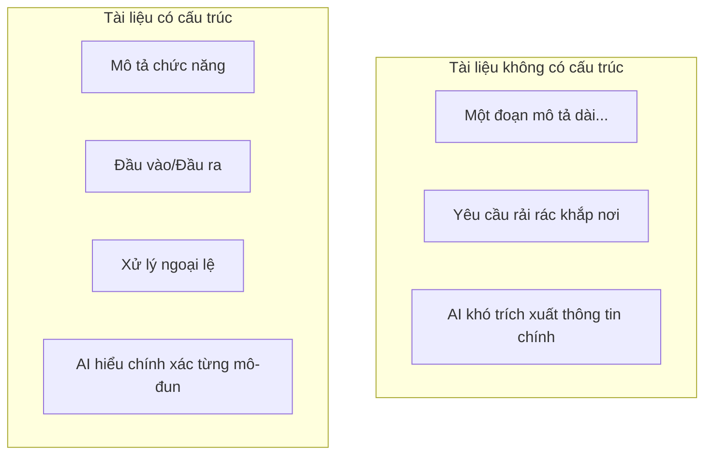

# 5.4.1 Tại sao định dạng lại quan trọng——PRD có cấu trúc

### Một câu nói lên vấn đề

Tài liệu có cấu trúc giúp AI có thể **định vị chính xác thông tin**, thay vì đoán trong các mô tả mơ hồ.

### Giá trị của cấu trúc



### Cấu trúc tài liệu được đề xuất

```markdown
# [Tên chức năng]

## Tổng quan chức năng
Một câu giải thích chức năng này làm gì

## Câu chuyện người dùng
Là [vai trò], tôi muốn [làm gì], để [lợi ích gì]

## Chi tiết chức năng

### Đầu vào
- Trường 1: loại, bắt buộc/tùy chọn, điều kiện ràng buộc
- Trường 2: loại, bắt buộc/tùy chọn, điều kiện ràng buộc

### Đầu ra
- Khi thành công: cấu trúc dữ liệu trả về
- Khi thất bại: mã lỗi và thông báo lỗi

### Quy tắc kinh doanh
1. Quy tắc 1
2. Quy tắc 2

### Xử lý ngoại lệ
| Tình huống ngoại lệ | Cách xử lý |
|----------|----------|
| Trường hợp 1 | Phản hồi 1 |
| Trường hợp 2 | Phản hồi 2 |

## Ràng buộc kỹ thuật
- Dùng công nghệ gì
- Tuân theo quy chuẩn nào

## Tiêu chí chấp nhận
- [ ] Tiêu chí 1
- [ ] Tiêu chí 2
```

### Ví dụ thực tế

**Chức năng**: Đăng ký người dùng

```markdown
# Đăng ký người dùng

## Tổng quan chức năng
Người dùng mới tạo tài khoản thông qua email và mật khẩu

## Câu chuyện người dùng
Là một khách truy cập mới, tôi muốn đăng ký một tài khoản, để lưu lại các cài đặt cá nhân của tôi

## Chi tiết chức năng

### Đầu vào
| Trường | Loại | Bắt buộc | Ràng buộc |
|------|------|------|------|
| email | string | Có | Định dạng email hợp lệ |
| password | string | Có | 8-20 ký tự, ít nhất 1 chữ cái và 1 số |
| name | string | Không | Tối đa 50 ký tự |

### Đầu ra
Thành công:
```json
{
  "id": "user_123",
  "email": "user@example.com",
  "name": "Nguyễn Văn A",
  "createdAt": "2024-01-15T10:00:00Z"
}
```

Thất bại:
```json
{
  "error": "EMAIL_EXISTS",
  "message": "Email này đã được đăng ký"
}
```

### Quy tắc kinh doanh
1. Email không phân biệt chữ hoa/thường
2. Mật khẩu phải được hash trước khi lưu
3. Gửi email xác minh sau khi đăng ký

### Xử lý ngoại lệ
| Tình huống ngoại lệ | Mã trạng thái HTTP | Mã lỗi |
|----------|-------------|--------|
| Email đã tồn tại | 409 | EMAIL_EXISTS |
| Định dạng email sai | 400 | INVALID_EMAIL |
| Mật khẩu không đạt yêu cầu | 400 | WEAK_PASSWORD |

## Ràng buộc kỹ thuật
- Đường dẫn API: POST /api/auth/register
- Dùng bcrypt mã hóa mật khẩu
- Trả về JWT token

## Tiêu chí chấp nhận
- [ ] Đầu vào hợp lệ có thể đăng ký thành công
- [ ] Email trùng trả về lỗi chính xác
- [ ] Mật khẩu được mã hóa trong cơ sở dữ liệu
```

### Lợi ích của việc mô-đun hóa

Sau khi chia tài liệu thành các mô-đun độc lập:

1. **AI dễ hiểu hơn**: Mỗi mô-đun có trách nhiệm rõ ràng
2. **Dễ cập nhật cục bộ**: Thay đổi một chỗ không ảnh hưởng những nơi khác
3. **Thuận tiện chấp nhận**: Kiểm tra từng mô-đun xem đã hoàn thành chưa
4. **Hỗ trợ lặp lại**: Có thể cài đặt mô-đun cốt lõi trước

### Các vấn đề cấu trúc thường gặp

**Vấn đề 1: Thông tin lẫn lộn**
```
❌ "Người dùng nhập email và mật khẩu, nếu email đã tồn tại thì báo lỗi, mật khẩu cần mã hóa..."

✅ Viết riêng:
- Đầu vào: email, mật khẩu
- Ngoại lệ: email đã tồn tại → báo lỗi
- Ràng buộc kỹ thuật: mật khẩu cần mã hóa
```

**Vấn đề 2: Thiếu thông tin chính**
```
❌ "Cài đặt chức năng đăng nhập người dùng"

✅ Bổ sung đầy đủ:
- Đầu vào: email, mật khẩu
- Đầu ra: thông tin người dùng + token
- Ngoại lệ: mật khẩu sai, người dùng không tồn tại
- Kỹ thuật: JWT hết hạn sau 7 ngày
```

### Lời khuyên thực tế

1. **Dùng mẫu**: Mỗi lần viết tài liệu dùng cách cấu trúc giống nhau
2. **Viết khung rồi điền**: Viết tiêu đề trước, rồi điền nội dung từ từ
3. **Giữ tính nhất quán**: Tất cả tài liệu trong dự án dùng cùng định dạng
4. **Kiểm tra định kỳ**: Xem cấu trúc tài liệu có cần tối ưu không
