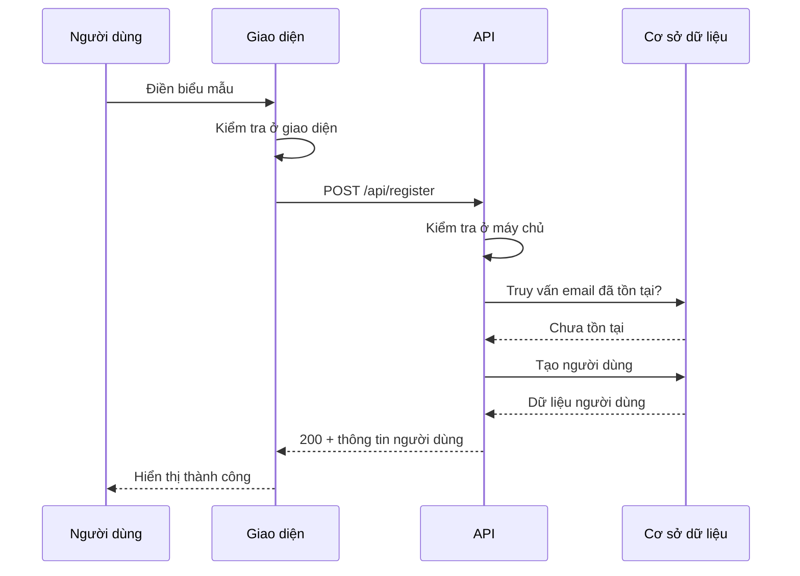

# 5.4.2 Dữ liệu từ đâu tới, tới đâu——Định nghĩa đầu vào/đầu ra

### Một câu nói lên vấn đề

Định nghĩa rõ ràng đầu vào/đầu ra giúp AI biết **nhận dữ liệu gì, trả về kết quả gì**.

### Tại sao đầu vào/đầu ra quan trọng


Định nghĩa đầu vào/đầu ra mơ hồ là nguồn gốc chính của lỗi mã:

| Định nghĩa mơ hồ | AI có thể hiểu | Bạn mong muốn |
|------------|---------------|----------|
| "Nhận dữ liệu người dùng" | Chỉ có name? | email + password + name |
| "Trả về thông tin người dùng" | Có mật khẩu không? | Không có trường nhạy cảm |
| "Trả về phân trang" | Một trang bao nhiêu dòng? | 10 dòng/trang |

### Các yếu tố của định nghĩa đầu vào

Mỗi trường đầu vào cần mô tả:

```markdown
| Trường | Loại | Bắt buộc | Giá trị mặc định | Ràng buộc | Mô tả |
|------|------|------|--------|----------|------|
| email | string | Có | - | Định dạng email hợp lệ | Email người dùng |
| password | string | Có | - | 8-20 ký tự | Mật khẩu đăng nhập |
| page | number | Không | 1 | >= 1 | Số trang |
| limit | number | Không | 10 | 1-100 | Số dòng mỗi trang |
```

### Các yếu tố của định nghĩa đầu ra

Thành công và thất bại cần định nghĩa riêng:

```markdown
### Phản hồi thành công (200)
```json
{
  "data": {
    "id": "string",
    "email": "string",
    "name": "string | null",
    "createdAt": "ISO8601 timestamp"
  },
  "token": "string (JWT)"
}
```

### Phản hồi thất bại
```json
{
  "error": {
    "code": "ERROR_CODE",
    "message": "Mô tả lỗi cho người dùng"
  }
}
```
```

### Mô tả dòng chảy dữ liệu đầy đủ

Dùng biểu đồ để thể hiện cách dữ liệu lưu chuyển:



### Mô tả kiểu dữ liệu phổ biến

```markdown
## Quy ước kiểu dữ liệu

### Kiểu cơ bản
- string: chuỗi ký tự
- number: số (nguyên hoặc thập phân)
- boolean: đúng/sai
- null: giá trị rỗng

### Kiểu kết hợp
- array<T>: mảng kiểu T
- object: đối tượng cặp khóa-giá trị

### Kiểu đặc biệt
- id: định danh duy nhất (ví dụ "user_abc123")
- email: định dạng email hợp lệ
- url: URL hợp lệ
- datetime: timestamp ISO8601
- uuid: chuỗi UUID
```

### Quy tắc xác thực đầu vào

Ghi rõ quy tắc xác thực cho mỗi trường:

```markdown
### email
- Định dạng: xxx@xxx.xxx
- Không phân biệt hoa/thường
- Chiều dài tối đa: 255 ký tự

### password
- Chiều dài: 8-20 ký tự
- Bắt buộc có: ít nhất 1 chữ cái + 1 số
- Tùy chọn có: ký tự đặc biệt !@#$%^&*

### name
- Chiều dài: 1-50 ký tự
- Cho phép: tiếng Việt, tiếng Anh, số
- Không cho phép: ký tự đặc biệt
```

### Định dạng đầu ra phân trang

Phân trang là trường hợp phổ biến, nên chuẩn hóa:

```markdown
### Định dạng phản hồi phân trang
```json
{
  "data": [...],           // Dữ liệu trang hiện tại
  "pagination": {
    "page": 1,             // Số trang hiện tại
    "limit": 10,           // Số dòng mỗi trang
    "total": 100,          // Tổng số dòng
    "totalPages": 10       // Tổng số trang
  }
}
```
```

### Trường hợp thực tế: API lấy danh sách bài viết

```markdown
## Lấy danh sách bài viết

### Yêu cầu
- Phương pháp: GET
- Đường dẫn: /api/posts

### Tham số đầu vào (Query)
| Tham số | Loại | Bắt buộc | Giá trị mặc định | Mô tả |
|------|------|------|--------|------|
| page | number | Không | 1 | Số trang |
| limit | number | Không | 10 | Số dòng mỗi trang |
| category | string | Không | - | Lọc theo danh mục |
| search | string | Không | - | Tìm kiếm từ khóa |

### Phản hồi thành công (200)
```json
{
  "data": [
    {
      "id": "post_123",
      "title": "Tiêu đề bài viết",
      "excerpt": "Tóm tắt...",
      "author": {
        "id": "user_456",
        "name": "Nguyễn Văn A"
      },
      "createdAt": "2024-01-15T10:00:00Z"
    }
  ],
  "pagination": {
    "page": 1,
    "limit": 10,
    "total": 50,
    "totalPages": 5
  }
}
```
```

### Lời khuyên thực tế

1. **Dùng bảng liệt kê trường**: Rõ ràng hơn mô tả bằng lời
2. **Cung cấp dữ liệu ví dụ**: Giúp AI biết định dạng mong muốn
3. **Phân biệt bắt buộc/tùy chọn**: Tránh quên kiểm tra
4. **Nêu giới hạn ranh biên**: Chiều dài tối đa, phạm vi giá trị
5. **Giữ tính nhất quán**: Dùng cùng quy ước định dạng trong toàn dự án
