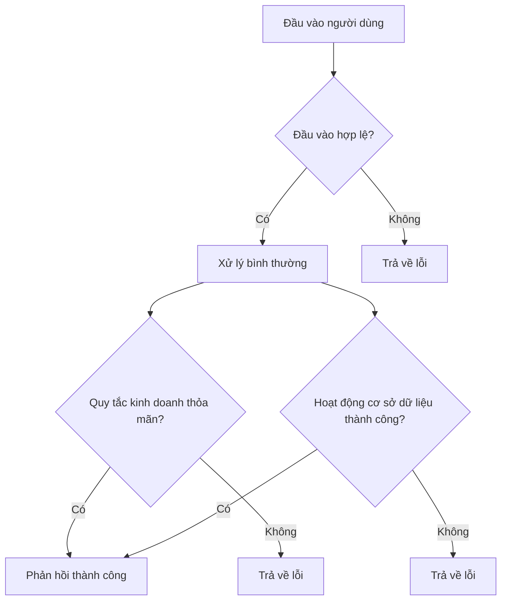

# 5.4.3 Nếu như... sẽ thế nào——Điều kiện biên và xử lý ngoại lệ

### Một câu nói lên vấn đề

Dự đoán trước tất cả các tình huống có thể sai lầm, giúp AI biết **mỗi ngoại lệ cần phản hồi như thế nào**.

### Tại sao điều kiện biên quan trọng

Luồng bình thường chỉ chiếm 20% mã, xử lý ngoại lệ chiếm 80%:



Nếu không định nghĩa điều kiện biên, AI sinh mã có thể:
- Quên xử lý những lỗi quan trọng
- Trả về định dạng lỗi không nhất quán
- Tạo lỗ hổng bảo mật

### Phân loại điều kiện biên

```markdown
## Danh sách kiểm tra điều kiện biên

### 1. Điều kiện biên đầu vào
- Trường bắt buộc để trống
- Định dạng trường sai
- Giá trị trường vượt phạm vi
- Ký tự bất hợp pháp

### 2. Điều kiện biên kinh doanh
- Tài nguyên không tồn tại
- Tài nguyên đã tồn tại (lặp lại)
- Không có quyền truy cập
- Vượt quá giới hạn hạn ngạch

### 3. Điều kiện biên hệ thống
- Kết nối cơ sở dữ liệu thất bại
- Dịch vụ bên thứ ba hết thời gian chờ
- Lỗi nội bộ máy chủ
```

### Định dạng tiêu chuẩn xử lý ngoại lệ

Mỗi ngoại lệ cần ghi rõ:

| Tình huống ngoại lệ | Mã trạng thái HTTP | Mã lỗi | Thông báo lỗi | Lời khuyên xử lý |
|----------|-------------|--------|----------|----------|
| Email để trống | 400 | MISSING_EMAIL | Vui lòng nhập email | Kiểm tra biểu mẫu ở giao diện |
| Định dạng email sai | 400 | INVALID_EMAIL | Định dạng email không đúng | Kiểm tra regex ở giao diện |
| Email đã tồn tại | 409 | EMAIL_EXISTS | Email này đã được đăng ký | Gợi ý đi đến đăng nhập |
| Người dùng không tồn tại | 404 | USER_NOT_FOUND | Người dùng không tồn tại | - |
| Mật khẩu sai | 401 | INVALID_PASSWORD | Mật khẩu không đúng | Không tiết lộ lý do cụ thể |

### Định dạng thống nhất phản hồi lỗi

```json
{
  "error": {
    "code": "ERROR_CODE",
    "message": "Thông báo thân thiện cho người dùng",
    "details": {
      "field": "email",
      "reason": "định dạng không đúng"
    }
  }
}
```

### Trường hợp thực tế: Xử lý ngoại lệ đăng nhập

```markdown
## Xử lý ngoại lệ giao diện đăng nhập

### Xác thực đầu vào
| Điều kiện | Phản hồi |
|------|------|
| Email để trống | 400 MISSING_EMAIL |
| Mật khẩu để trống | 400 MISSING_PASSWORD |
| Định dạng email sai | 400 INVALID_EMAIL |

### Xác thực kinh doanh
| Điều kiện | Phản hồi |
|------|------|
| Người dùng không tồn tại | 401 INVALID_CREDENTIALS |
| Mật khẩu sai | 401 INVALID_CREDENTIALS |
| Tài khoản bị vô hiệu | 403 ACCOUNT_DISABLED |
| Đăng nhập quá nhiều lần | 429 TOO_MANY_ATTEMPTS |

### Xem xét bảo mật
- Người dùng không tồn tại và mật khẩu sai trả về cùng mã lỗi
- Tránh để kẻ tấn công tìm ra các tài khoản hợp lệ bằng cách thử lỗi
```

### Danh sách kiểm tra kiểm thử điều kiện biên

Với mỗi chức năng, liệt kê các bộ kiểm tra biên:

```markdown
## Đăng bài - Kiểm thử điều kiện biên

### Tiêu đề
- Tiêu đề trống → 400 MISSING_TITLE
- 1 ký tự → thành công
- 100 ký tự → thành công
- 101 ký tự → 400 TITLE_TOO_LONG
- Chứa thẻ HTML → tự động chuyển đổi

### Nội dung
- Nội dung trống → 400 MISSING_CONTENT
- 1 ký tự → thành công
- 100000 ký tự → thành công
- 100001 ký tự → 400 CONTENT_TOO_LONG

### Thẻ
- 0 thẻ → thành công
- 5 thẻ → thành công
- 6 thẻ → 400 TOO_MANY_TAGS
- Tên thẻ 50 ký tự → thành công
- Tên thẻ 51 ký tự → 400 TAG_TOO_LONG
```

### Dùng AI giúp bạn tìm điều kiện biên

```
Bạn: Tôi muốn cài đặt chức năng đăng ký người dùng, giúp tôi liệt kê tất cả các điều kiện biên cần xử lý

AI: ## Danh sách kiểm tra điều kiện biên

### Xác thực đầu vào
1. Email
   - Để trống → 400 MISSING_EMAIL
   - Định dạng sai → 400 INVALID_EMAIL
   - Chiều dài vượt 255 → 400 EMAIL_TOO_LONG

2. Mật khẩu
   - Để trống → 400 MISSING_PASSWORD
   - Chiều dài < 8 → 400 PASSWORD_TOO_SHORT
   - Chiều dài > 20 → 400 PASSWORD_TOO_LONG
   - Không có chữ cái → 400 PASSWORD_WEAK
   - Không có số → 400 PASSWORD_WEAK

### Xác thực kinh doanh
1. Email đã được đăng ký → 409 EMAIL_EXISTS
2. Kích hoạt quy tắc chống spam → 429 RATE_LIMITED

### Ngoại lệ hệ thống
1. Kết nối cơ sở dữ liệu thất bại → 500 INTERNAL_ERROR
2. Dịch vụ email không sẵn sàng → đăng ký thành công, nhưng ghi lại lỗi gửi
```

### Chiến lược giảm tải duyên dặt

Đối với chức năng không quan trọng, cân nhắc xử lý giảm tải:

```markdown
## Chiến lược giảm tải

### Gửi email xác minh
- Bình thường: Gửi ngay sau khi đăng ký
- Giảm tải: Nếu dịch vụ email sự cố, ghi vào hàng chờ, thử lại sau
- Thông báo người dùng: "Đăng ký thành công, email xác minh sẽ gửi trong thời gian tới"

### Tải avatar lên
- Bình thường: Tải lên OSS
- Giảm tải: Nếu OSS sự cố, lưu vào thư mục tạm thời cục bộ
- Sau đó: Công việc định kỳ di chuyển sang OSS
```

### Lời khuyên thực tế

1. **Liệt kê rồi bổ sung**: Trước tiên suy nghĩ luồng bình thường, rồi từ từ suy nghĩ "nếu như... sẽ thế nào"
2. **Bảo mật là ưu tiên**: Thông báo lỗi cho hoạt động nhạy cảm cần mơ hồ hóa
3. **Thân thiện với người dùng**: Thông báo lỗi cần giúp người dùng biết cách xử lý
4. **Định dạng nhất quán**: Tất cả giao diện dùng cùng cấu trúc phản hồi lỗi
5. **Ghi nhật ký chi tiết**: Lỗi máy chủ cần có nhật ký chi tiết, nhưng không lộ cho người dùng
