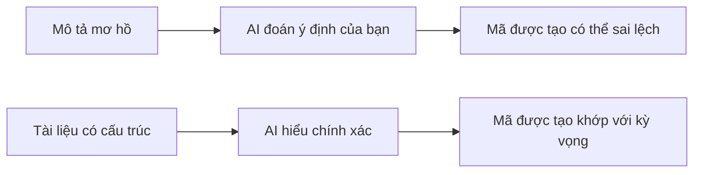

# 5.4 Tài liệu bạn viết AI có thể hiểu không——PRD có thể đọc được bằng AI

### Tại sao định dạng tài liệu lại quan trọng

Trong Vibe Coding, tài liệu không chỉ cần cho con người đọc được, mà còn cần AI "hiểu" được.

**Tài liệu tốt vs tài liệu tệ**:

| Tài liệu tệ | Tài liệu tốt |
|--------|--------|
| "Làm một trang đẹp" | "Dùng Tailwind, góc thẻ 8px, khoảng cách 16px" |
| "Người dùng đăng nhập rồi chuyển hướng" | "Đăng nhập thành công trả về 200, chuyển hướng tới /dashboard" |
| "Xử lý trường hợp lỗi" | "Sai mật khẩu trả về 401, lỗi định dạng trả về 400" |

### Các yếu tố cốt lõi của tài liệu có cấu trúc

Một PRD thân thiện với AI nên chứa:

1. **Đầu vào/Đầu ra rõ ràng**: Dữ liệu từ đâu tới, tới đâu
2. **Điều kiện ràng buộc cụ thể**: Ngôn ngữ công nghệ, định dạng, ranh giới
3. **Xử lý ngoại lệ rõ ràng**: Các tình huống lỗi khác nhau sẽ phản hồi như thế nào
4. **Tiêu chí thành công có thể xác minh**: Cách để biết "làm đúng"

### Mục tiêu của phần này

Sau khi học xong phần này, bạn sẽ nắm được:

1. **Thiết kế có cấu trúc**: Làm cho tài liệu rõ ràng, phân cấp rõ ràng
2. **Định nghĩa đầu vào/đầu ra**: Làm rõ dòng chảy dữ liệu và hợp đồng giao diện
3. **Xử lý điều kiện biên**: Dự đoán trước các tình huống ngoài dự kiến của hệ thống
4. **Tối ưu hóa định dạng**: Sử dụng định dạng Markdown mà AI ưa thích

**Nhớ**: Viết tài liệu là viết Prompt. Tài liệu càng rõ ràng, AI hiểu càng chính xác, mã được tạo ra càng khớp với kỳ vọng.
