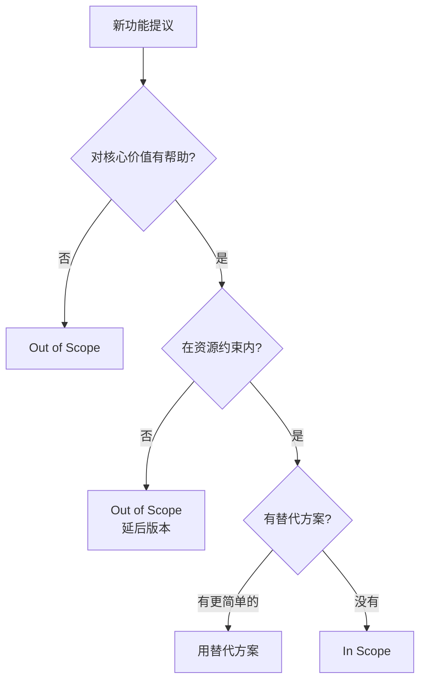

# 5.5.3 Cái nào nên làm, cái nào không nên làm——Xác định phạm vi

### Giải quyết vấn đề bằng một câu

Xác định phạm vi là làm rõ: **Làm gì (In Scope) và không làm gì (Out of Scope)**。

### Tại sao xác định phạm vi rất quan trọng

Yêu cầu không có ranh giới sẽ dẫn đến:
- **Dung lượng phạm vi**: Liên tục thêm các chức năng mới, dự án kéo dài vô thời hạn
- **Sai lệch kỳ vọng**: Bạn nghĩ đã xong, người dùng cho rằng vẫn còn thiếu rất nhiều
- **Lãng phí tài nguyên**: Đã làm rất nhiều "trang trí hoa lệ" nhưng bỏ quên cốt lõi

### Cấu trúc xác định phạm vi

```markdown
## Xác định phạm vi

### In Scope (Cần làm)
- Chức năng 1
- Chức năng 2
- Chức năng 3

### Out of Scope (Không làm)
- Chức năng A (Lý do: Vượt quá MVP)
- Chức năng B (Lý do: Độ phức tạp kỹ thuật cao)
- Chức năng C (Lý do: Lượng người dùng không đủ để hỗ trợ)

### Yêu cầu phi chức năng
- Yêu cầu hiệu suất
- Yêu cầu bảo mật
- Yêu cầu tương thích
```

### 实际案例：博客系统

```markdown
## Phạm vi Hệ thống Blog V1.0

### In Scope
- [x] CRUD Bài viết (Tạo, Đọc, Cập nhật, Xóa)
- [x] Trình soạn thảo Markdown
- [x] Danh sách bài viết và trang chi tiết
- [x] Danh mục và thẻ
- [x] SEO cơ bản (thẻ meta, sitemap)

### Out of Scope
| Chức năng | Lý do | Phiên bản dự kiến |
|------|------|----------|
| Hệ thống bình luận | Không cần giai đoạn MVP | V1.1 |
| Hỗ trợ đa người dùng | Blog cá nhân tạm không cần | V2.0 |
| Đăng ký trả phí | Xem xét thương mại sau | V2.0+ |
| Đa ngôn ngữ | Ban đầu chỉ phục vụ người dùng Trung Quốc | Tạm không lên kế hoạch |

### Yêu cầu phi chức năng
- **Hiệu suất**: Trang chủ tải < 3 giây
- **Bảo mật**: Mật khẩu người dùng được mã hóa lưu trữ
- **Tương thích**: Hỗ trợ các trình duyệt chính (Chrome, Safari, Firefox)
- **Khả dụng**: 99% khả dụng
```

### Tiêu chí phán xét In/Out



### Yêu cầu phi chức năng清单

除了功能，还要考虑：

| Loại | Điểm xem xét | Ví dụ |
|------|--------|------|
| **Hiệu suất** | Thời gian phản hồi, tải đồng thời | Trang chủ tải < 3 giây |
| **Bảo mật** | Xác thực, ủy quyền, bảo vệ dữ liệu | Mật khẩu mã hóa, HTTPS |
| **Khả dụng** | Tỷ lệ hoạt động, phục hồi lỗi | 99% khả dụng |
| **Dễ bảo trì** | Chất lượng mã, tài liệu | TypeScript có kiểu mạnh |
| **Tương thích** | Trình duyệt, thiết bị | Hỗ trợ di động |
| **Khả năng mở rộng** | Tăng trưởng trong tương lai | Hỗ trợ mở rộng ngang |

### Cách từ chối dung lượng phạm vi

Khi ai đó đề xuất một chức năng mới:

```
1. Trước tiên xác nhận hiểu yêu cầu
   "Bạn muốn thực hiện cái gì... đúng không?"

2. Đánh giá mối quan hệ với giá trị cốt lõi
   "Chức năng này giúp giải quyết vấn đề cốt lõi bao nhiêu?"

3. Đánh giá chi phí thực hiện
   "Cần bao lâu để thực hiện điều này?"

4. Đề xuất giải pháp thay thế hoặc trì hoãn
   "Chúng ta có thể trước tiên sử dụng phương pháp XX để giải quyết, rồi tối ưu hóa ở phiên bản tiếp theo"
```

### Để AI giúp bạn xác định phạm vi

```
Bạn: MVP của hệ thống blog nên bao gồm những chức năng nào? Những chức năng nào có thể trì hoãn?

AI: ## Gợi ý phạm vi MVP

### Phải có (In Scope)
Giá trị cốt lõi: Cho phép người dùng viết blog và được truy cập
1. CRUD Bài viết - Chức năng cốt lõi
2. Hỗ trợ Markdown - Kỳ vọng cơ bản của người dùng mục tiêu
3. Trang danh sách/chi tiết - Cơ sở hiển thị nội dung

### Có thể trì hoãn (Out of Scope)
1. Bình luận → Có thể sử dụng Giscus hoặc bên thứ ba
2. Tìm kiếm → Khi bài viết ít có thể dùng tìm kiếm trình duyệt
3. RSS → Chức năng nâng cao, không bắt buộc
4. Thống kê → Có thể sử dụng Google Analytics

### Ưu tiên phi chức năng
1. Ưu tiên cao: Bảo mật (mã hóa mật khẩu)
2. Ưu tiên trung bình: Hiệu suất (trang chủ trong 3 giây)
3. Ưu tiên thấp: SEO (có thể tối ưu hóa sau)
```

### 实用建议

1. **写下来**：口头说的边界容易遗忘
2. **说明理由**：为什么不做比不做本身更重要
3. **留有余地**：Out of Scope 不是永远不做
4. **定期回顾**：随着项目进展，范围可能需要调整
