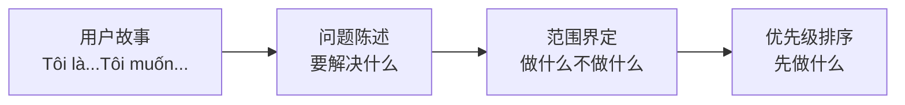

# 5.5 Trước tiên kể chuyện rồi mới lập danh sách——Câu chuyện người dùng và Ưu tiên

### Từ câu chuyện đến danh sách

Khi xác định yêu cầu, nhiều người thường liệt kê các chức năng trực tiếp. Nhưng cách tốt hơn là **Trước tiên kể chuyện, rồi mới lập danh sách**.

### Tại sao câu chuyện người dùng rất quan trọng

Câu chuyện người dùng giúp bạn:
- **Giữ quan điểm người dùng**: Chức năng được thiết kế phục vụ người dùng
- **Làm rõ giá trị**: Mỗi chức năng phải trả lời "tại sao cần làm"
- **Dễ giao tiếp**: Dùng ngôn ngữ tự nhiên, AI và người đều có thể hiểu

### Câu chuyện người dùng vs Danh sách chức năng

| Danh sách chức năng | Câu chuyện người dùng |
|----------|----------|
| "用户登录功能" | "Tôi là người dùng, Tôi muốn用邮箱密码登录，Để访问我的个人数据" |
| "文章搜索" | "Tôi là读者，Tôi muốn搜索历史文章，Để快速找到感兴趣的内容" |
| "消息通知" | "Tôi là作者，Tôi muốn收到评论通知，Để及时回复读者" |

### Mục tiêu của phần này

Sau khi học xong phần này, bạn sẽ nắm vững:

1. **Định dạng câu chuyện người dùng**: Mô tả yêu cầu bằng định dạng tiêu chuẩn
2. **Trình bày vấn đề**: Làm rõ vấn đề cốt lõi cần giải quyết
3. **Xác định phạm vi**: Xác định những gì nên làm, những gì không nên làm
4. **Ma trận ưu tiên**: Quyết định thứ tự một cách khoa học

**Nhớ**: Định nghĩa yêu cầu tốt không phải là "Tôi muốn chức năng gì" mà là "Người dùng cần giải quyết vấn đề gì".
