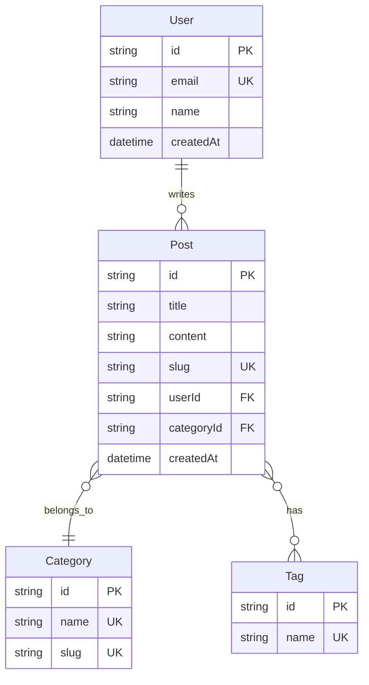

# 5.6.2 Dữ liệu nên được lưu trữ như thế nào——Thiết kế bảng dữ liệu

### Giải quyết vấn đề bằng một câu

Thiết kế bảng dữ liệu trả lời một câu hỏi: **Dữ liệu được lưu trữ với cấu trúc nào và mối quan hệ giữa các bảng là gì**.

### Sơ đồ quan hệ thực thể (ER Diagram)

Vẽ sơ đồ trước, sau đó tạo bảng:



### Các loại quan hệ

| Quan hệ | Ký hiệu | Ví dụ |
|------|------|------|
| Một-một | `||--||` | User - Profile |
| Một-nhiều | `||--o{` | User - Posts |
| Nhiều-nhiều | `}o--o{` | Post - Tags |

### Mẫu định nghĩa trường

```markdown
## Bảng Post

| Trường | Kiểu | Ràng buộc | Mô tả |
|------|------|------|------|
| id | string | PK | Khóa chính, sử dụng cuid |
| title | string | NOT NULL | Tiêu đề, 1-100 ký tự |
| content | text | NOT NULL | Nội dung, định dạng Markdown |
| slug | string | UNIQUE | Định danh thân thiện với URL |
| status | enum | DEFAULT 'draft' | draft/published |
| userId | string | FK → User.id | Tác giả |
| categoryId | string | FK → Category.id | Danh mục |
| createdAt | datetime | DEFAULT now() | Thời gian tạo |
| updatedAt | datetime | AUTO UPDATE | Thời gian cập nhật |

### Chỉ mục
- `slug` - Chỉ mục duy nhất, dùng cho truy vấn URL
- `userId` - Chỉ mục thông thường, dùng cho lọc theo tác giả
- `createdAt` - Chỉ mục thông thường, dùng cho sắp xếp
```

### Ví dụ Prisma Schema

```prisma
model Post {
  id         String    @id @default(cuid())
  title      String
  content    String
  slug       String    @unique
  status     Status    @default(DRAFT)

  author     User      @relation(fields: [userId], references: [id])
  userId     String

  category   Category  @relation(fields: [categoryId], references: [id])
  categoryId String

  tags       Tag[]

  createdAt  DateTime  @default(now())
  updatedAt  DateTime  @updatedAt

  @@index([userId])
  @@index([createdAt])
}

enum Status {
  DRAFT
  PUBLISHED
}
```

### Nguyên tắc thiết kế

#### 1. Thiết kế khóa chính
```
✅ Sử dụng cuid hoặc uuid
   - Không tiết lộ thông tin kinh doanh
   - Hỗ trợ tạo phân tán

❌ Sử dụng ID tự tăng
   - Dễ bị đoán
   - Xung đột khi hợp nhất dữ liệu
```

#### 2. Trường thời gian
```
Mỗi bảng nên có:
- createdAt: Ghi lại thời gian tạo
- updatedAt: Ghi lại thời gian cập nhật lần cuối

Tùy chọn:
- deletedAt: Đánh dấu xóa mềm
```

#### 3. Xử lý khóa ngoài
```
Chiến lược khi xóa dữ liệu liên quan:

CASCADE  - Xóa theo chuỗi (xóa người dùng thì xóa bài viết)
SET NULL - Đặt rỗng (xóa danh mục thì đặt danh mục bài viết rỗng)
RESTRICT - Cấm xóa (không xóa danh mục nếu có bài viết)
```

### Các mẫu thiết kế phổ biến

#### Quan hệ nhiều-nhiều
```prisma
// Phương án một: Bảng trung gian ngầm (Prisma tự tạo)
model Post {
  tags Tag[]
}
model Tag {
  posts Post[]
}

// Phương án hai: Bảng trung gian tường minh (khi cần trường bổ sung)
model PostTag {
  post    Post     @relation(fields: [postId], references: [id])
  postId  String
  tag     Tag      @relation(fields: [tagId], references: [id])
  tagId   String
  order   Int      // Trường bổ sung: sắp xếp

  @@id([postId, tagId])
}
```

#### Xóa mềm
```prisma
model Post {
  // ...
  deletedAt DateTime?
}

// Lọc khi truy vấn
const posts = await prisma.post.findMany({
  where: { deletedAt: null }
})
```

### Để AI giúp bạn thiết kế bảng dữ liệu

```
Bạn: Hệ thống blog cần những bảng dữ liệu nào? Vui lòng cung cấp Prisma Schema

AI: // prisma/schema.prisma

model User {
  id       String @id @default(cuid())
  email    String @unique
  name     String
  password String
  posts    Post[]
  createdAt DateTime @default(now())
}

model Post {
  id         String   @id @default(cuid())
  title      String
  content    String
  slug       String   @unique
  published  Boolean  @default(false)
  author     User     @relation(fields: [authorId], references: [id])
  authorId   String
  category   Category @relation(fields: [categoryId], references: [id])
  categoryId String
  tags       Tag[]
  createdAt  DateTime @default(now())
  updatedAt  DateTime @updatedAt
}

model Category {
  id    String @id @default(cuid())
  name  String @unique
  slug  String @unique
  posts Post[]
}

model Tag {
  id    String @id @default(cuid())
  name  String @unique
  posts Post[]
}
```

### Gợi ý thực tế

1. **Vẽ ER diagram trước**: Hình ảnh hóa giúp làm rõ mối quan hệ
2. **Đặt tên nhất quán**: Phong cách đặt tên trường thống nhất (camelCase hoặc snake_case)
3. **Dư thừa thích hợp**: Có thể dư thừa một chút để cải thiện hiệu suất truy vấn
4. **Dự trữ cho mở rộng**: Xem xét các nhu cầu tiềm tàng trong tương lai
