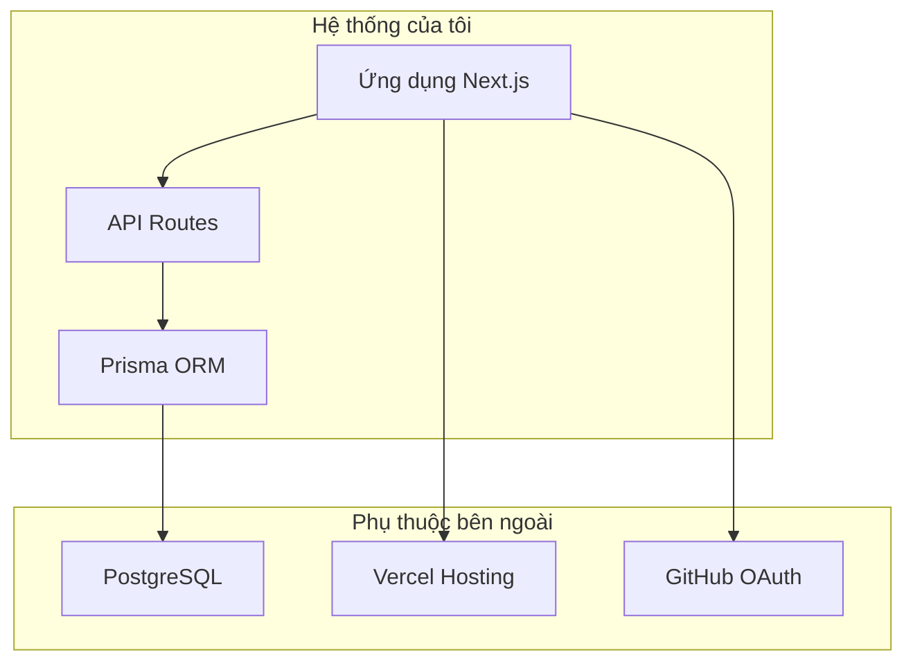
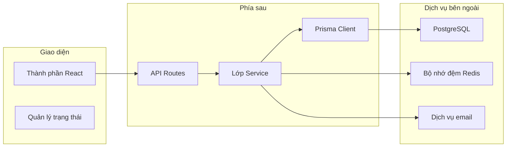

# 5.6.3 Tôi quản lý phần nào——Ranh giới hệ thống

### Giải quyết vấn đề bằng một câu

Ranh giới hệ thống xác định **những gì tự mình phát triển và những gì phụ thuộc vào bên ngoài**.

### Tại sao phải phân chia ranh giới



Ranh giới rõ ràng giúp:
- Biết vấn đề nào cần tìm ai giải quyết
- Đánh giá thứ gì có thể kiểm soát, thứ gì có rủi ro
- Lập kế hoạch dự phòng

### Thành phần nội bộ vs Phụ thuộc bên ngoài

```markdown
## Phân chia ranh giới hệ thống blog

### Thành phần nội bộ (tự triển khai)
| Thành phần | Mô tả | Khả năng kiểm soát |
|------|------|--------|
| Trang giao diện | Thành phần React Next.js | Hoàn toàn có thể kiểm soát |
| Giao diện API | Next.js API Routes | Hoàn toàn có thể kiểm soát |
| Truy cập dữ liệu | Gọi Prisma ORM | Hoàn toàn có thể kiểm soát |
| Logic kinh doanh | Quản lý bài viết/người dùng/danh mục | Hoàn toàn có thể kiểm soát |

### Phụ thuộc bên ngoài (sử dụng dịch vụ)
| Phụ thuộc | Mục đích | Khả năng thay thế | Rủi ro |
|------|------|----------|------|
| PostgreSQL | Lưu trữ dữ liệu | Trung bình (chuyển sang MySQL) | Thấp |
| Vercel | Lưu trữ triển khai | Cao (chuyển sang Railway) | Thấp |
| GitHub OAuth | Xác thực người dùng | Trung bình (chuyển sang Google) | Thấp |
| Cloudinary | Lưu trữ hình ảnh | Cao (chuyển sang OSS) | Thấp |
```

### Biểu đồ mối quan hệ phụ thuộc



### Danh sách phụ thuộc bên ngoài

```markdown
## Danh sách phụ thuộc bên ngoài

### Cơ sở hạ tầng
| Dịch vụ | Mục đích | Dung lượng miễn phí | Giá trả tiền |
|------|------|----------|----------|
| Vercel | Lưu trữ | 100GB/tháng | $20/tháng trở lên |
| Supabase | Cơ sở dữ liệu | 500MB | $25/tháng trở lên |
| Cloudflare | CDN | Không giới hạn | Miễn phí |

### API của bên thứ ba
| Dịch vụ | Mục đích | Dung lượng miễn phí |
|------|------|----------|
| GitHub OAuth | Đăng nhập | Miễn phí |
| Resend | Email | 100 lá thư/ngày |
| Sentry | Theo dõi lỗi | 5K sự kiện/tháng |

### Phụ thuộc npm
| Gói | Mục đích | Hoạt động |
|----|------|--------|
| @prisma/client | ORM | Hoạt động |
| next-auth | Xác thực | Hoạt động |
| zod | Xác thực | Hoạt động |
```

### Đánh giá rủi ro

Mỗi phụ thuộc bên ngoài cần xem xét:

| Loại rủi ro | Vấn đề | Biện pháp ứng phó |
|----------|------|----------|
| **Tính khả dụng** | Dịch vụ ngừng hoạt động thì sao | Chuẩn bị dịch vụ dự phòng |
| **Chi phí** | Vượt quá hạn mức miễn phí thì sao | Đặt cảnh báo sử dụng |
| **Chuyển đổi** | Cần chuyển đổi dịch vụ thì sao | Tạo lớp giao diện trừu tượng |
| **Bảo mật** | Khóa API bị rò rỉ thì sao | Biến môi trường + kiểm soát quyền |

### Trừu tượng hóa phụ thuộc

Để giảm rủi ro phụ thuộc, có thể tạo một lớp trừu tượng:

```typescript
// Kém: Ghép trực tiếp
import { S3Client } from '@aws-sdk/client-s3'
const client = new S3Client({...})

// Tốt: Giao diện trừu tượng
interface StorageService {
  upload(file: File): Promise<string>
  delete(url: string): Promise<void>
}

class S3Storage implements StorageService {
  async upload(file: File) { /* ... */ }
  async delete(url: string) { /* ... */ }
}

class LocalStorage implements StorageService {
  async upload(file: File) { /* ... */ }
  async delete(url: string) { /* ... */ }
}
```

### Để AI giúp bạn phân tích phụ thuộc

```
Bạn: Phân tích hệ thống blog của tôi có những phụ thuộc bên ngoài nào, đánh giá rủi ro

AI: ## Phân tích phụ thuộc

### Phụ thuộc cao (phải có)
1. **Cơ sở dữ liệu PostgreSQL**
   - Rủi ro: Trung bình (dịch vụ lưu trữ có thể thay đổi)
   - Lựa chọn thay thế: Tự xây dựng / chuyển sang MySQL

2. **Lưu trữ Vercel**
   - Rủi ro: Thấp (có thể di chuyển nhanh chóng)
   - Lựa chọn thay thế: Railway / Fly.io

### Phụ thuộc trung bình (có thể thay thế)
1. **GitHub OAuth**
   - Rủi ro: Thấp
   - Lựa chọn thay thế: Google OAuth / mật khẩu email

### Phụ thuộc thấp (trang trí)
1. **Google Analytics**
   - Rủi ro: Rất thấp
   - Lựa chọn thay thế: Umami / không dùng
```

### Gợi ý thực tế

1. **Liệt kê tất cả phụ thuộc**: Bao gồm gói npm và dịch vụ đám mây
2. **Đánh giá chi phí thay thế**: Cái nào dễ đổi
3. **Phụ thuộc quan trọng cần trừu tượng**: Thuận tiện cho di chuyển tương lai
4. **Theo dõi sức khỏe phụ thuộc**: Chú ý trạng thái dịch vụ và cập nhật phiên bản
